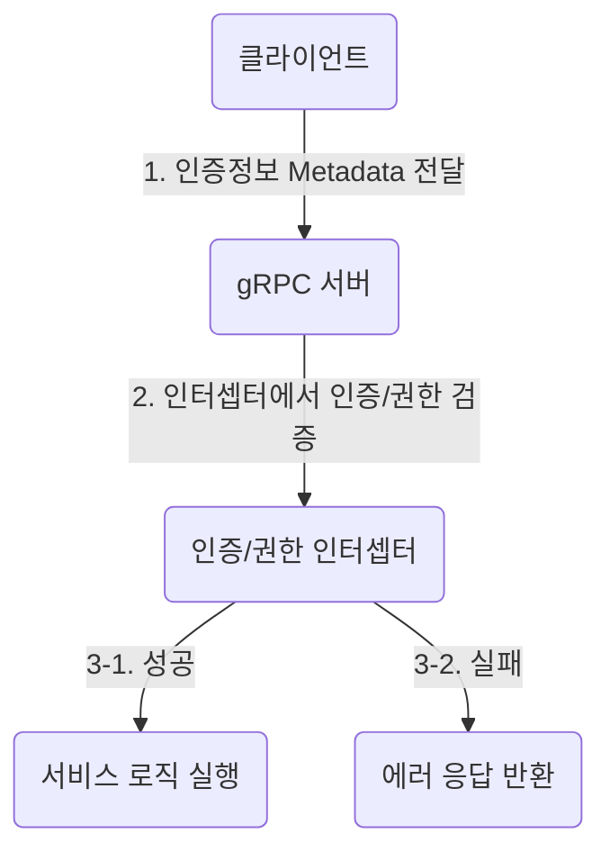
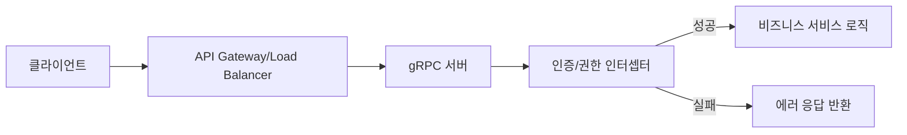

> gRPC API에서 인증(Authentication)과 권한(Authorization) 체크가 왜 중요한지, 그리고 기본적으로 어떻게 동작하는지 초보자도 쉽게 이해할 수 있도록 실전 중심으로 설명합니다.
> 실무에서 자주 발생하는 보안 실수와, 안전한 API 설계의 핵심 원리를 함께 다룹니다.

---

#### gRPC와 보안: 왜 인증/권한이 중요한가?

- `gRPC`는 빠르고 효율적인 서비스 간 통신을 제공하지만, **보안**은 자동으로 보장되지 않습니다.
- 인증/권한 체크가 없다면, 누구든 민감 데이터에 접근하거나, 악의적 요청을 보낼 수 있습니다.
- 마이크로서비스, 외부 API, 모바일/웹 클라이언트 등 다양한 환경에서 **신뢰할 수 있는 통신**을 보장하려면 반드시 보안 계층이 필요합니다.

##### 실전 배경: gRPC와 보안의 현실

> "API는 잘 만들었지만, 인증 없이 오픈된 gRPC 엔드포인트 때문에 데이터가 유출된 사례가 있습니다."
> "내부 마이크로서비스라서 괜찮다고 생각했지만, 실제로 내부망 침입 사고로 인증 없는 호출로 치명적 장애가 발생한 적이 있습니다."

#### 실무에서 인증/권한 체크가 필요한 대표 사례

- **외부 API 공개**: 인증 없이 gRPC 엔드포인트를 오픈하면, 누구나 호출 가능 → 데이터 유출, 서비스 남용 위험
- **내부 마이크로서비스 통신**: 서비스간 신뢰가 깨질 경우(예: 내부망 침입), 인증 없는 호출로 치명적 피해 발생
- **사용자 데이터 보호**: 로그인한 사용자만 자신의 정보에 접근해야 함. 권한 체크 없으면 타인 데이터 노출
- **비용/리소스 보호**: 인증/권한 없이 무분별한 호출이 가능하면, 서버 리소스 고갈 및 장애 유발
- **실제 보안 사고 사례**: 인증이 없는 gRPC API를 통해 외부에서 대량의 요청이 들어와 서비스가 중단된 사례, 내부 서비스간 권한 체크 미흡으로 타 서비스 데이터가 노출된 사례 등 다수

##### 실전 대화 예시

| 상황 | 대화 | 결과 |
|---|---|---|
| gRPC 인증 미적용 | "이 API는 내부용이라 인증 필요 없죠?"<br>"아뇨, 내부망도 침입 위험이 있습니다. 최소한 토큰 인증은 필수입니다." | 인증 미적용 시 데이터 유출 위험 |
| 권한 체크 누락 | "관리자만 접근해야 하는데, 일반 사용자도 호출 가능하네요."<br>"권한 체크 로직이 누락되어 있었습니다. 인터셉터에서 일괄 처리합시다." | 권한 체크 일관 적용 필요 |

#### 인증(Authentication)과 권한(Authorization)의 차이

- **인증(Authentication)**: "누구인가?"를 확인하는 절차 (예: 로그인, 토큰 검증)
- **권한(Authorization)**: "무엇을 할 수 있는가?"를 결정하는 절차 (예: 관리자만 특정 API 호출 가능)
- 두 과정은 별개이지만, 항상 함께 적용되어야 안전합니다.

##### 인증/권한 비교 표

| 구분 | 인증(Authentication) | 권한(Authorization) |
|---|---|---|
| 목적 | 사용자 신원 확인 | 사용자의 행위/접근 범위 결정 |
| 예시 | 로그인, 토큰 검증 | 관리자/일반 사용자 구분, 특정 API 접근 제한 |
| 적용 위치 | 주로 인터셉터, 게이트웨이 | 서비스 로직, 인터셉터, API Gateway |

##### 인증/권한 체크가 누락된 실전 사고 사례

- 인증 없이 오픈된 gRPC 엔드포인트로 인해 외부에서 데이터가 유출됨
- 권한 체크 없이 관리자 API를 호출할 수 있어, 일반 사용자가 시스템 설정 변경
- 인증 실패 시 민감 정보가 에러 메시지로 노출되어, 공격자가 시스템 구조를 파악함

#### gRPC에서 인증/권한 체크의 기본 원리

- gRPC는 HTTP/2 기반이므로, HTTP 헤더를 활용해 인증 정보를 전달할 수 있습니다.
- **메타데이터(Metadata)**: gRPC의 인증/권한 정보는 보통 Metadata(헤더)에 담아 전송
- **인터셉터(ServerInterceptor)**: 서버 측에서 인증/권한 검증 로직을 인터셉터로 분리해 적용
- **실패 시 처리**: 인증 실패(UNAUTHENTICATED), 권한 부족(PERMISSION_DENIED) 등 명확한 에러 코드로 응답

##### gRPC 인증/권한 체크 아키텍처 그림



##### 예시: gRPC 인증 흐름(간단 개념도)

```
클라이언트
  |
  | 1. 토큰/인증정보를 Metadata에 추가
  v
서버
  | 2. 인터셉터에서 인증/권한 검증
  | 3. 성공 → 서비스 로직 실행
  |    실패 → 에러 응답 반환
```

##### 다양한 인증 방식 비교

| 인증 방식 | 특징 | 장점 | 단점 | 실전 적용 예시 |
|---|---|---|---|---|
| JWT | 토큰 기반, stateless | 분산 환경에 적합, 확장성 | 토큰 탈취 시 위험 | 모바일/웹, 마이크로서비스 |
| OAuth2 | 외부 인증 위임 | 소셜 로그인, 권한 분리 | 구현 복잡 | 외부 API, B2B 연동 |
| mTLS | 양방향 인증, 강력한 보안 | 인증서 기반, 신뢰성 높음 | 인증서 관리 필요 | 내부 서비스 통신 |
| API Key | 간단한 키 기반 인증 | 구현 쉬움 | 키 유출 시 위험 | 테스트, 단순 서비스 |

##### 실전 인증/권한 체크 체크리스트

- [ ] 모든 gRPC 엔드포인트에 인증/권한 체크가 적용되어 있는가?
- [ ] 인증 실패/권한 부족 시, 명확한 에러 코드와 메시지를 반환하는가?
- [ ] 민감 정보가 로그/에러 메시지에 노출되지 않는가?
- [ ] 인증/권한 로직이 인터셉터 등 중앙에서 일관되게 관리되는가?
- [ ] 인증/권한 관련 테스트 코드가 존재하는가?

##### 초보자를 위한 FAQ

- **Q. gRPC는 HTTP/2 기반인데, 기존 REST API와 인증 방식이 다른가요?**
  - A. 인증 원리는 유사하지만, gRPC는 Metadata를 통해 인증 정보를 전달합니다. JWT, OAuth2, mTLS 등 다양한 방식이 모두 적용 가능합니다.
- **Q. 인증/권한 체크를 직접 구현해도 되나요?**
  - A. 직접 구현보다는 검증된 라이브러리(JWT, OAuth2, Armeria의 인증 모듈 등)를 활용하는 것이 안전합니다.
- **Q. 인증/권한 체크는 어디서 처리해야 하나요?**
  - A. 서비스 로직 곳곳에 분산시키기보다는, 인터셉터 등 중앙에서 일관되게 처리해야 관리와 보안에 유리합니다.

##### 실전 팁과 주의사항

- 인증/권한 체크는 개발 초기부터 반드시 설계에 포함
- 인증 로직은 인터셉터/미들웨어에서 일괄 처리, 서비스 로직은 비즈니스에 집중
- 테스트 환경에서도 인증/권한 체크를 반드시 적용(테스트용 토큰 등 활용)
- 운영 환경에서는 토큰 만료, 인증서 갱신 등 보안 유지 관리에 주의
- 인증/권한 관련 로그는 민감 정보 노출 없이, 감사 용도로만 최소화

##### 실전 적용 예시: Kotlin 기반 gRPC 인증 인터셉터 (구현 개요)

```kotlin
import io.grpc.*

class AuthInterceptor : ServerInterceptor {
    override fun <ReqT : Any?, RespT : Any?> interceptCall(
        call: ServerCall<ReqT, RespT>,
        headers: Metadata,
        next: ServerCallHandler<ReqT, RespT>
    ): ServerCall.Listener<ReqT> {
        val tokenKey = Metadata.Key.of("authorization", Metadata.ASCII_STRING_MARSHALLER)
        val token = headers.get(tokenKey) ?: return unauthenticated(call)
        // 실제 토큰 검증 로직 (JWT 등)
        if (!validateToken(token)) {
            return unauthenticated(call)
        }
        // 권한 체크 로직 추가 가능
        return next.startCall(call, headers)
    }
    private fun <ReqT, RespT> unauthenticated(call: ServerCall<ReqT, RespT>): ServerCall.Listener<ReqT> {
        call.close(Status.UNAUTHENTICATED.withDescription("Invalid or missing token"), Metadata())
        return object : ServerCall.Listener<ReqT>() {}
    }
    private fun validateToken(token: String): Boolean {
        // JWT, OAuth2 등 실제 검증 로직 구현
        return token.startsWith("Bearer ")
    }
}
```

##### 실전 적용 시 주의할 점

- 토큰 검증 로직은 반드시 라이브러리/공식 모듈 활용(직접 파싱/검증은 위험)
- 인증 실패 시 클라이언트에 민감 정보 노출 금지
- 권한 체크는 역할(Role) 기반으로 일관되게 관리
- 인증/권한 관련 변경 시, 전체 서비스 영향도 반드시 점검

##### 실전에서 자주 묻는 질문(FAQ)

- **Q. 인증/권한 체크를 빼먹으면 어떤 일이 생기나요?**
  - A. 데이터 유출, 서비스 장애, 비용 폭증 등 심각한 사고로 이어질 수 있습니다.
- **Q. 인증/권한 체크를 테스트하는 방법은?**
  - A. 정상/비정상 토큰, 권한 부족 시나리오 등 다양한 테스트 케이스를 자동화하세요.
- **Q. 인증/권한 체크를 CI/CD에 어떻게 녹이나요?**
  - A. 인터셉터/미들웨어에 인증 로직을 넣고, 테스트 코드와 린트, PR 체크리스트에 포함시키세요.

##### 실전 보안 사고 사례 (요약)

- 인증 없는 gRPC API로 인해 외부에서 대량의 요청이 들어와 서비스가 중단됨
- 권한 체크 미흡으로 일반 사용자가 관리자 API를 호출, 시스템 설정이 변경됨
- 인증 실패 시 에러 메시지에 민감 정보가 노출되어, 공격자가 시스템 구조를 파악함

##### gRPC 인증/권한 체크 실전 체크리스트 (확장)

- [ ] 모든 엔드포인트에 인증/권한 체크가 적용되어 있는가?
- [ ] 인증 실패/권한 부족 시, 명확한 에러 코드와 메시지를 반환하는가?
- [ ] 민감 정보가 로그/에러 메시지에 노출되지 않는가?
- [ ] 인증/권한 로직이 인터셉터 등 중앙에서 일관되게 관리되는가?
- [ ] 인증/권한 관련 테스트 코드가 존재하는가?
- [ ] 운영 환경에서 토큰 만료, 인증서 갱신 등 보안 유지 관리가 이루어지는가?
- [ ] 인증/권한 관련 변경 시, 전체 서비스 영향도를 점검하는가?

---

#### 실무에서 자주 발생하는 보안 실수

- 인증/권한 체크를 아예 누락하거나, 일부 엔드포인트에만 적용
- 토큰 검증 로직을 직접 구현하다가, 만료/위조/탈취에 취약해짐
- 인증 실패 시 에러 메시지에 민감 정보 노출
- 권한 체크를 서비스 로직 곳곳에 분산 → 관리/테스트 어려움

#### 안전한 gRPC API를 위한 실전 팁

- 인증/권한 검증은 반드시 인터셉터 등 중앙에서 일관되게 처리
- JWT, OAuth2, mTLS 등 검증된 인증 방식을 활용
- 인증 실패/권한 부족 시, 명확한 에러 코드와 메시지 제공
- 민감 정보는 로그/응답에 노출하지 않기
- 인증/권한 로직은 테스트 코드로 자동화

#### 결론 및 도움말

> gRPC API에서 인증과 권한 체크는 선택이 아닌 필수입니다. 실무에서는 작은 실수 하나가 보안 사고로 이어질 수 있으니, 반드시 중앙 집중적이고 일관된 방식으로 검증하세요. 공식 문서와 검증된 라이브러리를 적극 활용하면, 초보자도 안전한 백엔드 API를 만들 수 있습니다.

---

#### gRPC 인증/권한에 대한 오해와 진실

- `gRPC는 HTTP/2라서 기본적으로 안전하다?` → **오해!**: HTTP/2는 전송 계층일 뿐, 인증/권한은 별도로 구현해야 함
- `내부망이면 인증이 필요 없다?` → **오해!**: 내부망도 침입, 내부자 공격, 실수 등 다양한 위협이 존재
- `API Key만 있으면 충분하다?` → **오해!**: API Key는 유출 위험이 높고, 권한 세분화가 어렵다. 상황에 따라 JWT, OAuth2, mTLS 등 적합한 방식을 선택해야 함

---

#### 실무 적용 전략 및 협업/운영 팁

##### 1. 인증/권한 설계 시 팀 내 협업 포인트
- API 명세 단계에서 인증/권한 정책을 명확히 정의(예: 어떤 엔드포인트에 어떤 권한이 필요한지 표로 정리)
- 코드 리뷰 시 인증/권한 체크 누락 여부를 반드시 확인(체크리스트 활용)
- 문서화: 인증 방식, 토큰 구조, 권한 체계, 에러 코드 등을 Notion, Wiki 등으로 공유

##### 2. 운영/자동화 전략
- 인증/권한 로직은 별도 모듈/패키지로 관리하여 재사용성 및 테스트 용이성 확보
- 테스트 코드에서 정상/비정상 인증, 권한 부족 시나리오를 자동화
- CI/CD 파이프라인에 인증/권한 체크 테스트 포함
- 토큰 만료, 인증서 갱신 등 운영 자동화 스크립트/알림 시스템 구축

##### 3. 실전 코드 리뷰 예시

> "이 PR에서 신규 gRPC API가 추가됐는데, 인증/권한 체크가 빠진 부분이 있습니다. 인터셉터에서 일괄 적용해주세요."
> "JWT 토큰 파싱 로직을 직접 구현하지 말고, 공식 라이브러리를 사용해주세요."

##### 4. 인증/권한 정책 문서 샘플(마크다운)

```
### gRPC 인증/권한 정책
- 인증: 모든 외부/내부 gRPC 엔드포인트는 JWT 기반 인증 필수
- 권한: 관리자/일반 사용자/게스트 등 역할별 권한 분리
- 인증 실패: Status.UNAUTHENTICATED, 권한 부족: Status.PERMISSION_DENIED 반환
- 토큰 만료/위조/탈취 등 예외 상황에 대한 응답 정책 명확히 정의
```

---

#### 실전 아키텍처: 인증/권한 계층 구조(예시)



---

#### 인증/권한 체크 실전 FAQ (확장)

- **Q. 인증/권한 체크를 코드에 직접 넣으면 안 되나요?**
  - A. 서비스 로직에 직접 분산시키면 관리가 어렵고, 누락 위험이 큽니다. 인터셉터/미들웨어 등 중앙 집중적으로 관리하세요.
- **Q. JWT 토큰이 탈취되면 어떻게 하나요?**
  - A. 토큰 만료 시간을 짧게 설정하고, 탈취 감지 시 즉시 폐기/블랙리스트 처리, HTTPS만 사용
- **Q. 인증/권한 체크가 성능에 영향을 주나요?**
  - A. 약간의 오버헤드는 있으나, 보안이 훨씬 중요합니다. 캐싱, 효율적 로직 분리 등으로 최적화 가능
- **Q. 인증/권한 로직 변경 시 주의점은?**
  - A. 전체 서비스 영향도를 반드시 점검하고, 변경 내역을 문서화/공유하세요.

---

#### 실전 인증/권한 체크 코드 예시 (Kotlin, Armeria+gRPC)

```kotlin
import com.linecorp.armeria.server.grpc.GrpcServiceBuilder
import io.grpc.ServerInterceptor

val authInterceptor: ServerInterceptor = AuthInterceptor()

val grpcService = GrpcServiceBuilder()
    .addService(MyGrpcService())
    .intercept(authInterceptor)
    .build()
```

---

#### 인증/권한 체크 실전 체크리스트(최종)

- [ ] 모든 엔드포인트에 인증/권한 체크가 적용되어 있는가?
- [ ] 인증 실패/권한 부족 시, 명확한 에러 코드와 메시지를 반환하는가?
- [ ] 민감 정보가 로그/에러 메시지에 노출되지 않는가?
- [ ] 인증/권한 로직이 인터셉터 등 중앙에서 일관되게 관리되는가?
- [ ] 인증/권한 관련 테스트 코드가 존재하는가?
- [ ] 운영 환경에서 토큰 만료, 인증서 갱신 등 보안 유지 관리가 이루어지는가?
- [ ] 인증/권한 관련 변경 시, 전체 서비스 영향도를 점검하는가?
- [ ] 인증 정책/권한 체계/에러 코드가 문서화되어 팀 내 공유되고 있는가?
- [ ] 신규 API 추가/변경 시 인증/권한 체크가 누락되지 않았는지 코드리뷰/PR 체크리스트에 포함되어 있는가?

---

#### 참고자료/레퍼런스

- [gRPC Authentication Overview](https://grpc.io/docs/guides/auth/)
- [Armeria Security 공식 문서](https://armeria.dev/docs/server-security/)
- [Google Cloud API 보안 가이드](https://cloud.google.com/apis/design/security)
- [JWT 공식 사이트](https://jwt.io/)
- [OAuth2 공식 문서](https://oauth.net/2/)
- [Spring Security 공식 문서](https://docs.spring.io/spring-security/site/docs/current/reference/html5/)
- [Awesome gRPC Security](https://github.com/grpc-ecosystem/awesome-grpc#security)
- [OWASP API Security Top 10](https://owasp.org/API-Security/)
