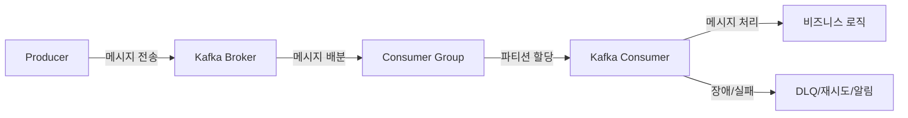

> 이 글은 Spring Boot 3와 Kotlin을 활용해 실무에서 안정적이고 효율적으로 Kafka Consumer를 구현하는 방법을 초보자도 따라할 수 있도록 단계별로 안내합니다.
> 실전 환경 구성, 설정, 예외처리, 테스트, 운영 노하우, 자주 묻는 질문, 참고자료까지 모두 담았습니다.

---

#### Kafka란 무엇인가?

- `Kafka`는 대용량의 데이터 스트림을 처리하기 위한 분산 메시지 브로커입니다.
- 실시간 로그 수집, 이벤트 처리, 데이터 파이프라인 등 다양한 분야에서 널리 사용됩니다.
- 프로듀서(Producer)가 메시지를 보내고, 컨슈머(Consumer)가 메시지를 받아 처리합니다.

#### Spring Boot 3 + Kotlin 환경에서 Kafka Consumer를 써야 하는 이유

- 비동기 메시지 기반 아키텍처로 서비스 확장성, 장애 격리, 데이터 처리 효율성 확보
- Spring Boot 3는 최신 Kafka 클라이언트와의 호환성, 간편한 설정, 강력한 의존성 관리 제공
- Kotlin은 간결한 문법, 널 안정성, 함수형 프로그래밍 지원으로 생산성 향상

---

#### 실전 환경 준비

- **필수 조건**: JDK 17+, Spring Boot 3.x, Kafka 브로커(로컬/클라우드), Gradle/Maven
- **주요 라이브러리**: `spring-kafka`, `kotlin`, `spring-boot-starter`

##### Gradle 의존성 예시

```kotlin
dependencies {
    implementation("org.springframework.boot:spring-boot-starter")
    implementation("org.springframework.kafka:spring-kafka")
    implementation("org.jetbrains.kotlin:kotlin-reflect")
    implementation("org.jetbrains.kotlin:kotlin-stdlib-jdk8")
    testImplementation("org.springframework.boot:spring-boot-starter-test")
    testImplementation("org.springframework.kafka:spring-kafka-test")
}
```

---

#### application.yml 기본 설정

```yaml
spring:
  kafka:
    bootstrap-servers: localhost:9092
    consumer:
      group-id: my-consumer-group
      auto-offset-reset: earliest
      key-deserializer: org.apache.kafka.common.serialization.StringDeserializer
      value-deserializer: org.apache.kafka.common.serialization.StringDeserializer
      enable-auto-commit: false
```

---

#### application.yml과 Kafka Consumer 설정 원리

Kafka와 Spring Boot 환경에서는 `application.yml` 파일을 통해 서비스 설정을 쉽고 명확하게 관리할 수 있습니다. YAML은 들여쓰기로 계층을 표현하며, 복잡한 설정도 가독성 높게 작성할 수 있어 실무에서 표준적으로 사용됩니다.

##### application.yml 예시 (Kafka Consumer)

```yaml
spring:
  kafka:
    bootstrap-servers: localhost:9092
    consumer:
      group-id: my-consumer-group
      auto-offset-reset: earliest
      key-deserializer: org.apache.kafka.common.serialization.StringDeserializer
      value-deserializer: org.apache.kafka.common.serialization.StringDeserializer
      enable-auto-commit: false
      max-poll-records: 100
      fetch-min-size: 1
    listener:
      ack-mode: manual
      concurrency: 3
```

- **주요 옵션 설명**

  | 옵션명 | 설명 | 실전 팁 |
  |---|---|---|
  | bootstrap-servers | Kafka 브로커 주소 | 여러 개 입력 시 장애 대응, 쉼표로 구분 |
  | group-id | 컨슈머 그룹명 | 서비스/기능별로 명확히 구분 |
  | auto-offset-reset | earliest/ latest | 신규 컨슈머의 시작 위치 결정 |
  | key/value-deserializer | 메시지 역직렬화 방식 | JSON, Avro 등 데이터 포맷에 따라 변경 |
  | enable-auto-commit | 오프셋 자동 커밋 | 실무에서는 false(수동 커밋) 권장 |
  | max-poll-records | 한 번에 가져올 메시지 수 | 대량 처리 시 튜닝 필요 |
  | ack-mode | Ack 방식(manual, record 등) | 정확한 메시지 처리 보장 |
  | concurrency | 컨슈머 스레드 수 | 파티션 수와 맞추면 성능 극대화 |

---

##### 실전 환경 분리 예시 (운영/테스트/로컬)

```yaml
# application-prod.yml
spring:
  kafka:
    bootstrap-servers: prod-kafka:9092
    consumer:
      group-id: prod-group

# application-test.yml
spring:
  kafka:
    bootstrap-servers: test-kafka:9092
    consumer:
      group-id: test-group
```
- 환경별로 별도 yml 파일을 두고, Spring Profile로 분리 관리

---

##### 실무에서 자주 하는 yaml 관련 실수와 해결법

- **들여쓰기 오류**: yaml은 공백/들여쓰기가 엄격, 탭 대신 스페이스 사용
- **환경별 설정 누락**: 운영/테스트/로컬 환경별로 설정 분리 필수
- **민감 정보 하드코딩**: 토큰/비밀번호 등은 환경변수 또는 별도 secret 파일 관리
- **옵션 오타**: 오타 시 무시되므로, 공식 문서 참고 및 IDE 자동완성 활용

---

##### 실전 대화 예시

| 상황 | 대화 | 결과 |
|---|---|---|
| 환경 분리 미흡 | "로컬에서만 되는 설정이 운영에 반영됐어요."<br>"application-prod.yml 별도 관리하고, profile 명확히 지정합시다." | 운영 장애 예방 |
| 들여쓰기 오류 | "Kafka 연결이 안 돼요."<br>"yml 들여쓰기 다시 확인해보세요. 탭 대신 스페이스만 사용해야 합니다." | 설정 오류 즉시 해결 |

---

##### yaml 설정 실전 체크리스트

- [ ] 환경별(application-prod.yml, application-test.yml 등)로 설정 분리
- [ ] 민감 정보는 환경변수/secret 관리로 분리
- [ ] 들여쓰기, 옵션명 오타 없는지 검토
- [ ] 주요 옵션(ack, concurrency, poll 등) 실무에 맞게 튜닝
- [ ] Spring Profile로 환경 전환 자동화

---

##### yaml 관련 FAQ

- **Q. yml과 properties 파일 차이점은?**
  - A. yml은 계층 구조, 가독성, 멀티 환경 분리에 강점. properties는 단일 키-값, 간단한 설정에 적합
- **Q. 운영/테스트 환경을 쉽게 전환하려면?**
  - A. Spring Profile을 활용해 profile별 yml 파일을 분리, 실행 시 `--spring.profiles.active=prod` 등으로 지정
- **Q. yaml 들여쓰기 오류 방지법?**
  - A. IDE(yaml 플러그인) 사용, 탭 대신 스페이스, GitHub Action 등으로 lint 자동화

---

#### Kafka Consumer 실무 구현 (Kotlin)

##### 1. Consumer Listener 클래스 작성

```kotlin
import org.apache.kafka.clients.consumer.ConsumerRecord
import org.springframework.kafka.annotation.KafkaListener
import org.springframework.stereotype.Component

@Component
class SampleKafkaConsumer {
    @KafkaListener(topics = ["sample-topic"], groupId = "my-consumer-group")
    fun consume(record: ConsumerRecord<String, String>) {
        println("[Kafka] 메시지 수신: ${record.value()}")
        // TODO: 비즈니스 로직 처리
    }
}
```

##### 2. Consumer 설정 커스터마이징 (Optional)

```kotlin
import org.springframework.context.annotation.Bean
import org.springframework.context.annotation.Configuration
import org.springframework.kafka.config.ConcurrentKafkaListenerContainerFactory
import org.springframework.kafka.core.ConsumerFactory

@Configuration
class KafkaConsumerConfig {
    @Bean
    fun kafkaListenerContainerFactory(consumerFactory: ConsumerFactory<String, String>): ConcurrentKafkaListenerContainerFactory<String, String> {
        val factory = ConcurrentKafkaListenerContainerFactory<String, String>()
        factory.consumerFactory = consumerFactory
        factory.setConcurrency(3) // 컨슈머 스레드 수
        factory.setErrorHandler { exception, data ->
            println("[Kafka] 에러 발생: $exception, 데이터: $data")
        }
        return factory
    }
}
```

---

#### 실무에서 자주 쓰는 Consumer 패턴

- **Batch Listener**: 여러 메시지를 한 번에 받아 처리
- **Manual Ack**: 메시지 처리 후 수동으로 커밋(정확한 처리 보장)
- **Retry/Dead Letter**: 처리 실패 시 재시도, DLQ로 이동
- **Tracing/Logging**: 메시지 추적, 장애 분석을 위한 로깅

##### Batch Listener 예시

```kotlin
@KafkaListener(topics = ["sample-topic"], containerFactory = "kafkaListenerContainerFactory")
fun consumeBatch(records: List<ConsumerRecord<String, String>>) {
    records.forEach { println("[Kafka] 배치 메시지: ${it.value()}") }
}
```

---

#### 예외처리와 장애 대응 전략

- 컨슈머 예외 발생 시 로그 기록 후, 재시도/스킵/알림 등 정책 선택
- Dead Letter Topic(DLT) 활용: 반복 실패 메시지는 별도 토픽으로 이동
- KafkaListener ErrorHandler, SeekToCurrentErrorHandler 등 활용

---

#### 테스트 코드 작성법

```kotlin
import org.junit.jupiter.api.Test
import org.springframework.beans.factory.annotation.Autowired
import org.springframework.boot.test.context.SpringBootTest
import org.springframework.kafka.test.context.EmbeddedKafka

@SpringBootTest
@EmbeddedKafka(partitions = 1, topics = ["sample-topic"])
class SampleKafkaConsumerTest {
    @Test
    fun testConsume() {
        // KafkaTemplate 등으로 메시지 전송 후 consume 메서드 동작 확인
    }
}
```

---

#### 실전 운영/배포 팁

- 컨슈머 그룹 스케일 아웃: 파티션 수와 컨슈머 수 조정
- 모니터링: Lag, 처리량, 에러율 등 Kafka Metrics, Grafana, Prometheus 활용
- 장애 대응: DLQ, 알림 시스템, 자동 재시작 스크립트 등 구축
- 설정/토픽/오프셋 관리 자동화

---

#### 실전 Q&A, 오해와 진실

- `Kafka는 메시지 유실이 없다?` → **오해!**: 예외/설정 실수로 유실 가능, 정확한 Ack/오프셋 관리 필요
- `컨슈머는 무조건 빠르게 처리해야 한다?` → **부분 오해!**: 처리 속도보다 신뢰성/안정성 우선, 병렬성/배치/재시도 전략 활용
- `Spring Boot만 쓰면 Kafka가 자동으로 안전하다?` → **오해!**: 설정/예외처리/운영 전략 직접 챙겨야 함

---

#### 결론 및 도움말

> Spring Boot 3 + Kotlin으로 Kafka Consumer를 구현하면 실무에서 확장성, 안정성, 생산성을 모두 잡을 수 있습니다. 공식 문서와 실전 예제, 모니터링/운영 자동화까지 적극 활용해보세요. 장애/오류/운영 경험을 쌓는 것이 가장 큰 성장 포인트입니다.

---

#### Kafka Consumer 실전 아키텍처와 구조



- Producer가 메시지를 Kafka Broker에 전송
- Broker는 파티션별로 메시지를 저장하고, Consumer Group에 분배
- Consumer는 파티션을 할당받아 메시지를 읽고, 비즈니스 로직 처리
- 장애/실패 메시지는 DLQ(Dead Letter Queue)로 이동하거나, 재시도/알림 처리

---

#### 실무 장애 사례와 해결 전략

| 사고 유형 | 원인 | 결과 | 해결책 |
|---|---|---|---|
| 메시지 유실 | Offset 자동 커밋, 예외 미처리 | 일부 데이터 손실 | 수동 커밋, 예외 핸들링, 재처리 로직 |
| 메시지 중복 처리 | 중복 소비, 재시도 로직 오류 | 데이터 중복, 부정확한 통계 | Idempotency, 중복방지 로직 |
| 컨슈머 다운 | OutOfMemory, 네트워크 장애 | 메시지 적체, 서비스 중단 | 모니터링, 자동 재시작, 알림 시스템 |
| DLQ 미구현 | 반복 실패 메시지 무한 재시도 | 장애 전파, 리소스 낭비 | DLQ, 알림, 장애 메시지 추적 |

---

#### Kafka 운영 자동화/모니터링/보안

- **운영 자동화**: 배포/설정/토픽 관리 스크립트화, CI/CD 연동, 오프셋 모니터링 자동화
- **모니터링**: Lag, 처리량, 에러율, 소비 속도 등 Grafana, Prometheus, JMX Exporter 활용
- **보안**: SASL 인증, ACL 권한 관리, TLS 암호화, 민감 정보 마스킹, 보안 로그 기록
- **장애 대응**: DLQ, 알림 시스템, 자동 재시작, 장애 메시지 대시보드 구축

##### 실전 운영 체크리스트

- [ ] Lag/오프셋/에러율 실시간 모니터링
- [ ] 장애 발생 시 알림/자동 재시작 체계 구축
- [ ] 토픽/파티션/컨슈머 그룹 구조 문서화
- [ ] 운영/배포 자동화 스크립트화
- [ ] 보안 설정(SASL, TLS, ACL) 적용

---

#### 실전 Q&A, 오해와 진실 (확장)

- `Kafka는 메시지 유실이 없다?` → **오해!**: 예외/설정 실수로 유실 가능, Ack/오프셋 관리 필요
- `컨슈머는 무조건 빠르게 처리해야 한다?` → **부분 오해!**: 처리 속도보다 신뢰성/안정성 우선, 병렬성/배치/재시도 전략 활용
- `Spring Boot만 쓰면 Kafka가 자동으로 안전하다?` → **오해!**: 설정/예외처리/운영 전략 직접 챙겨야 함
- `DLQ는 없어도 된다?` → **오해!**: 반복 실패 메시지는 반드시 분리/추적 필요
- `Kafka 운영은 어렵다?` → **부분 오해!**: 자동화/모니터링/문서화로 충분히 관리 가능

---

#### 실전 대화 예시: 장애 상황과 협업

| 상황 | 대화 | 결과 |
|---|---|---|
| 메시지 유실 | "왜 일부 주문이 누락됐죠?"<br>"컨슈머 예외 발생 시 자동 커밋되어 데이터가 유실됐습니다." | 수동 커밋, 예외처리 강화 필요 |
| 장애 메시지 | "DLQ가 없어서 장애 메시지가 계속 재시도됩니다."<br>"DLQ를 도입하고, 장애 메시지 추적 대시보드 구축합시다." | 장애 대응 체계 개선 |
| 운영 자동화 | "토픽/파티션 관리가 수동이라 실수 위험이 큽니다."<br>"운영 스크립트와 CI/CD로 자동화합시다." | 운영 효율/안정성 향상 |

---

#### Kafka Consumer 실무 협업/코드 리뷰 체크리스트

- [ ] 컨슈머/파티션 구조 설계가 명확히 문서화되어 있는가?
- [ ] 예외/장애 처리(DLQ, 재시도, 알림 등) 로직이 구현되어 있는가?
- [ ] 메시지 중복/유실/순서 보장 등 품질 이슈가 관리되고 있는가?
- [ ] 운영/배포/설정 자동화가 적용되어 있는가?
- [ ] 보안 설정 및 민감 정보 관리가 철저히 이루어지는가?
- [ ] 테스트 코드(EmbeddedKafka 등)로 실제 메시지 송수신이 검증되는가?
- [ ] 모니터링/알림/대시보드가 구축되어 있는가?
- [ ] 코드 리뷰/PR 체크리스트에 위 항목이 포함되어 있는가?

---

#### Kafka Consumer 실전 팁/FAQ (초보자 관점)

- **Q. 메시지 유실/중복 방지하려면?**
  - A. 수동 커밋, Idempotency, 재처리/재시도 정책, DLQ 활용
- **Q. 장애 발생 시 어떻게 대응하나요?**
  - A. 장애 메시지는 DLQ로 분리, 알림/대시보드로 추적, 자동 재시작/복구 체계 마련
- **Q. 운영 중 토픽/파티션 변경 가능?**
  - A. 가능하나, 파티션 수 변경 시 컨슈머 재시작/재할당 필요
- **Q. Kafka 보안은 어떻게 하나요?**
  - A. SASL 인증, TLS 암호화, ACL 권한 관리, 민감 정보 마스킹
- **Q. 실무에서 가장 많이 하는 실수는?**
  - A. 자동 커밋/예외 미처리로 메시지 유실, DLQ 미구현, 모니터링/문서화 부족
- **Q. 테스트/운영 환경 분리 방법은?**
  - A. 별도 Kafka 클러스터/토픽, 환경별 설정 분리, EmbeddedKafka 활용

---

#### Kafka Consumer 실전 배포/운영 자동화 전략

- CI/CD 파이프라인에 Kafka 관련 테스트/배포 자동화 포함
- 운영 스크립트로 토픽/파티션/오프셋 관리 자동화
- 장애 발생 시 자동 재시작/알림 시스템 연동
- 모니터링 대시보드(Grafana, Prometheus) 구축
- 문서화/운영 정책/장애 이력 체계적 관리

---

#### Kafka Consumer 실전 보안/품질 관리

- SASL, TLS, ACL 등 보안 정책 적용
- 민감 정보(토큰, 개인정보 등) 마스킹/암호화
- 메시지 유효성 검증, 중복/순서/유실 방지 로직 적용
- 운영/배포/테스트 환경 분리 및 접근 제어

---

#### 결론 및 도움말

> Kafka Consumer 실무에서는 장애/운영/보안/자동화/협업까지 모두 신경써야 합니다. 초보자도 실전 사례, 체크리스트, 자동화/모니터링 도구를 적극 활용하면 안정적이고 효율적인 메시지 처리가 가능합니다. 공식 문서와 다양한 실전 사례, 오픈소스 도구를 참고해 꾸준히 경험을 쌓아보세요.

---

#### 참고자료/레퍼런스

- [Spring for Apache Kafka 공식 문서](https://docs.spring.io/spring-kafka/docs/current/reference/html/)
- [Kotlin + Spring Boot Kafka 실전 예제](https://github.com/spring-projects/spring-kafka/tree/main/samples)
- [Kafka 공식 문서](https://kafka.apache.org/documentation/)
- [Kafka Streams와 실시간 처리](https://kafka.apache.org/documentation/streams/)
- [실전 Kafka 운영 노하우](https://engineering.linecorp.com/ko/blog/kafka-in-production/)
- [Kafka 보안 가이드](https://docs.confluent.io/platform/current/security/index.html)
- [Kafka Monitoring with Prometheus](https://prometheus.io/docs/guides/kafka/)
- [Kafka Dead Letter Queue 패턴](https://www.confluent.io/blog/kafka-connect-dead-letter-queue/)
