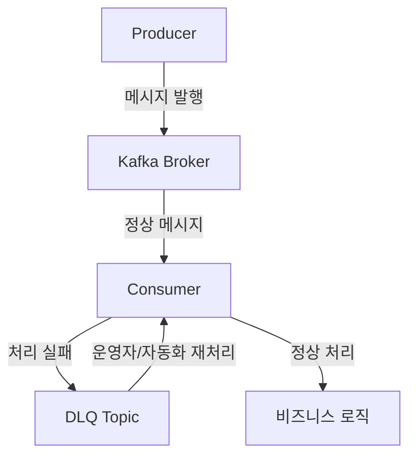
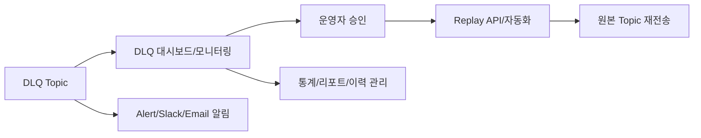

> 이 글은 Spring Boot 3와 Kotlin 환경에서 Kafka Dead Letter Queue(DLQ) 및 재처리 패턴을 실무적으로 구현하는 방법을 초보자도 쉽게 따라할 수 있도록 단계별로 안내합니다. DLQ의 개념, 필요성, Spring Kafka 설정, 실전 코드, 운영/모니터링/보안, 실수/FAQ, 체크리스트까지 모두 담았습니다.

---

#### DLQ(Dead Letter Queue)란 무엇인가?

- DLQ는 처리 실패 메시지를 별도 토픽에 저장해 유실/무한 재시도/장애 전파를 막는 안전장치입니다.
- 장애/예외/파싱 오류 등으로 정상 처리되지 못한 메시지를 추적, 재처리, 분석할 수 있습니다.
- 실무에서 대규모 메시지 시스템의 신뢰성과 장애 대응에 필수적인 패턴입니다.

#### 왜 Kafka에서 DLQ/재처리 패턴이 중요한가?

- 무한 재시도/메시지 적체/서비스 장애 예방
- 장애 메시지의 원인 분석 및 재처리 자동화
- 운영/모니터링/알림/보안 정책과의 연계
- 실무에서 자주 발생하는 실수(유실, 무한 루프, 장애 전파) 방지

---

#### 실전 환경 준비

- **필수 조건**: JDK 17+, Spring Boot 3.x, Kafka 브로커(로컬/클라우드), Gradle/Maven
- **주요 라이브러리**: `spring-kafka`, `kotlin`, `spring-boot-starter`

##### Gradle 의존성 예시

```kotlin
dependencies {
    implementation("org.springframework.boot:spring-boot-starter")
    implementation("org.springframework.kafka:spring-kafka")
    implementation("org.jetbrains.kotlin:kotlin-reflect")
    implementation("org.jetbrains.kotlin:kotlin-stdlib-jdk8")
    testImplementation("org.springframework.boot:spring-boot-starter-test")
    testImplementation("org.springframework.kafka:spring-kafka-test")
}
```

---

#### application.yml과 DLQ/재처리 설정 원리

```yaml
spring:
  kafka:
    bootstrap-servers: localhost:9092
    consumer:
      group-id: my-dlq-consumer
      auto-offset-reset: earliest
      enable-auto-commit: false
      max-poll-records: 100
    listener:
      ack-mode: manual
      concurrency: 2
    template:
      default-topic: my-dlq-topic
```

- **실전 팁**: DLQ 토픽은 `원본토픽명.dlq` 등 명확히 구분, 운영/테스트 환경별 분리 권장

---

#### Kafka DLQ/재처리 실전 구현 (Kotlin)

##### 1. 기본 DLQ Consumer/Producer 패턴

```kotlin
@Service
class MyKafkaConsumer(
    private val kafkaTemplate: KafkaTemplate<String, String>
) {
    @KafkaListener(topics = ["my-topic"], groupId = "my-dlq-consumer")
    fun consume(message: String, ack: Acknowledgment) {
        try {
            // 메시지 처리 로직
            process(message)
            ack.acknowledge()
        } catch (ex: Exception) {
            // 실패 메시지는 DLQ로 전송
            kafkaTemplate.send("my-topic.dlq", message)
            ack.acknowledge()
            println("[DLQ] 처리 실패: $message, 이유: ${ex.message}")
        }
    }
    fun process(message: String) {
        // 예시: 파싱/비즈니스 로직
        if (message.contains("error")) throw RuntimeException("파싱 실패")
    }
}
```

##### 2. Batch Listener + DLQ

```kotlin
@KafkaListener(topics = ["my-topic"], containerFactory = "batchFactory")
fun batchConsume(messages: List<String>, ack: Acknowledgment) {
    messages.forEach { message ->
        try {
            process(message)
        } catch (ex: Exception) {
            kafkaTemplate.send("my-topic.dlq", message)
        }
    }
    ack.acknowledge()
}
```

##### 3. DLQ 재처리(Replay) 예시

```kotlin
@Service
class DlqReplayService(
    private val kafkaTemplate: KafkaTemplate<String, String>
) {
    fun replay(dlqMessage: String) {
        kafkaTemplate.send("my-topic", dlqMessage)
        println("[DLQ] 재처리 발행: $dlqMessage")
    }
}
```

##### 4. DLQ/재처리 테스트 코드(EmbeddedKafka)

```kotlin
@SpringBootTest
@EmbeddedKafka(partitions = 1, topics = ["my-topic", "my-topic.dlq"])
class DlqTest {
    @Autowired lateinit var kafkaTemplate: KafkaTemplate<String, String>
    @Test
    fun testDlqSend() {
        kafkaTemplate.send("my-topic.dlq", "fail-message").get()
        // DLQ 메시지 수신/재처리 검증 코드 추가 가능
    }
}
```

---

#### DLQ/재처리 실전 운영/모니터링/보안 체크리스트

- [ ] DLQ 토픽/파티션/보존기간 별도 관리
- [ ] DLQ 메시지 적재/알림/대시보드 구축
- [ ] 재처리(Replay) 시 원인/이력/결과 추적
- [ ] DLQ/Replay API/운영 도구 자동화
- [ ] 장애/오류/유실/중복 방지 로직 적용
- [ ] 보안(ACL, 암호화, 민감 정보 마스킹) 준수
- [ ] 운영/테스트 환경 분리 및 문서화

---

#### 실전 Q&A, 오해와 진실, 장애 사례

- `DLQ면 무조건 안전하다?` → **오해!**: DLQ도 적재/보존/재처리 정책 없으면 유실/적체/보안 이슈
- `DLQ 메시지는 자동 재처리된다?` → **오해!**: 수동/자동 재처리 도구/API 별도 구현 필요
- `모든 장애 메시지를 DLQ로 보내면 된다?` → **부분 오해!**: 일시적 장애/영구 장애 구분, 재시도/알림/분석 병행 필요
- `DLQ 운영은 어렵다?` → **부분 오해!**: Spring Kafka, 운영 스크립트, 모니터링 도구 활용 시 충분히 자동화 가능

##### 장애/운영 실전 대화 예시

| 상황 | 대화 | 결과 |
|---|---|---|
| DLQ 적체 | "DLQ 메시지가 쌓여서 장애가 계속됩니다."<br>"DLQ 알림/대시보드와 주기적 재처리 자동화합시다." | 운영 효율/안정성 향상 |
| 재처리 실수 | "DLQ 메시지를 모두 재처리했더니 장애가 재발했어요."<br>"재처리 전 원인 분석, 단계별 재처리, 결과 추적 필수!" | 장애 재발 방지 |
| 보안/유실 | "DLQ에 개인정보가 노출됐어요."<br>"민감 정보 마스킹, ACL/암호화 정책 적용해야 합니다." | 보안 강화 |

---

#### Kafka DLQ/재처리 아키텍처와 구조



- Producer가 메시지를 발행하면 Consumer가 처리, 실패 시 DLQ Topic에 적재
- 운영자/자동화 도구가 DLQ 메시지를 분석/재처리, 장애 원인 추적 및 복구

---

#### DLQ/재처리 실전 장애/운영 사례와 해결 전략

| 사고 유형 | 원인 | 결과 | 해결책 |
|---|---|---|---|
| 메시지 무한 재시도 | 예외 미처리, DLQ 미구현 | 서비스 장애, 리소스 낭비 | DLQ, 재처리 정책 도입 |
| DLQ 적체 | 재처리/모니터링 부재 | 장애 메시지 누적, 운영 리스크 | 알림/대시보드, 자동화 재처리 |
| 개인정보 노출 | DLQ 보안 미적용 | 민감 정보 유출 | 마스킹, ACL, 암호화 적용 |
| 장애 메시지 유실 | DLQ 보존기간 미설정 | 장애 원인 추적 불가 | 보존기간/백업/문서화 |

---

#### DLQ/재처리 운영 자동화/모니터링/보안 실전 전략

- **운영 자동화**: DLQ 메시지 적재/재처리/알림 스크립트화, CI/CD 연동, 운영 정책 문서화
- **모니터링**: DLQ 적재량, 재처리 성공률, 장애 메시지 유형 등 Grafana, Prometheus, Alert 연동
- **보안**: DLQ 토픽 ACL, 민감 정보 마스킹, 전송 암호화, 접근 로그 기록
- **장애 대응**: DLQ 적체/유실/오류 알림, 재처리 자동화, 장애 이력 대시보드 구축

##### 실전 운영 체크리스트

- [ ] DLQ 토픽/파티션/보존기간 별도 관리
- [ ] DLQ 메시지 적재/알림/대시보드 구축
- [ ] 재처리(Replay) 시 원인/이력/결과 추적
- [ ] DLQ/Replay API/운영 도구 자동화
- [ ] 장애/오류/유실/중복 방지 로직 적용
- [ ] 보안(ACL, 암호화, 민감 정보 마스킹) 준수
- [ ] 운영/테스트 환경 분리 및 문서화
- [ ] 장애/운영/보안 정책 정기 점검

---

#### 실전 Q&A, 오해와 진실 (확장)

- `DLQ면 무조건 안전하다?` → **오해!**: DLQ도 적재/보존/재처리 정책 없으면 유실/적체/보안 이슈
- `DLQ 메시지는 자동 재처리된다?` → **오해!**: 수동/자동 재처리 도구/API 별도 구현 필요
- `모든 장애 메시지를 DLQ로 보내면 된다?` → **부분 오해!**: 일시적 장애/영구 장애 구분, 재시도/알림/분석 병행 필요
- `DLQ 운영은 어렵다?` → **부분 오해!**: Spring Kafka, 운영 스크립트, 모니터링 도구 활용 시 충분히 자동화 가능
- `DLQ는 운영자만 관리한다?` → **오해!**: 개발/운영/보안/QA 협업 필수

---

#### 실전 대화 예시: 장애 상황과 협업

| 상황 | 대화 | 결과 |
|---|---|---|
| DLQ 적체 | "DLQ 메시지가 쌓여서 장애가 계속됩니다."<br>"DLQ 알림/대시보드와 주기적 재처리 자동화합시다." | 운영 효율/안정성 향상 |
| 재처리 실수 | "DLQ 메시지를 모두 재처리했더니 장애가 재발했어요."<br>"재처리 전 원인 분석, 단계별 재처리, 결과 추적 필수!" | 장애 재발 방지 |
| 보안/유실 | "DLQ에 개인정보가 노출됐어요."<br>"민감 정보 마스킹, ACL/암호화 정책 적용해야 합니다." | 보안 강화 |
| 정책 미흡 | "DLQ 메시지 보존기간이 짧아 장애 원인을 못 찾았습니다."<br>"보존/백업/문서화 정책 강화합시다." | 운영 정책 개선 |

---

#### DLQ/재처리 실전 협업/코드 리뷰 체크리스트

- [ ] DLQ/Replay 구조 설계가 명확히 문서화되어 있는가?
- [ ] 장애/예외 처리(DLQ, 재시도, 알림 등) 로직이 구현되어 있는가?
- [ ] DLQ 토픽/파티션/보존/보안 정책이 적용되어 있는가?
- [ ] 운영/배포/설정 자동화가 적용되어 있는가?
- [ ] 민감 정보/보안 관리가 철저히 이루어지는가?
- [ ] 테스트 코드로 DLQ/Replay 시나리오가 검증되는가?
- [ ] 모니터링/알림/대시보드가 구축되어 있는가?
- [ ] 코드 리뷰/PR 체크리스트에 위 항목이 포함되어 있는가?

---

#### DLQ/재처리 실전 팁/FAQ (초보자 관점)

- **Q. DLQ/Replay 패턴을 꼭 도입해야 하나요?**
  - A. 장애/유실/운영 리스크 최소화를 위해 실무 필수
- **Q. DLQ 토픽은 어떻게 관리하나요?**
  - A. 원본 토픽명.dlq로 구분, 파티션/보존기간 별도 설정, 접근 권한 분리
- **Q. DLQ 메시지 재처리 시 주의점?**
  - A. 원인 분석, 단계별/부분 재처리, 결과 추적, 장애 재발 방지
- **Q. DLQ/Replay 자동화 방법은?**
  - A. Spring Batch, 운영 스크립트, API, 대시보드 등 활용
- **Q. 실무에서 가장 많이 하는 실수는?**
  - A. DLQ 미구현, 재처리/보존/보안 정책 부재, 모니터링 부족, 장애 메시지 일괄 재처리
- **Q. 운영/테스트 환경 분리 방법은?**
  - A. 별도 DLQ 토픽, 환경별 설정 분리, Spring Profile 활용

---

#### DLQ/재처리 실전 배포/운영 자동화 전략

- CI/CD 파이프라인에 DLQ/Replay 테스트/배포 자동화 포함
- 운영 스크립트로 DLQ 메시지 적재/재처리/알림 자동화
- 장애 발생 시 자동 알림/재처리/대시보드 연동
- 모니터링 대시보드(Grafana, Prometheus) 구축
- 문서화/운영 정책/장애 이력 체계적 관리

---

#### DLQ/재처리 실전 보안/품질 관리

- DLQ 토픽 ACL, 암호화, 접근 로그 등 보안 정책 적용
- 민감 정보(토큰, 개인정보 등) 마스킹/암호화
- 장애/재처리 메시지 유효성 검증, 중복/유실 방지 로직 적용
- 운영/배포/테스트 환경 분리 및 접근 제어

---

#### DLQ/재처리 실전 운영 정책 및 경험 공유

##### 1. 운영 정책 수립의 중요성
- DLQ/Replay 정책은 장애 예방뿐 아니라 장애 발생 시 빠른 복구와 재발 방지에 핵심입니다.
- 운영 정책에는 메시지 보존기간, 재처리 승인 프로세스, 장애 메시지 분석/이력 관리, 보안/감사 기준 등이 포함되어야 합니다.
- 실무에서는 운영자, 개발자, QA, 보안 담당자 등 여러 부서가 협업하여 정책을 수립/적용합니다.

##### 2. 실전 운영 경험과 교훈
- **DLQ 적체로 인한 장애 확산**: 운영팀이 DLQ 적재량 모니터링을 놓쳐 장애 메시지가 누적, 서비스 전체에 영향. → 알림/대시보드/자동화 재처리 도입 후 재발 방지
- **재처리 실수로 장애 재발**: 원인 분석 없이 일괄 재처리 시 장애가 반복. → 단계별 재처리, 영향도 분석, 결과 추적 프로세스 도입
- **보안 미흡으로 개인정보 노출**: DLQ에 암호화/마스킹 미적용, 개인정보 유출 사고. → 보안 정책 강화, 접근 제어, 로그 감사 강화
- **운영/테스트 환경 혼용**: 환경 분리 미흡으로 테스트 메시지가 운영에 유입. → Spring Profile, 별도 토픽, 접근 권한 분리로 해결

##### 3. DLQ/재처리 실전 자동화/품질 관리
- CI/CD 파이프라인에서 DLQ/Replay 테스트 자동화, 장애/유실/중복 방지 테스트 케이스 필수
- 운영 스크립트로 DLQ 메시지 적재, 알림, 재처리, 대시보드 연동 자동화
- 장애 발생 시 자동 알림, 재처리 이력 관리, 장애 유형별 분류/통계화
- 품질 관리: 장애/재처리 메시지 유효성 검증, 중복/유실 방지, 보안/품질 정책 정기 점검

##### 4. 실전 운영자/개발자 협업 대화 예시 (확장)

| 상황 | 운영자 | 개발자 | 결과 |
|---|---|---|---|
| DLQ 적체 | "DLQ 적재량이 급증합니다." | "재처리 자동화 스크립트 개선하겠습니다." | 장애 예방, 운영 효율화 |
| 장애 재발 | "동일 장애 메시지가 반복됩니다." | "원인 분석 후 단계별 재처리하겠습니다." | 장애 재발 방지 |
| 보안 이슈 | "DLQ 접근 로그에 이상 징후가 있습니다." | "ACL/암호화 정책 추가 적용하겠습니다." | 보안 강화 |
| 문서화 | "DLQ/Replay 정책 문서 최신화 필요합니다." | "운영 정책/이력 자동화 문서화하겠습니다." | 협업/지식 공유 강화 |

##### 5. DLQ/재처리 실전 아키텍처/운영 설계 팁
- 장애 메시지 유형별 별도 DLQ 토픽 설계(예: 파싱 오류, 외부 API 장애 등)
- 재처리 승인/알림/이력 관리 API/대시보드 구축
- 운영 정책/설정/이력 자동화 문서화, 운영자/개발자/QA/보안 협업 체계화
- 장애/유실/중복/보안 등 품질 목표와 KPI 수립, 정기 점검/리포트

##### 6. DLQ/재처리 실전 테스트/품질 관리 체크리스트
- [ ] DLQ/Replay 정상/이상 시나리오 테스트 케이스 작성/자동화
- [ ] 장애/유실/중복/보안 테스트 자동화
- [ ] 운영/배포/설정 변경 시 DLQ/Replay 영향도 분석/테스트
- [ ] 장애/재처리 이력/통계/리포트 정기 점검

##### 7. DLQ/재처리 실전 Q&A/운영자 관점 상세 설명
- **Q. DLQ/Replay 정책은 누가 관리하나요?**
  - A. 운영자/개발자/QA/보안 등 협업, 정책/문서/자동화로 관리
- **Q. 장애 메시지 일괄 재처리 시 주의점은?**
  - A. 원인 분석, 영향도 파악, 단계별/부분 재처리, 결과 추적 필수
- **Q. DLQ 메시지 보안/감사 기준은?**
  - A. 접근 로그, ACL, 암호화, 민감 정보 마스킹, 감사 정책 적용
- **Q. 운영 정책/문서화는 왜 중요한가요?**
  - A. 장애 대응/지식 공유/협업/품질 관리에 필수, 자동화/정기 점검 필요

---

#### DLQ/재처리 실전 운영 정책 및 경험 공유

##### 8. DLQ/재처리 실전 장애/운영 시나리오별 상세 사례

- **사례 1: 장애 메시지 유형별 분리 DLQ 설계**  
  실무에서는 파싱 오류, 외부 API 장애, 인증 실패 등 장애 유형별로 별도 DLQ 토픽을 운영. 장애 원인별 통계/분석/대응이 용이해지고, 재처리 정책도 유형별로 차등 적용 가능.

- **사례 2: 자동화 재처리와 승인 프로세스**  
  운영자가 DLQ 대시보드에서 장애 메시지 상태, 원인, 이력 확인 후 승인 시에만 재처리 자동화. 실수로 인한 장애 재발을 방지하고, 운영 책임 분산.

- **사례 3: 보안/감사 정책 강화**  
  DLQ 접근 로그, 메시지 암호화, 민감 정보 마스킹, 접근 권한 분리 등 보안/감사 정책을 강화하여 개인정보 유출, 내부 오남용, 외부 공격을 예방.

- **사례 4: 운영/테스트 환경 완전 분리**  
  Spring Profile, 별도 Kafka 클러스터, 접근 권한 분리로 운영/테스트 환경을 완전히 분리. 테스트 메시지 유입, 운영 데이터 유실 방지.

##### 9. DLQ/Replay 실전 자동화/모니터링 아키텍처 예시



- DLQ 메시지는 대시보드에서 모니터링, 운영자 승인 후 Replay API로 재처리, 이력/통계/알림 자동화

##### 10. DLQ/재처리 실전 품질/보안/운영 정책 상세 체크리스트

- [ ] 장애 유형별 DLQ 분리 설계 및 운영 정책 문서화
- [ ] DLQ/Replay 승인, 재처리, 이력 관리 프로세스 자동화
- [ ] DLQ 메시지 접근 로그, 암호화, 마스킹, 감사 정책 적용
- [ ] 운영/테스트/개발 환경 완전 분리 및 접근 권한 관리
- [ ] 장애/재처리 통계, KPI, 품질 목표 수립 및 정기 리포트
- [ ] 운영자/개발자/QA/보안 협업 체계 구축 및 정기 점검

##### 11. DLQ/재처리 실전 실수/FAQ/운영자 Q&A (확장)

- **Q. DLQ 메시지 자동 삭제 정책을 적용해도 되나요?**
  - A. 보존기간은 장애 분석/감사/법적 요구사항을 고려해 충분히 길게 설정, 자동 삭제 전 백업/이력 관리 필수
- **Q. 장애 메시지 일괄 재처리 시 재발 방지 방법은?**
  - A. 원인 분석, 영향도 파악, 단계별/부분 재처리, 결과 추적, 운영자 승인 프로세스 필수
- **Q. DLQ/Replay 자동화 시 주의점은?**
  - A. 승인/알림/이력 관리 자동화, 장애/유실/중복 방지 로직, 품질/보안 정책 점검
- **Q. DLQ 운영 정책/문서화의 실질적 효과는?**
  - A. 장애 대응력, 협업 효율, 품질/보안/감사 수준 향상, 신규 인력 온보딩/지식 공유에 결정적

##### 12. DLQ/재처리 실전 협업/운영자 관점 실무 대화 예시 (확장)

| 상황 | 운영자 | 개발자 | 보안 담당자 | 결과 |
|---|---|---|---|---|
| DLQ 적체 | "DLQ 적재량이 급증합니다." | "재처리 자동화 스크립트 개선하겠습니다." | "접근 로그/알림 연동하겠습니다." | 장애 예방, 협업 강화 |
| 장애 재발 | "동일 장애 메시지가 반복됩니다." | "원인 분석 후 단계별 재처리하겠습니다." | "감사 로그 점검하겠습니다." | 장애 재발 방지 |
| 보안 이슈 | "DLQ 접근 로그에 이상 징후가 있습니다." | "ACL/암호화 정책 추가 적용하겠습니다." | "민감 정보 마스킹 재점검하겠습니다." | 보안 강화 |
| 문서화 | "DLQ/Replay 정책 문서 최신화 필요합니다." | "운영 정책/이력 자동화 문서화하겠습니다." | "감사 정책도 반영하겠습니다." | 협업/지식 공유 강화 |
| 신규 온보딩 | "DLQ 운영 정책을 잘 모르겠습니다." | "문서/대시보드/자동화 교육 자료 공유하겠습니다." | "보안/감사 체크리스트도 전달하겠습니다." | 온보딩 효율화 |

##### 13. DLQ/재처리 실전 품질/보안/운영 자동화 전략 (확장)
- 장애 유형별 DLQ/Replay 자동화 스크립트, 대시보드, 알림, 승인/이력 관리 API 구축
- 장애/재처리 메시지 품질/유효성/중복/유실/보안 점검 자동화, 정기 리포트
- 운영 정책/문서화/교육/온보딩 자동화, 협업/감사/품질 관리 체계화

---

#### DLQ/재처리 실전 운영 정책 및 경험 공유

##### 14. DLQ/재처리 품질/감사/보안/교육/온보딩 실전 전략

- **품질 관리**: 장애/재처리 메시지 유효성, 중복/유실, 보안 점검 자동화. KPI(장애 복구 시간, DLQ 적재량, 재처리 성공률 등) 수립 및 정기 리포트.
- **감사/보안**: DLQ/Replay 접근 로그, 감사 정책, 민감 정보 마스킹/암호화, 접근 권한 분리, 외부/내부 감사 대응 프로세스 구축.
- **교육/온보딩**: 신규 인력 대상 DLQ/Replay 정책, 운영 자동화, 대시보드, 장애 복구 시나리오 교육. 실전 사례/문서/체크리스트/교육 자료 공유.
- **협업/지식 공유**: 운영자/개발자/QA/보안/신입 등 다양한 역할별 실전 경험, 장애/운영/보안/품질/자동화/교육/정책/문서화 등 지식 체계화.

##### 15. DLQ/재처리 실전 통계/리포트/운영 KPI 예시

| KPI 항목 | 설명 | 측정 방법 | 목표/관리 기준 |
|---|---|---|---|
| DLQ 적재량 | 장애 메시지 누적량 | 대시보드, 모니터링 | 임계치 초과 시 알림/조치 |
| 장애 복구 시간(MTTR) | 장애 발생~복구 소요시간 | 장애/재처리 이력 | SLA 준수, 단축 목표 |
| 재처리 성공률 | DLQ→정상 처리 비율 | 이력/통계 | 99% 이상 유지 |
| 보안 감사 이슈 | 접근/암호화/마스킹 감사 결과 | 감사 로그/리포트 | 이슈 0건 유지 |
| 온보딩/교육 이수율 | 신규 인력 교육/문서화 이수 | 교육 자료/이력 | 100% 목표 |

##### 16. DLQ/재처리 실전 장애 복구/운영 자동화 시나리오

- 장애 발생 → DLQ 적재 → 대시보드/알림 → 운영자 승인/분석 → 단계별/부분 재처리 → 결과 추적/리포트 → 정책/자동화 개선
- 장애 유형별 자동화 스크립트, 승인/이력 관리 API, 대시보드 연동, 알림/통계/리포트 자동화
- 장애 복구/운영 자동화 시나리오 문서화, 교육/온보딩 자료화, 정기 점검/리포트

##### 17. DLQ/재처리 실전 FAQ/운영자 Q&A (심화)

- **Q. DLQ/Replay 정책 없이 운영하면 어떤 문제가 발생하나요?**
  - A. 장애 메시지 유실/적체/재발, 보안/감사 이슈, 협업/온보딩 혼란 등 다양한 리스크 발생
- **Q. KPI/통계/리포트가 왜 중요한가요?**
  - A. 장애 예방/복구, 품질/보안/감사, 협업/교육/온보딩, 정책 개선 등 실무 전반에 필수
- **Q. DLQ/Replay 정책/자동화/문서화가 잘 된 조직의 특징은?**
  - A. 장애 대응력, 품질/보안/감사 수준, 협업/온보딩 효율, 운영 자동화/지식 공유 등 실무 경쟁력 우수
- **Q. 신입/운영자/개발자/보안 담당자별로 꼭 알아야 할 핵심은?**
  - A. 정책/자동화/보안/품질/교육/문서화/협업/운영 경험 등 역할별 실전 지식 습득

##### 18. DLQ/재처리 실전 운영자/신입/협업 대화 예시 (심화)

| 상황 | 운영자 | 개발자 | 보안 담당자 | 신입/QA | 결과 |
|---|---|---|---|---|---|
| 장애 복구 | "DLQ 적재량이 임계치 초과입니다." | "자동화 스크립트로 단계별 재처리하겠습니다." | "접근 로그/암호화 점검하겠습니다." | "이력/리포트 확인하겠습니다." | 장애 신속 복구, 협업 강화 |
| 품질/보안 점검 | "정기 감사/품질 점검 일정입니다." | "테스트/자동화 리포트 제출하겠습니다." | "마스킹/암호화 정책 점검하겠습니다." | "문서/교육 자료 최신화하겠습니다." | 품질/보안/교육 강화 |
| 온보딩/교육 | "신입 교육 일정 공유합니다." | "운영 정책/자동화 자료 전달하겠습니다." | "보안/감사 체크리스트 교육하겠습니다." | "실전 사례/FAQ 숙지하겠습니다." | 온보딩 효율/지식 공유 강화 |
| 통계/리포트 | "DLQ/Replay KPI 리포트 공유합니다." | "장애/재처리 통계 분석하겠습니다." | "감사/보안 이슈 점검하겠습니다." | "교육/문서화 이수 확인하겠습니다." | 운영 품질/협업/지식 관리 강화 |

---

#### 결론 및 도움말

> Kafka DLQ/재처리 패턴은 장애/유실/운영 리스크를 최소화하는 실전 핵심 전략입니다. Spring Boot 3 + Kotlin 환경에서 DLQ를 적극 도입하고, 자동화/모니터링/보안/재처리 정책까지 꼼꼼히 챙기면 초보자도 실무에서 신뢰성 높은 메시지 시스템을 구축할 수 있습니다. 공식 문서, 오픈소스 도구, 실전 사례를 참고해 경험을 쌓아보세요.

---

#### 참고자료/레퍼런스

- [Spring for Apache Kafka 공식 문서](https://docs.spring.io/spring-kafka/docs/current/reference/html/)
- [Kafka Dead Letter Pattern 공식 가이드](https://www.confluent.io/blog/kafka-connect-dead-letter-queue/)
- [실전 Kafka 운영 노하우](https://engineering.linecorp.com/ko/blog/kafka-in-production/)
- [Spring Kafka DLQ/재처리 예제](https://github.com/spring-projects/spring-kafka/tree/main/samples)
- [Kafka Streams와 실시간 처리](https://kafka.apache.org/documentation/streams/)
- [Kafka 보안 가이드](https://docs.confluent.io/platform/current/security/index.html)
- [Kafka Monitoring with Prometheus](https://prometheus.io/docs/guides/kafka/)
- [Kafka DLQ 운영 자동화 사례](https://medium.com/@linkedinengineering/kafka-dead-letter-queues-at-linkedin-1d2f3a3f)
