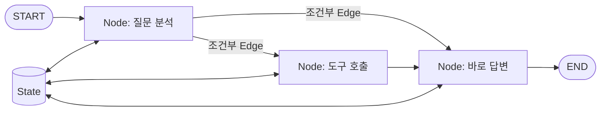

> LLM 애플리케이션의 흐름이 분기와 반복을 포함하기 시작하면 일반적인 함수 호출만으로는 상태와 실행 경로를 관리하기 어렵습니다.
> 이 글은 LangGraph의 핵심 용어를 `State`, `Node`, `Edge` 중심으로 연결하고, 짧은 Python 예제로 전체 동작을 설명합니다.
> 글을 읽고 나면 LangGraph가 필요한 상황과 그래프 코드를 읽는 기준을 잡을 수 있습니다.

## LangGraph란 무엇인가?

LangGraph는 장시간 실행되고 상태를 유지하는 에이전트 워크플로를 만들기 위한 저수준 오케스트레이션 프레임워크이자 런타임입니다. 이름에 `Graph`가 들어가는 이유는 작업을 **노드(Node)**로, 실행 순서를 **엣지(Edge)**로 표현하기 때문입니다. 여러 단계가 같은 **상태(State)**를 읽고 갱신하면서 그래프를 따라 실행됩니다.

LangGraph가 LLM이나 에이전트 그 자체인 것은 아닙니다. 어떤 모델을 호출할지, 도구를 언제 사용할지, 실패 후 어디서 재개할지 같은 실행 흐름을 구성하는 역할을 합니다. LangChain 없이도 사용할 수 있지만, LangChain의 모델과 도구 인터페이스를 함께 사용하면 연동이 편리합니다.

단순한 `질문 → 모델 호출 → 답변` 흐름이라면 일반 함수나 체인으로 충분합니다. 다음과 같이 실행 흐름 자체가 중요한 경우 LangGraph가 잘 맞습니다.

- 모델의 판단에 따라 다른 도구를 호출해야 한다.
- 결과가 충분할 때까지 같은 단계를 반복해야 한다.
- 사람의 승인을 받은 뒤 작업을 계속해야 한다.
- 장애가 발생해도 이전 단계부터 다시 시작하지 않고 재개해야 한다.
- 여러 에이전트 또는 하위 작업의 상태를 명시적으로 관리해야 한다.

## 먼저 보는 전체 구조

LangGraph의 가장 중요한 관계는 아래 한 장으로 정리할 수 있습니다.



`START`에서 실행이 시작되고 각 노드는 현재 상태를 입력으로 받습니다. 노드가 반환한 값은 상태에 반영되며, 엣지는 다음에 실행할 노드를 결정합니다. 실행이 `END`에 도달하면 한 번의 그래프 실행이 끝납니다.

## 반드시 알아야 할 핵심 용어

### State: 그래프가 공유하는 데이터

`State`는 그래프 실행 중 노드들이 공유하는 데이터 구조입니다. 대화 메시지, 사용자 입력, 도구 결과, 재시도 횟수처럼 다음 단계가 알아야 하는 값을 담습니다. Python에서는 주로 `TypedDict`, Pydantic 모델 또는 dataclass로 스키마를 정의합니다.

상태는 전역 변수와 다릅니다. 노드는 상태 객체를 직접 변경하기보다 **변경할 일부 값만 반환**하고, LangGraph가 기존 상태와 합칩니다. 따라서 상태에는 워크플로의 진행을 설명하는 값만 넣고, 데이터베이스 연결 객체처럼 실행 문맥과 무관한 의존성은 넣지 않는 편이 좋습니다.

```python
from typing import TypedDict


class SummaryState(TypedDict):
    text: str
    summary: str
```

상태를 설계할 때는 “이 값이 다음 노드의 판단 또는 실행 재개에 필요한가?”를 기준으로 삼으면 됩니다. 필요하지 않다면 일반 함수의 지역 변수로 두는 편이 단순합니다.

### Node: 실제 작업을 수행하는 함수

`Node`는 그래프의 한 단계를 수행하는 Python 함수입니다. 현재 상태를 입력으로 받아 모델 호출, 도구 실행, 데이터 변환 같은 작업을 수행하고 상태 업데이트를 반환합니다.

```python
def summarize(state: SummaryState) -> dict:
    short_text = state["text"][:100]
    return {"summary": short_text}
```

이 함수는 전체 상태가 아니라 변경할 `summary`만 반환합니다. 노드를 작게 유지하면 각 단계를 독립적으로 테스트하기 쉽고, 실행 로그에서 어느 단계가 실패했는지도 찾기 쉬워집니다.

### Edge: 다음 실행 위치를 연결하는 규칙

`Edge`는 노드 사이의 실행 순서를 정의합니다. 항상 같은 다음 단계로 이동하는 **일반 엣지**와, 현재 상태에 따라 경로를 선택하는 **조건부 엣지**가 있습니다.

```python
builder.add_edge("validate", "save")
builder.add_conditional_edges("route", choose_next)
```

조건부 엣지의 라우팅 함수는 상태를 읽고 다음 노드의 이름을 반환합니다. LLM이 직접 흐름을 지배하게 두기보다, 모델의 구조화된 결과를 상태에 저장하고 라우팅 함수가 그 값을 검증해 경로를 고르게 하면 흐름을 더 예측하기 쉽습니다.

### START와 END: 그래프의 경계

`START`는 사용자 입력이 처음 전달되는 가상 시작 노드이고, `END`는 실행 종료를 나타내는 가상 노드입니다. 두 값은 실제 작업 함수가 아니며 그래프의 진입점과 종료점을 명확하게 표시합니다.

모든 경로가 반드시 하나의 노드로 합쳐질 필요는 없습니다. 조건에 따라 여러 노드에서 `END`로 이동할 수 있습니다. 다만 종료 조건이 없는 반복 경로를 만들면 그래프가 계속 실행될 수 있으므로 반복에는 명확한 탈출 조건이 필요합니다.

### Reducer: 상태 업데이트를 합치는 규칙

여러 노드가 같은 상태 키를 갱신할 때는 기존 값과 새 값을 어떻게 합칠지 정해야 합니다. 이 규칙이 `Reducer`입니다. 리듀서를 지정하지 않은 키는 기본적으로 새 값이 기존 값을 덮어씁니다.

```python
import operator
from typing import Annotated, TypedDict


class AgentState(TypedDict):
    query: str
    logs: Annotated[list[str], operator.add]
```

위 상태에서 노드가 `{"logs": ["검색 완료"]}`를 반환하면 기존 목록을 교체하지 않고 뒤에 추가합니다. 채팅 메시지에는 단순한 리스트 덧셈보다 메시지 ID를 고려하는 `add_messages` 리듀서나 이를 포함한 `MessagesState`를 주로 사용합니다.

특히 병렬로 실행되는 노드가 같은 키를 갱신한다면 리듀서가 중요합니다. 합치는 규칙이 없으면 업데이트 충돌이 발생할 수 있으므로, 누적할 값과 덮어쓸 값을 상태 스키마에서 의도적으로 구분해야 합니다.

### StateGraph와 Compile: 설계도와 실행 객체

`StateGraph`는 상태 스키마를 기준으로 노드와 엣지를 등록하는 그래프 빌더입니다. 아직 실행 가능한 객체는 아니며, `compile()`을 호출해야 실제로 `invoke()`, `stream()` 등을 사용할 수 있는 컴파일된 그래프가 만들어집니다.

컴파일 과정에서는 시작점이나 존재하지 않는 노드로 향하는 엣지 같은 기본 구조를 검증합니다. 체크포인터와 같은 실행 옵션도 이 시점에 연결합니다. 즉, `StateGraph`는 설계도이고 컴파일된 그래프는 실행기라고 이해하면 됩니다.

## 상태를 저장하고 실행을 이어 가는 용어

### Checkpoint와 Checkpointer

`Checkpoint`는 특정 시점의 그래프 상태를 저장한 스냅샷입니다. LangGraph는 체크포인터를 사용해 각 실행 단계의 상태를 저장할 수 있습니다. 덕분에 실패 후 재개, 사람의 승인 대기, 이전 상태 조회, 시간 여행과 같은 기능을 구현할 수 있습니다.

개발 중에는 메모리 기반 체크포인터를 사용할 수 있지만, 프로세스가 종료되면 데이터가 사라집니다. 운영 환경에서는 애플리케이션의 저장성과 배포 구조에 맞는 데이터베이스 기반 체크포인터를 선택해야 합니다.

### Thread: 한 실행 흐름을 구분하는 식별자

`Thread`는 여러 체크포인트를 하나의 연속된 실행으로 묶는 논리적 식별자입니다. 채팅 서비스라면 대화방 또는 세션 하나와 비슷합니다. 같은 `thread_id`로 그래프를 다시 호출하면 체크포인터가 그 스레드의 상태를 찾아 이어서 사용할 수 있습니다.

```python
config = {"configurable": {"thread_id": "conversation-42"}}
result = graph.invoke({"text": "긴 문서 내용"}, config=config)
```

`thread_id`는 상태 내부의 사용자 ID와 역할이 다릅니다. 사용자 한 명이 여러 대화를 가질 수 있으므로 사용자, 대화, 실행을 같은 식별자로 뭉치지 않는 것이 좋습니다.

### Store: 스레드를 넘어 공유하는 장기 데이터

체크포인트가 특정 스레드의 실행 상태를 저장한다면 `Store`는 스레드 간에 공유할 장기 데이터를 저장합니다. 예를 들어 사용자 선호도나 여러 대화에서 재사용할 메모리를 Store에 둘 수 있습니다.

둘의 경계를 간단히 나누면 **현재 대화를 재개하는 데 필요한 값은 Checkpoint**, **다른 대화에서도 기억해야 하는 값은 Store**입니다. 모든 데이터를 상태에 넣으면 체크포인트가 불필요하게 커지고 데이터 수명 주기도 모호해집니다.

### Interrupt: 실행을 멈추고 외부 입력을 기다리는 기능

`Interrupt`는 노드 실행 중 그래프를 의도적으로 일시 정지하고 외부 입력을 기다리는 기능입니다. 결제 승인, 위험한 도구 실행 확인, 사람이 결과를 수정해야 하는 Human-in-the-loop 흐름에 사용합니다. 체크포인터가 현재 상태를 보존하므로 나중에 같은 스레드에서 실행을 재개할 수 있습니다.

중요한 점은 재개할 때 중단된 노드가 처음부터 다시 실행될 수 있다는 것입니다. `interrupt()`보다 앞에서 이메일 발송이나 결제처럼 중복 실행되면 안 되는 부수 효과를 수행하지 않도록 노드를 설계해야 합니다. 필요한 경우 부수 효과를 별도 노드로 분리하고 멱등성을 보장합니다.

## 최소 예제로 흐름 연결하기

아래 예제는 입력 길이에 따라 요약하거나 원문을 유지하는 작은 그래프입니다. 모델 호출 없이도 `State → Node → Edge → Compile → Invoke`의 관계를 확인할 수 있습니다.

```python
from typing import Literal, TypedDict

from langgraph.checkpoint.memory import InMemorySaver
from langgraph.graph import END, START, StateGraph


class DocumentState(TypedDict):
    text: str
    result: str


def summarize(state: DocumentState) -> dict:
    return {"result": state["text"][:40] + "..."}


def keep_original(state: DocumentState) -> dict:
    return {"result": state["text"]}


def route_by_length(
    state: DocumentState,
) -> Literal["summarize", "keep_original"]:
    if len(state["text"]) > 40:
        return "summarize"
    return "keep_original"


builder = StateGraph(DocumentState)
builder.add_node("summarize", summarize)
builder.add_node("keep_original", keep_original)

builder.add_conditional_edges(START, route_by_length)
builder.add_edge("summarize", END)
builder.add_edge("keep_original", END)

graph = builder.compile(checkpointer=InMemorySaver())

config = {"configurable": {"thread_id": "document-1"}}
result = graph.invoke(
    {"text": "LangGraph는 상태를 중심으로 여러 작업의 실행 흐름을 그래프로 구성합니다."},
    config=config,
)

print(result["result"])
```

실행 순서는 단순합니다. 입력이 초기 상태가 되고, `START`에 연결된 조건부 엣지가 글자 수를 검사합니다. 선택된 노드는 `result` 업데이트를 반환하고, 상태가 갱신된 뒤 `END`에서 실행이 종료됩니다. 체크포인터는 `document-1` 스레드의 실행 상태를 저장합니다.

실제 LLM 요약기로 확장하려면 `summarize` 노드 안에서 모델을 호출하면 됩니다. 그래프 구조는 그대로 두고 노드의 작업만 교체할 수 있다는 점이 그래프 기반 설계의 장점입니다.

## 다음 단계에서 만나는 용어

기본 구조를 이해한 뒤에는 아래 용어를 만나게 됩니다. 처음부터 모두 사용할 필요는 없습니다.

| 용어 | 역할 | 필요한 상황 |
|---|---|---|
| `Command` | 상태 업데이트와 다음 이동을 함께 표현 | 노드 내부에서 갱신과 라우팅을 동시에 결정할 때 |
| `Send` | 서로 다른 입력으로 노드를 동적 병렬 실행 | 항목 수가 실행 중 결정되는 map-reduce 흐름 |
| `Subgraph` | 큰 그래프 안에 포함되는 하위 그래프 | 기능별 상태와 흐름을 분리하거나 멀티 에이전트를 구성할 때 |
| `Stream` | 실행 중간의 상태·메시지·사용자 정의 데이터를 전달 | 토큰 스트리밍이나 진행 상황 표시가 필요할 때 |

이 기능들은 복잡한 흐름을 표현하는 도구입니다. 고정 엣지와 조건부 엣지만으로 충분한 그래프에 `Command`나 `Send`를 추가하면 오히려 실행 경로를 읽기 어려워질 수 있습니다.

## 자주 하는 오해와 주의사항

### 그래프를 쓰면 자동으로 좋은 에이전트가 되는가?

LangGraph는 실행 제어와 상태 관리를 도와주지만 프롬프트, 도구 설명, 모델 선택의 품질을 대신 해결하지 않습니다. 그래프 구조가 정확해도 모델 출력과 도구 자체가 불안정하면 결과는 불안정합니다. 모델의 판단 결과는 가능하면 구조화하고, 노드 경계에서 검증해야 합니다.

### 모든 값을 State에 넣어야 하는가?

아닙니다. 다음 단계, 재개, 관찰에 필요한 값만 상태로 관리하는 것이 좋습니다. 임시 계산 값이나 다시 만들기 쉬운 대용량 데이터까지 저장하면 체크포인트 크기와 저장 비용이 커집니다.

### Node와 Agent는 같은가?

노드는 단순한 Python 함수일 수도 있고, 모델과 도구를 사용하는 에이전트 전체일 수도 있습니다. 즉, 노드는 실행 단위이고 에이전트는 목표를 달성하기 위해 판단하고 행동하는 구성 요소입니다. 두 용어는 계층이 다릅니다.

### 무조건 LangGraph를 선택해야 하는가?

분기, 반복, 영속성, 사람의 개입이 필요하지 않은 짧은 작업에는 일반 함수가 더 읽기 쉽습니다. 흐름의 복잡성을 관리하기 위해 도입한 그래프가 작업 자체보다 복잡해진다면 아직 사용할 시점이 아닐 수 있습니다.

## 실무 적용 체크리스트

- 상태 키마다 덮어쓰기와 누적 중 어떤 업데이트가 필요한지 정했는가?
- 각 노드는 한 가지 책임을 가지며 독립적으로 테스트할 수 있는가?
- 조건부 엣지의 모든 경로와 종료 조건을 확인했는가?
- 운영용 체크포인터와 `thread_id` 생성 규칙을 정했는가?
- 재시도 또는 Interrupt 재개 시 부수 효과가 중복 실행되지 않는가?
- 장기 데이터와 실행 상태를 Store와 Checkpoint로 구분했는가?
- 그래프가 필요 없는 단순 흐름까지 노드로 쪼개지 않았는가?

이 체크리스트의 핵심은 그래프를 크게 만드는 것이 아니라 상태와 실행 경계를 명확하게 만드는 것입니다. 처음에는 최소한의 노드와 엣지로 시작하고, 실제 분기나 재개 요구가 생길 때 확장하는 편이 안전합니다.

## 결론 및 도움말

> LangGraph는 `State`를 노드들이 갱신하고 `Edge`가 다음 실행 위치를 결정하는 구조입니다. 여기에 `Reducer`가 상태 병합 규칙을, `Checkpoint`와 `Thread`가 실행 복구 단위를, `Interrupt`가 사람의 개입 지점을 제공합니다.
>
> 처음 학습할 때는 복잡한 멀티 에이전트보다 작은 조건부 그래프를 직접 만들고 상태 변화부터 관찰해 보세요. 이후 영속성과 중단·재개를 추가하면 각 용어가 필요한 이유를 자연스럽게 이해할 수 있습니다.

## 참고자료/레퍼런스

- [LangGraph 공식 문서: Overview](https://docs.langchain.com/oss/python/langgraph/overview)
- [LangGraph 공식 문서: Graph API](https://docs.langchain.com/oss/python/langgraph/graph-api)
- [LangGraph 공식 문서: Persistence](https://docs.langchain.com/oss/python/langgraph/persistence)
- [LangGraph 공식 문서: Interrupts](https://docs.langchain.com/oss/python/langgraph/interrupts)
