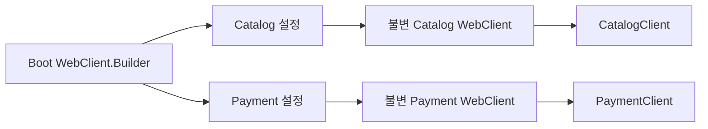

> WebClient 호출은 몇 줄이면 만들 수 있지만, timeout과 오류 분류가 빠지면 외부 API 장애가 내 서비스의 장애로 번지기 쉽습니다.
> 이 글은 2026년 6월 20일 기준 최신 안정판인 Spring Boot `4.1.0`에서 전용 starter, Kotlin 코루틴, 제한적 재시도와 테스트를 한 흐름으로 구성합니다.
> 글을 읽고 나면 새 외부 API 클라이언트를 만들 때 무엇을 기본값으로 두고, 무엇을 호출별로 결정해야 하는지 판단할 수 있습니다.

## 먼저 결론: 운영용 WebClient의 기본값

Spring WebClient는 논블로킹 방식으로 HTTP 요청을 보내고 응답을 `Mono`나 `Flux`로 다루는 클라이언트입니다. Spring WebFlux 서버에서 주로 사용하지만, Spring MVC 애플리케이션에서도 외부 API를 동시에 호출하거나 Kotlin 코루틴으로 비동기 흐름을 만들 때 사용할 수 있습니다.

운영 코드의 출발점은 `WebClient.create()`가 아닙니다. Spring Boot가 준비한 `WebClient.Builder`를 주입받아 외부 시스템별로 하나의 `WebClient`를 만들고, 주소와 timeout은 설정으로 분리해야 합니다. 상태 코드는 업무 의미가 있는 예외로 바꾸고, 재시도는 안전한 요청과 일시적 장애에만 제한합니다.

핵심 판단 기준을 먼저 표로 정리하면 다음과 같습니다.

| 관심사 | 권장 기본값 | 피해야 할 방식 |
|---|---|---|
| 의존성 | Boot 4.1의 `spring-boot-starter-webclient` | 클라이언트만 필요한데 전체 WebFlux 서버 starter 추가 |
| 생성 | 자동 구성된 `WebClient.Builder` 주입 | 호출마다 `WebClient.create()` |
| 범위 | 외부 시스템별 불변 `WebClient` | 하나의 가변 builder를 여러 설정에서 계속 변경 |
| 제한 시간 | connect와 read timeout 모두 설정 | 무제한 대기 또는 호출마다 임의의 `timeout()` 추가 |
| 오류 | 상태 코드와 응답 본문을 도메인 예외로 변환 | 모든 오류를 같은 예외로 처리 |
| 재시도 | 멱등 요청의 429·5xx·연결 오류만 소수 재시도 | 모든 4xx·POST를 무조건 재시도 |
| 관측 | Boot의 Observation과 Actuator 활용 | 토큰과 응답 본문 전체를 로그로 출력 |
| 테스트 | 실제 HTTP 경계의 상태·지연·재시도 검증 | WebClient 자체를 깊게 mocking |

이 원칙은 “리액티브 코드를 많이 쓰자”가 아니라 **외부 시스템의 느림과 실패를 내 서비스 안에서 제한하자**는 데 목적이 있습니다. WebClient를 선택하는 것만으로 장애 격리나 성능 향상이 자동으로 생기지는 않습니다.

## 예제 환경과 의존성

이 글의 예제는 Java 21, Kotlin 2.3.21, Spring Boot 4.1.0을 사용합니다. Boot 4 계열에서는 WebClient와 리액티브 HTTP Service Client에 필요한 기능을 모은 전용 starter를 사용할 수 있습니다.

아래 Gradle 설정은 WebClient, Kotlin 코루틴 연동, 운영 지표, 테스트에 필요한 최소 의존성을 보여 줍니다. Spring MVC 서버라면 기존 `spring-boot-starter-webmvc`를 유지한 채 `spring-boot-starter-webclient`만 추가하면 됩니다.

```kotlin
plugins {
    kotlin("jvm") version "2.3.21"
    kotlin("plugin.spring") version "2.3.21"
    id("org.springframework.boot") version "4.1.0"
    id("io.spring.dependency-management") version "1.1.7"
}

java {
    toolchain {
        languageVersion = JavaLanguageVersion.of(21)
    }
}

repositories {
    mavenCentral()
}

dependencies {
    implementation("org.springframework.boot:spring-boot-starter-webclient")
    implementation("org.springframework.boot:spring-boot-starter-actuator")
    implementation("org.jetbrains.kotlinx:kotlinx-coroutines-reactor")
    implementation("org.jetbrains.kotlin:kotlin-reflect")
    implementation("tools.jackson.module:jackson-module-kotlin")

    testImplementation("org.springframework.boot:spring-boot-starter-webclient-test")
    testImplementation("org.jetbrains.kotlin:kotlin-test-junit5")
    testImplementation("com.squareup.okhttp3:mockwebserver:5.4.0")
    testRuntimeOnly("org.junit.platform:junit-platform-launcher")
}

kotlin {
    compilerOptions {
        freeCompilerArgs.addAll(
            "-Xjsr305=strict",
            "-Xannotation-default-target=param-property",
        )
    }
}

tasks.withType<Test> {
    useJUnitPlatform()
}
```

Boot 3.x 예제에서 흔히 보이는 `spring-boot-starter-webflux`도 WebClient를 제공하지만 서버와 클라이언트 구현을 함께 포함합니다. Boot 4.1의 새 프로젝트에서 리액티브 서버가 필요하지 않다면 더 좁은 `spring-boot-starter-webclient`가 의도를 잘 드러냅니다.

## WebClient.Builder를 주입해야 하는 이유

Spring Boot는 prototype 범위의 `WebClient.Builder`를 자동 구성합니다. 이 builder에는 애플리케이션의 codec, HTTP 리소스, SSL, Micrometer Observation 같은 Boot 설정이 연결됩니다. `WebClient.create()`를 직접 호출하면 이런 자동 구성과 `WebClientCustomizer`가 적용되지 않습니다.

주의할 점은 builder가 가변 객체라는 사실입니다. 같은 builder를 계속 변경하면 그 뒤에 만들어지는 클라이언트에도 변경이 반영됩니다. 주입 지점에서 외부 시스템 하나를 위한 클라이언트를 한 번 만들거나, 여러 클라이언트를 같은 위치에서 만든다면 `clone()`으로 분리하는 편이 안전합니다.



외부 시스템별 클라이언트를 나누면 base URL, 인증, timeout, 오류 모델의 경계가 분명해집니다. 전역 설정은 모든 HTTP 호출에 정말 공통인 항목만 두고, 특정 파트너 API에만 필요한 헤더나 codec을 전역 customizer에 넣지 않는 것이 좋습니다.

## 주소와 timeout을 코드 밖으로 분리하기

외부 API 주소는 환경마다 달라지고, timeout은 서비스 수준 목표와 상대 시스템 특성에 따라 조정됩니다. 먼저 애플리케이션 설정에 주소와 HTTP 클라이언트의 공통 제한 시간을 선언합니다.

```yaml
clients:
  catalog:
    base-url: https://catalog.example.com
    max-in-memory-size: 1MB

spring:
  http:
    clients:
      connect-timeout: 1s
      read-timeout: 2s
      redirects: dont-follow
```

`connect-timeout`은 TCP 연결을 맺는 최대 시간이고, `read-timeout`은 연결 후 응답 데이터를 기다리는 시간을 제한합니다. 두 값은 서로 다른 실패를 막으므로 하나만 설정해서는 충분하지 않습니다. 위의 `1s`, `2s`는 예시이며, 실제 값은 호출 체인의 전체 응답 시간 예산보다 작게 잡고 지연 분포를 관찰해 결정해야 합니다.

Boot 4.1은 `spring.http.clients.*` 설정을 모든 지원 HTTP 클라이언트에 적용합니다. 외부 시스템마다 timeout이 크게 다르면 전역 값을 억지로 공유하지 말고 `ClientHttpConnectorBuilderCustomizer`나 시스템별 connector를 사용해야 합니다. 반대로 모든 클라이언트가 같은 기본값으로 충분하다면 낮은 수준의 Netty 설정을 직접 작성하지 않는 편이 단순합니다.

Catalog 전용 값은 타입 안전한 설정 객체로 받습니다.

```kotlin
package com.example.catalog

import org.springframework.boot.context.properties.ConfigurationProperties
import org.springframework.util.unit.DataSize
import java.net.URI

@ConfigurationProperties("clients.catalog")
data class CatalogClientProperties(
    val baseUrl: URI,
    val maxInMemorySize: DataSize = DataSize.ofMegabytes(1),
)
```

이제 Boot builder로 외부 시스템 전용 WebClient를 한 번 생성합니다. codec 메모리 제한은 큰 JSON 응답이 JVM 메모리를 예상보다 많이 점유하는 상황을 막습니다.

```kotlin
package com.example.catalog

import org.springframework.beans.factory.annotation.Qualifier
import org.springframework.boot.context.properties.EnableConfigurationProperties
import org.springframework.context.annotation.Bean
import org.springframework.context.annotation.Configuration
import org.springframework.http.HttpHeaders
import org.springframework.http.MediaType
import org.springframework.web.reactive.function.client.WebClient

@Configuration(proxyBeanMethods = false)
@EnableConfigurationProperties(CatalogClientProperties::class)
class CatalogClientConfiguration {

    @Bean
    @Qualifier("catalogWebClient")
    fun catalogWebClient(
        builder: WebClient.Builder,
        properties: CatalogClientProperties,
    ): WebClient = builder
        .baseUrl(properties.baseUrl.toString())
        .defaultHeader(HttpHeaders.ACCEPT, MediaType.APPLICATION_JSON_VALUE)
        .codecs { codecs ->
            codecs.defaultCodecs().maxInMemorySize(
                properties.maxInMemorySize.toBytes().toInt(),
            )
        }
        .build()
}
```

`WebClient`는 생성 후 불변이며 재사용하도록 설계되어 있습니다. 요청마다 새 인스턴스를 만들 필요가 없습니다. `max-in-memory-size`를 크게 올리는 것으로 대용량 파일 문제를 해결해서도 안 됩니다. 파일 다운로드나 긴 스트림은 전체 본문을 객체로 모으지 말고 `DataBuffer` 또는 스트리밍 방식으로 저장해야 합니다.

## 상태 코드를 업무 예외로 바꾸기

`retrieve()`는 본문을 꺼내는 가장 간단한 API입니다. 기본적으로 4xx와 5xx를 `WebClientResponseException`으로 바꾸지만, 호출하는 서비스가 이해할 수 있는 예외로 변환하면 상위 계층이 HTTP 세부사항에 덜 묶입니다.

예제 Catalog API는 `404`를 상품 없음으로, `429`와 `5xx`를 일시적 장애로 분류합니다. 나머지 4xx는 기본 예외로 남겨 잘못된 인증이나 요청 형식이 재시도로 가려지지 않게 합니다.

```kotlin
package com.example.catalog

data class ProductResponse(
    val id: Long,
    val name: String,
    val price: Long,
)

data class UpstreamError(
    val message: String,
)

class ProductNotFoundException(id: Long) :
    RuntimeException("Catalog product not found: $id")

class CatalogTemporaryException(
    val status: Int,
    message: String,
) : RuntimeException(message)
```

클라이언트 코드는 HTTP 호출, 상태 해석, 응답 변환까지만 담당합니다. 도메인 계산이나 데이터베이스 트랜잭션을 이 클래스 안에 섞지 않으면 실패 경계와 테스트가 단순해집니다.

```kotlin
package com.example.catalog

import kotlinx.coroutines.reactor.awaitSingle
import org.springframework.beans.factory.annotation.Qualifier
import org.springframework.http.HttpStatus
import org.springframework.stereotype.Component
import org.springframework.web.reactive.function.client.WebClient
import org.springframework.web.reactive.function.client.WebClientRequestException
import reactor.util.retry.Retry
import java.time.Duration

@Component
class CatalogClient(
    @Qualifier("catalogWebClient")
    private val webClient: WebClient,
) {

    suspend fun getProduct(id: Long): ProductResponse = webClient.get()
        .uri("/v1/products/{id}", id)
        .retrieve()
        .onStatus({ status -> status == HttpStatus.NOT_FOUND }) { response ->
            response.releaseBody()
                .thenReturn(ProductNotFoundException(id))
        }
        .onStatus(
            { status ->
                status == HttpStatus.TOO_MANY_REQUESTS ||
                    status.is5xxServerError
            },
        ) { response ->
            val status = response.statusCode().value()
            response.bodyToMono(UpstreamError::class.java)
                .defaultIfEmpty(UpstreamError("Catalog temporarily unavailable"))
                .map { body -> CatalogTemporaryException(status, body.message) }
        }
        .bodyToMono(ProductResponse::class.java)
        .retryWhen(retrySpec())
        .awaitSingle()

    private fun retrySpec(): Retry = Retry.backoff(
        2,
        Duration.ofMillis(100),
    )
        .maxBackoff(Duration.ofSeconds(1))
        .jitter(0.5)
        .filter { error ->
            error is CatalogTemporaryException ||
                error is WebClientRequestException
        }
        .onRetryExhaustedThrow { _, signal -> signal.failure() }
}
```

`response.releaseBody()`는 사용하지 않을 404 응답 본문을 소비해 연결이 정상적으로 반환되게 합니다. 오류 본문을 읽는 분기에서는 `bodyToMono`가 본문을 소비합니다. 응답 상태와 헤더를 함께 보고 서로 다른 본문 타입을 처리해야 한다면 `retrieve()`보다 `exchangeToMono()`가 알맞습니다. 이때는 모든 분기에서 응답 본문을 소비하거나 해제해야 합니다.

## 재시도는 실패를 숨기는 기능이 아니다

재시도는 순간적인 연결 실패나 짧은 5xx를 흡수할 수 있지만, 상대 시스템이 이미 과부하라면 요청 수를 더 늘립니다. 위 예제는 최초 요청 뒤 최대 두 번만 재시도하고, 지수 backoff와 jitter로 여러 인스턴스가 같은 순간에 다시 몰리는 현상을 줄입니다.

재시도 여부는 HTTP 메서드만 보고 결정하면 부족합니다.

- `GET`, `HEAD`처럼 멱등인 조회는 일시적 오류에 제한적으로 재시도할 수 있습니다.
- `POST` 결제나 주문 생성은 서버가 처리한 뒤 응답만 유실됐을 수 있습니다. idempotency key와 상대 API의 중복 처리 보장이 없다면 자동 재시도하지 않습니다.
- `400`, `401`, `403`, `404`는 같은 요청을 반복해도 대부분 성공하지 않습니다.
- `429`는 가능하면 `Retry-After` 헤더를 존중해야 합니다. 고정된 짧은 backoff로 무시하면 제한이 더 길어질 수 있습니다.
- 전체 호출 시간은 `요청 timeout × 시도 횟수 + backoff`까지 늘어날 수 있습니다. 상위 API의 시간 예산 안에 들어오는지 계산해야 합니다.

재시도만으로 지속 장애를 격리할 수는 없습니다. 트래픽이 크거나 외부 장애의 파급력이 큰 서비스는 bulkhead, circuit breaker, 동시 요청 제한을 함께 검토해야 합니다. 다만 그 기능을 모든 클라이언트에 미리 넣기보다 실제 장애 모델과 운영 요구가 있을 때 추가하는 편이 구성을 이해하기 쉽습니다.

## 인증과 로그에서 지켜야 할 경계

고정 API 키나 OAuth 토큰을 `defaultHeader`에 문자열로 박아 두면 회전이 어렵고 테스트나 로그에서 노출될 가능성이 커집니다. 비밀값은 환경 변수 자체보다 Secret Manager나 Vault 같은 비밀 저장소에서 가져오고, 만료되는 토큰은 요청 시점에 공급해야 합니다.

전역 filter는 모든 요청에 공통으로 필요한 인증이나 정책을 추가할 때 유용합니다. 하지만 요청·응답 본문 전체를 기록하는 filter는 개인정보, 세션, 토큰을 유출하고 본문 버퍼링으로 메모리 사용량까지 늘릴 수 있습니다. 운영 로그에는 다음 정도만 남기는 편이 안전합니다.

- 외부 시스템 이름과 HTTP 메서드
- 템플릿 형태의 경로
- 상태 코드와 소요 시간
- trace ID 또는 correlation ID
- 재시도 횟수와 최종 오류 종류

쿼리 문자열, `Authorization`, `Cookie`, 원문 응답은 기본적으로 제외합니다. 특정 장애를 위해 본문 로깅이 꼭 필요하다면 필드 마스킹, 크기 제한, 샘플링, 보관 기간을 함께 정해야 합니다.

## Actuator로 지연과 오류를 관찰하기

자동 구성된 `WebClient.Builder`를 사용하면 Spring의 Observation 지원을 유지할 수 있습니다. Actuator와 Micrometer registry를 연결하면 `http.client.requests` 계열 관측으로 외부 HTTP 호출의 시간과 결과를 볼 수 있습니다. 별도 filter에서 같은 타이머를 다시 만들면 지표가 중복될 수 있습니다.

운영 대시보드는 평균값보다 분포와 오류 비율을 봐야 합니다.

| 지표 | 확인할 질문 |
|---|---|
| p95·p99 지연 | 상대 API가 느려지는 구간이 언제인가? |
| 상태 코드 비율 | 4xx 계약 오류와 5xx 장애가 구분되는가? |
| timeout 수 | 상대 지연인지 내 timeout이 너무 짧은지 판단할 수 있는가? |
| 재시도 수 | 재시도가 복구에 기여하는가, 부하만 늘리는가? |
| 연결 풀 대기 | 호출량 대비 연결 자원이 부족한가? |

URI를 실제 상품 ID가 들어간 `/products/12345` 형태로 tag에 넣으면 시계열 수가 끝없이 늘어납니다. 가능한 한 `/products/{id}` 같은 낮은 cardinality의 템플릿을 사용하고, 사용자 ID나 주문 번호는 metric tag로 넣지 않습니다.

## MockWebServer로 HTTP 경계를 테스트하기

WebClient의 fluent API를 단계마다 mocking하면 구현 호출 순서에 묶인 취약한 테스트가 됩니다. 가벼운 로컬 HTTP 서버를 사용하면 실제 JSON 변환, 상태 코드 처리, 경로, 재시도를 한 번에 검증할 수 있습니다.

아래 테스트는 성공 응답을 변환하는지, 404는 재시도하지 않는지, 503은 두 번 재시도한 뒤 성공하는지를 확인합니다. 운영 코드의 `CatalogClient`를 그대로 사용하므로 리팩터링 뒤에도 외부 계약이 유지되는지 판단하기 쉽습니다.

```kotlin
package com.example.catalog

import kotlinx.coroutines.runBlocking
import okhttp3.mockwebserver.MockResponse
import okhttp3.mockwebserver.MockWebServer
import org.assertj.core.api.Assertions.assertThat
import org.assertj.core.api.Assertions.assertThatThrownBy
import org.junit.jupiter.api.AfterEach
import org.junit.jupiter.api.BeforeEach
import org.junit.jupiter.api.Test
import org.springframework.web.reactive.function.client.WebClient

class CatalogClientTest {

    private lateinit var server: MockWebServer
    private lateinit var client: CatalogClient

    @BeforeEach
    fun setUp() {
        server = MockWebServer()
        server.start()
        client = CatalogClient(
            WebClient.builder()
                .baseUrl(server.url("/").toString())
                .build(),
        )
    }

    @AfterEach
    fun tearDown() {
        server.shutdown()
    }

    @Test
    fun `상품 응답을 변환한다`() = runBlocking {
        server.enqueue(
            MockResponse()
                .setResponseCode(200)
                .setBody("""{"id":1,"name":"Keyboard","price":50000}""")
                .addHeader("Content-Type", "application/json"),
        )

        val product = client.getProduct(1)

        assertThat(product.name).isEqualTo("Keyboard")
        assertThat(server.takeRequest().path).isEqualTo("/v1/products/1")
    }

    @Test
    fun `404는 재시도하지 않는다`() {
        server.enqueue(MockResponse().setResponseCode(404))

        assertThatThrownBy {
            runBlocking { client.getProduct(99) }
        }.isInstanceOf(ProductNotFoundException::class.java)

        assertThat(server.requestCount).isEqualTo(1)
    }

    @Test
    fun `503은 두 번 재시도한 뒤 성공한다`() = runBlocking {
        repeat(2) {
            server.enqueue(
                MockResponse()
                    .setResponseCode(503)
                    .setBody("""{"message":"busy"}""")
                    .addHeader("Content-Type", "application/json"),
            )
        }
        server.enqueue(
            MockResponse()
                .setResponseCode(200)
                .setBody("""{"id":1,"name":"Keyboard","price":50000}""")
                .addHeader("Content-Type", "application/json"),
        )

        val product = client.getProduct(1)

        assertThat(product.id).isEqualTo(1)
        assertThat(server.requestCount).isEqualTo(3)
    }
}
```

MockWebServer 5의 `MockResponse` API를 사용한 예제입니다. 실제 프로젝트에서는 지연 응답으로 read timeout을 검증하고, 빈 오류 본문과 깨진 JSON, 429의 `Retry-After`, 연결 종료도 테스트 목록에 추가해야 합니다. 반면 모든 Reactor 연산자를 단위 테스트로 반복 확인할 필요는 없습니다. 우리 코드가 정의한 계약과 실패 정책에 집중하면 됩니다.

## WebFlux와 Spring MVC에서 block을 다르게 보자

WebClient는 논블로킹 클라이언트지만 마지막에 `.block()`을 호출하면 현재 스레드는 응답이 올 때까지 기다립니다. Spring WebFlux의 Netty event loop에서 `block()`을 호출하면 적은 수의 event loop가 멈춰 다른 요청까지 지연될 수 있으므로 사용하면 안 됩니다. `Mono`를 그대로 반환하거나 Kotlin의 `suspend` 함수와 `awaitSingle()`을 사용해야 합니다.

Spring MVC에서 `.block()`이 기술적으로 불가능한 것은 아닙니다. 다만 요청 스레드가 대기하므로 “WebClient를 썼으니 논블로킹이다”라고 볼 수 없습니다. 호출 흐름 전체가 동기식이고 병렬 조합이나 스트리밍이 필요 없다면 Boot가 권장하는 명령형 `RestClient`가 더 단순한 선택일 수 있습니다.

| 상황 | 우선 검토할 클라이언트 |
|---|---|
| WebFlux, Reactor 체인, 스트리밍 | `WebClient` |
| Kotlin 코루틴 기반 비동기 호출 | `WebClient` |
| Spring MVC의 단순 동기 호출 | `RestClient` |
| 여러 API를 동시에 호출하고 결과 조합 | `WebClient` 또는 코루틴 |
| 인터페이스로 HTTP 계약 선언 | HTTP Service Client |

최신 버전이라고 해서 모든 코드에 WebClient가 정답은 아닙니다. 호출 모델이 명령형이면 명령형 클라이언트를 선택하는 것이 코드와 실행 방식의 차이를 줄입니다.

## 자주 하는 실수와 주의사항

### 호출할 때마다 WebClient를 새로 만든다

클라이언트 인스턴스를 매번 만들면 공통 설정을 빠뜨리기 쉽고 테스트도 어려워집니다. 외부 시스템별 Bean을 한 번 만들고 재사용합니다. 단, 서로 다른 인증과 timeout을 하나의 “만능 클라이언트”에 조건문으로 넣지는 않습니다.

### `.timeout()` 하나로 모든 timeout을 해결한다

Reactor의 `timeout()`은 전체 publisher에 시간 제한을 거는 연산자이고 HTTP 연결 단계별 timeout과 의미가 다릅니다. connect와 read timeout을 HTTP 클라이언트 수준에서 먼저 설정하고, 전체 업무 시간 예산이 별도로 필요할 때만 Reactor timeout을 추가합니다. 겹치는 제한 시간이 어떤 예외를 만드는지도 테스트해야 합니다.

### 모든 오류를 `onErrorResume`으로 빈 값으로 바꾼다

빈 값은 “상품이 없음”과 “Catalog가 장애 중”을 구분하지 못하게 만듭니다. 복구 가능한 대체값이 업무적으로 정의된 경우에만 fallback을 사용하고, 그 사실을 metric이나 로그로 관찰할 수 있어야 합니다.

### 트랜잭션을 연 채 외부 API를 기다린다

데이터베이스 트랜잭션 안에서 느린 HTTP 호출을 기다리면 연결과 lock 보유 시간이 길어집니다. 가능한 한 외부 호출은 트랜잭션 밖에서 수행하고, 꼭 함께 처리해야 한다면 순서와 보상 전략을 명시합니다. WebClient의 논블로킹 특성이 데이터베이스 트랜잭션의 lock을 줄여 주지는 않습니다.

### 큰 응답 때문에 메모리 제한만 계속 올린다

기본 codec 제한은 실수로 거대한 본문을 한 번에 버퍼링하는 것을 막는 안전장치입니다. 기대 응답 크기를 계약으로 정하고 조금의 여유만 둡니다. 파일과 대규모 목록은 pagination이나 streaming API로 바꾸는 것이 먼저입니다.

## 배포 전 체크리스트

- 외부 시스템마다 base URL과 클라이언트 경계가 분리되어 있는가?
- Boot가 자동 구성한 `WebClient.Builder`를 사용하는가?
- connect와 read timeout이 상위 요청의 시간 예산 안에 있는가?
- 4xx, 429, 5xx, 연결 오류가 서로 다른 정책으로 처리되는가?
- 재시도 대상 요청이 멱등하거나 idempotency key로 보호되는가?
- 최대 시도 횟수와 backoff를 포함한 최악의 응답 시간을 계산했는가?
- 오류 응답 본문을 소비하거나 해제하는가?
- 토큰, 쿠키, 개인정보가 로그와 metric tag에 들어가지 않는가?
- 성공, 404, 429·5xx, timeout, 깨진 응답을 HTTP 경계에서 테스트했는가?
- p95·p99 지연, 상태 코드, timeout과 재시도를 운영에서 볼 수 있는가?

체크리스트의 목적은 설정 항목을 많이 만드는 것이 아닙니다. 외부 장애가 발생했을 때 **얼마나 기다리고, 무엇을 다시 시도하며, 어떤 신호로 문제를 발견할지** 코드와 운영 화면에서 같은 답을 갖게 하는 것입니다.

## 결론 및 도움말

> Spring Boot 4.1의 WebClient 모범 사례는 전용 starter와 자동 구성된 builder에서 시작합니다. 외부 시스템별 불변 클라이언트, 명시적인 connect·read timeout, 상태 코드별 예외, 멱등 요청에 한정한 backoff 재시도를 기본 경계로 삼으세요.
>
> WebClient 자체보다 중요한 것은 실패 정책과 관측 가능성입니다. 단순 동기 호출이라면 RestClient가 더 솔직한 선택일 수 있고, WebClient를 선택했다면 `.block()`으로 실행 모델을 흐리지 말고 테스트와 지표로 느림·오류·재시도의 결과를 확인해야 합니다.

## 참고자료/레퍼런스

- [Spring Boot 4.1.0 릴리스](https://github.com/spring-projects/spring-boot/releases/tag/v4.1.0)
- [Spring Boot 4.1 REST 서비스 호출 문서](https://docs.spring.io/spring-boot/4.1/reference/io/rest-client.html)
- [Spring Boot 공통 HTTP 클라이언트 설정](https://docs.spring.io/spring-boot/4.1/appendix/application-properties/index.html#application-properties.web.spring.http.clients.connect-timeout)
- [Spring Framework WebClient 문서](https://docs.spring.io/spring-framework/reference/web/webflux-webclient.html)
- [Spring Framework WebClient 설정과 timeout](https://docs.spring.io/spring-framework/reference/web/webflux-webclient/client-builder.html)
- [Spring Framework retrieve와 상태 코드 처리](https://docs.spring.io/spring-framework/reference/web/webflux-webclient/client-retrieve.html)
- [Spring Framework exchangeToMono 사용법](https://docs.spring.io/spring-framework/reference/web/webflux-webclient/client-exchange.html)
- [Reactor 오류 처리 문서](https://projectreactor.io/docs/core/release/reference/coreFeatures/error-handling.html)
