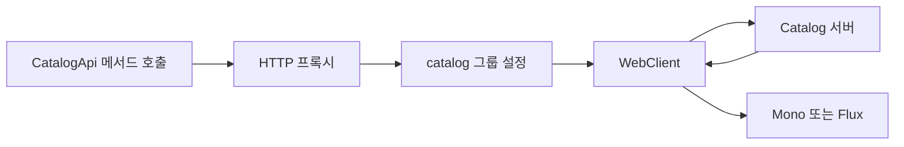

> 외부 API마다 반복되는 WebClient 호출 코드는 URL과 HTTP 계약을 알아보기 어렵게 만들고 테스트도 구현 세부사항에 묶이게 합니다.
> 이 글은 2026년 6월 20일 기준 최신 안정판인 Spring Boot `4.1.0`에서 HTTP Interface를 WebClient 기반 프록시로 등록하는 방법을 Java 예제로 설명합니다.
> 글을 읽고 나면 선언형 인터페이스가 적합한 상황, 그룹별 설정과 오류 정책을 붙이는 방법, 실제 HTTP 경계를 검증하는 방법을 판단할 수 있습니다.

## 먼저 결론: HTTP Interface는 HTTP 계약을 Java 인터페이스로 옮긴다

Spring HTTP Interface는 `@HttpExchange`와 `@GetExchange`, `@PostExchange` 같은 어노테이션으로 원격 HTTP API를 선언하는 기능입니다. 개발자는 `WebClient.get().uri(...).retrieve()`를 호출마다 작성하는 대신, 입력과 출력이 드러나는 Java 메서드를 호출합니다. 실제 요청 생성과 응답 변환은 런타임에 만들어진 프록시가 담당합니다.

Spring Framework에도 `HttpServiceProxyFactory`로 프록시를 직접 만드는 기능이 있습니다. Spring Boot 4는 여기에 인터페이스 탐색, Bean 등록, 논리 그룹, base URL, timeout, SSL 설정을 자동으로 연결합니다. 단, `@ImportHttpServices`의 기본 클라이언트는 RestClient이므로 WebClient 기반으로 실행하려면 `clientType`을 명시해야 합니다.

두 방식의 차이를 먼저 보면 역할이 선명해집니다.

| 구분 | WebClient 직접 사용 | HTTP Interface 사용 |
|---|---|---|
| 계약 위치 | fluent 호출 코드 안 | Java 인터페이스와 메서드 |
| 반복 코드 | URI·헤더·본문 변환을 호출마다 작성 | 공통 경로와 미디어 타입을 어노테이션으로 선언 |
| 동적 제어 | 상태와 요청을 자유롭게 분기 | 정해진 API 계약에 유리 |
| 테스트 초점 | WebClient 호출 구현 | 인터페이스가 만드는 실제 HTTP 요청 |
| 적합한 상황 | 응답별 복잡한 분기, 동적 요청 조립 | 안정된 사내·파트너 REST API |

HTTP Interface는 WebClient를 없애는 기능이 아닙니다. **WebClient 위에 타입이 있는 계약을 올리는 방식**입니다. 따라서 연결 timeout, codec, Observation 같은 WebClient의 실행 특성은 그대로 중요합니다.

## 예제 환경과 의존성

예제는 Java 21, Spring Boot 4.1.0, Gradle Kotlin DSL을 사용합니다. Spring Boot 4의 `spring-boot-starter-webclient`는 WebClient와 WebClient 기반 HTTP Service Client에 필요한 모듈을 제공합니다.

아래 설정은 애플리케이션 코드, Actuator 관측, HTTP 경계 테스트에 필요한 의존성입니다.

```kotlin
plugins {
    java
    id("org.springframework.boot") version "4.1.0"
    id("io.spring.dependency-management") version "1.1.7"
}

group = "com.example"
version = "0.0.1-SNAPSHOT"

java {
    toolchain {
        languageVersion = JavaLanguageVersion.of(21)
    }
}

repositories {
    mavenCentral()
}

dependencies {
    implementation("org.springframework.boot:spring-boot-starter-webclient")
    implementation("org.springframework.boot:spring-boot-starter-actuator")

    testImplementation("org.springframework.boot:spring-boot-starter-webclient-test")
    testImplementation("com.squareup.okhttp3:mockwebserver:5.4.0")
    testRuntimeOnly("org.junit.platform:junit-platform-launcher")
}

tasks.withType<Test> {
    useJUnitPlatform()
}
```

Spring MVC 서버에서 이 클라이언트를 사용한다면 기존 `spring-boot-starter-webmvc`와 함께 둘 수 있습니다. 클라이언트 때문에 `spring-boot-starter-webflux` 전체를 추가할 필요는 없습니다. 반대로 서버도 WebFlux라면 서버 starter가 이미 필요한 리액티브 기반을 제공합니다.

## 1단계: 외부 API 계약을 인터페이스로 선언하기

예제에서는 Catalog API의 상품 조회, 검색, 생성을 선언합니다. 타입 수준의 `@HttpExchange`에는 공통 경로와 응답 미디어 타입을 두고, 각 메서드에는 HTTP 메서드와 세부 경로만 적습니다.

먼저 요청과 응답 전용 DTO(Data Transfer Object)를 record로 만듭니다.

```java
package com.example.catalog;

public record ProductResponse(
        long id,
        String name,
        long price
) {
}
```

```java
package com.example.catalog;

public record CreateProductRequest(
        String name,
        long price
) {
}
```

이 타입은 외부 API의 JSON 계약을 표현합니다. 내부 도메인 엔티티나 JPA 엔티티를 응답 타입으로 바로 재사용하면 상대 API 필드 변경이 내부 모델까지 번지므로 경계 타입을 분리하는 편이 안전합니다.

이제 HTTP Interface를 선언합니다.

```java
package com.example.catalog;

import org.springframework.http.MediaType;
import org.springframework.web.bind.annotation.PathVariable;
import org.springframework.web.bind.annotation.RequestBody;
import org.springframework.web.bind.annotation.RequestHeader;
import org.springframework.web.bind.annotation.RequestParam;
import org.springframework.web.service.annotation.GetExchange;
import org.springframework.web.service.annotation.HttpExchange;
import org.springframework.web.service.annotation.PostExchange;
import reactor.core.publisher.Flux;
import reactor.core.publisher.Mono;

@HttpExchange(
        url = "/v1/products",
        accept = MediaType.APPLICATION_JSON_VALUE
)
public interface CatalogApi {

    @GetExchange("/{id}")
    Mono<ProductResponse> findById(@PathVariable long id);

    @GetExchange
    Flux<ProductResponse> search(@RequestParam String keyword);

    @PostExchange(contentType = MediaType.APPLICATION_JSON_VALUE)
    Mono<ProductResponse> create(
            @RequestHeader("Idempotency-Key") String idempotencyKey,
            @RequestBody CreateProductRequest request
    );
}
```

`@PathVariable`, `@RequestParam`, `@RequestHeader`, `@RequestBody`는 Spring MVC 컨트롤러에서 보던 어노테이션이지만 여기서는 클라이언트 요청을 만드는 데 사용됩니다. 반환 타입이 `Mono`와 `Flux`이므로 호출 시점에는 요청이 즉시 실행되지 않고, 구독될 때 WebClient가 네트워크 요청을 보냅니다.

생성 API에는 `Idempotency-Key`를 명시했습니다. POST를 재시도할 가능성이 있다면 같은 키의 중복 요청을 상대 시스템이 한 번의 처리로 보장하는지 계약으로 확인해야 합니다. 키를 붙이는 것만으로 멱등성이 자동으로 생기지는 않습니다.

## 2단계: @ImportHttpServices로 프록시 Bean 등록하기

인터페이스만 선언해서는 Spring Bean이 되지 않습니다. `@ImportHttpServices`로 가져오면 Spring이 인터페이스를 탐색하고 프록시를 Bean으로 등록합니다.

아래 애플리케이션은 `CatalogApi`를 `catalog` 그룹에 넣습니다.

```java
package com.example;

import com.example.catalog.CatalogApi;
import org.springframework.boot.SpringApplication;
import org.springframework.boot.autoconfigure.SpringBootApplication;
import org.springframework.web.service.registry.HttpServiceGroup;
import org.springframework.web.service.registry.ImportHttpServices;

@SpringBootApplication
@ImportHttpServices(
        group = "catalog",
        types = CatalogApi.class,
        clientType = HttpServiceGroup.ClientType.WEB_CLIENT
)
public class HttpInterfaceApplication {

    public static void main(String[] args) {
        SpringApplication.run(HttpInterfaceApplication.class, args);
    }
}
```

`clientType = WEB_CLIENT`가 이 그룹의 프록시를 WebClient로 만듭니다. 이를 생략하면 기본값인 RestClient가 선택되므로 `Mono`·`Flux` 계약과 실행 방식이 맞지 않습니다. WebClient starter를 추가한 사실만으로 그룹의 기본 클라이언트가 자동 전환되지는 않습니다.

인터페이스가 많으면 `types` 대신 `basePackages`나 `basePackageClasses`로 패키지를 탐색할 수 있습니다. 하지만 하나의 패키지에 서로 다른 외부 시스템의 인터페이스를 섞어 두면 같은 그룹으로 잘못 등록하기 쉽습니다. 외부 시스템별 패키지를 나누거나, 그룹 경계가 중요할 때는 타입을 명시하는 편이 읽기 쉽습니다.

그룹은 같은 HTTP 설정과 같은 `HttpServiceProxyFactory`를 공유하는 인터페이스 묶음입니다. 일반적으로 호스트 하나당 그룹 하나가 자연스럽지만, 같은 호스트라도 인증이나 SSL 정책이 다르면 별도 그룹으로 나눌 수 있습니다.



프록시는 인터페이스 어노테이션에서 경로와 헤더를 읽고, `catalog` 그룹의 WebClient로 요청합니다. 응답은 codec을 거쳐 DTO로 변환되며 호출자는 WebClient의 fluent API가 아니라 Java 메서드만 봅니다.

## 3단계: 그룹별 주소와 timeout 설정하기

운영 주소를 `@HttpExchange`에 직접 쓰면 개발·테스트·운영 환경을 바꾸기 어렵습니다. 인터페이스에는 상대 경로만 두고 `spring.http.serviceclient.<group>`에 실제 주소와 제한 시간을 선언합니다.

```yaml
spring:
  http:
    serviceclient:
      catalog:
        base-url: https://catalog.example.com
        connect-timeout: 1s
        read-timeout: 2s
        default-header:
          X-Client-Name: order-service
```

`catalog`은 `@ImportHttpServices`의 `group` 값과 정확히 같아야 합니다. `connect-timeout`은 연결을 맺는 시간, `read-timeout`은 연결 후 응답을 기다리는 시간을 제한합니다. 위 숫자는 예제이므로 실제 서비스에서는 상위 요청의 전체 시간 예산과 상대 API의 지연 분포를 보고 정해야 합니다.

`default-header`에는 클라이언트 이름이나 고정된 API 버전처럼 노출되어도 되는 값만 둡니다. 액세스 토큰이나 API 키를 설정 파일에 평문으로 넣지 말고, 비밀 저장소와 토큰 공급자를 통해 요청 시점에 추가해야 합니다.

모든 HTTP 클라이언트가 같은 기본 timeout을 사용한다면 `spring.http.clients.connect-timeout`과 `spring.http.clients.read-timeout`을 전역 기본값으로 둘 수 있습니다. 그룹 설정은 전역값을 덮어쓰므로 상대 시스템마다 다른 시간 예산도 표현할 수 있습니다.

## 4단계: WebClient 그룹에 오류 정책 붙이기

기본 동작에서는 4xx와 5xx 응답이 `WebClientResponseException` 계열 오류가 됩니다. 호출자가 Catalog의 404를 업무적인 “상품 없음”으로 구분해야 한다면 WebClient 그룹에 기본 상태 처리기를 추가할 수 있습니다.

먼저 경계에서 사용할 예외를 정의합니다.

```java
package com.example.catalog;

public class ProductNotFoundException extends RuntimeException {

    public ProductNotFoundException() {
        super("Catalog product was not found");
    }
}
```

`WebClientHttpServiceGroupConfigurer`는 WebClient 기반 그룹의 builder를 그룹별로 조정합니다. 아래 설정은 `catalog`에만 404 변환을 적용합니다.

```java
package com.example.catalog;

import org.springframework.context.annotation.Bean;
import org.springframework.context.annotation.Configuration;
import org.springframework.web.reactive.function.client.support.WebClientHttpServiceGroupConfigurer;

@Configuration(proxyBeanMethods = false)
public class CatalogHttpClientConfiguration {

    @Bean
    WebClientHttpServiceGroupConfigurer catalogGroupConfigurer() {
        return groups -> groups
                .filterByName("catalog")
                .forEachClient((group, builder) -> builder.defaultStatusHandler(
                        status -> status.value() == 404,
                        response -> response.releaseBody()
                                .thenReturn(new ProductNotFoundException())
                ));
    }
}
```

사용하지 않을 오류 본문은 `releaseBody()`로 소비해야 연결이 정상적으로 반환됩니다. 5xx 오류 본문을 읽어 별도 예외로 바꾸려면 `bodyToMono`로 본문을 소비한 뒤 예외를 반환합니다. 응답 본문에는 개인정보나 내부 오류가 포함될 수 있으므로 예외 메시지와 로그에 원문 전체를 무조건 복사하지 않습니다.

`groups.forEachClient(...)`로 모든 그룹에 설정할 수도 있지만, 특정 API의 상태 코드 의미를 전역화하면 다른 API의 계약을 망가뜨릴 수 있습니다. 공통 관측이나 안전한 헤더만 전역에 두고 업무 오류 변환은 이름으로 필터링하는 편이 좋습니다.

## 5단계: 일반 Spring Bean처럼 호출하기

등록된 인터페이스 프록시는 타입으로 주입할 수 있습니다. 서비스 계층은 HTTP 경계 타입을 내부 모델로 변환하거나 여러 호출을 조합하는 역할을 맡습니다.

```java
package com.example.catalog;

import org.springframework.stereotype.Service;
import reactor.core.publisher.Mono;

@Service
public class ProductQueryService {

    private final CatalogApi catalogApi;

    public ProductQueryService(CatalogApi catalogApi) {
        this.catalogApi = catalogApi;
    }

    public Mono<ProductResponse> getProduct(long id) {
        return catalogApi.findById(id);
    }
}
```

WebFlux 컨트롤러라면 이 `Mono`를 그대로 반환합니다. 서비스 내부에서 `.block()`을 호출하면 event loop를 멈출 수 있고 WebClient를 선택한 의미도 약해집니다. 호출 흐름이 처음부터 끝까지 동기식이라면 WebClient 기반 인터페이스보다 RestClient 기반 HTTP Interface가 더 단순할 수 있습니다.

재시도, circuit breaker, fallback은 인터페이스 어노테이션에 숨기지 말고 호출 정책을 이해할 수 있는 서비스나 decorator 계층에 둡니다. 특히 POST는 idempotency key와 서버의 중복 방지 보장이 없으면 자동 재시도하지 않습니다.

## MockWebServer로 실제 HTTP 계약 테스트하기

HTTP Interface의 가치는 프록시 구현을 mocking하는 데 있지 않습니다. 로컬 HTTP 서버를 사용하면 어노테이션이 만든 경로, 쿼리, 헤더, JSON 변환과 그룹 오류 설정을 실제 네트워크 경계에서 확인할 수 있습니다.

아래 통합 테스트는 동적 property로 Catalog 주소를 MockWebServer에 연결합니다. 테스트 컨텍스트가 만들어지기 전에 서버 주소가 필요하므로 정적 초기화에서 서버를 시작합니다.

```java
package com.example.catalog;

import java.io.IOException;
import java.io.UncheckedIOException;

import okhttp3.mockwebserver.MockResponse;
import okhttp3.mockwebserver.MockWebServer;
import okhttp3.mockwebserver.RecordedRequest;
import org.junit.jupiter.api.AfterAll;
import org.junit.jupiter.api.Test;
import org.springframework.beans.factory.annotation.Autowired;
import org.springframework.boot.test.context.SpringBootTest;
import org.springframework.test.context.DynamicPropertyRegistry;
import org.springframework.test.context.DynamicPropertySource;
import reactor.test.StepVerifier;

import static org.assertj.core.api.Assertions.assertThat;

@SpringBootTest
class CatalogApiTest {

    private static final MockWebServer SERVER = new MockWebServer();

    static {
        try {
            SERVER.start();
        }
        catch (IOException ex) {
            throw new UncheckedIOException(ex);
        }
    }

    @DynamicPropertySource
    static void catalogProperties(DynamicPropertyRegistry registry) {
        registry.add(
                "spring.http.serviceclient.catalog.base-url",
                () -> SERVER.url("/").toString()
        );
    }

    @Autowired
    CatalogApi catalogApi;

    @AfterAll
    static void stopServer() throws IOException {
        SERVER.shutdown();
    }

    @Test
    void findByIdBuildsTheDeclaredRequest() throws InterruptedException {
        SERVER.enqueue(new MockResponse()
                .setResponseCode(200)
                .addHeader("Content-Type", "application/json")
                .setBody("""
                        {"id":1,"name":"Keyboard","price":50000}
                        """));

        StepVerifier.create(catalogApi.findById(1))
                .assertNext(product -> {
                    assertThat(product.name()).isEqualTo("Keyboard");
                    assertThat(product.price()).isEqualTo(50000);
                })
                .verifyComplete();

        RecordedRequest request = SERVER.takeRequest();
        assertThat(request.getMethod()).isEqualTo("GET");
        assertThat(request.getPath()).isEqualTo("/v1/products/1");
        assertThat(request.getHeader("X-Client-Name"))
                .isEqualTo("order-service");
    }

    @Test
    void mapsNotFoundResponseToDomainException() throws InterruptedException {
        SERVER.enqueue(new MockResponse().setResponseCode(404));

        StepVerifier.create(catalogApi.findById(99))
                .expectError(ProductNotFoundException.class)
                .verify();

        assertThat(SERVER.takeRequest().getPath())
                .isEqualTo("/v1/products/99");
    }

    @Test
    void createSendsIdempotencyKeyAndJsonBody() throws InterruptedException {
        SERVER.enqueue(new MockResponse()
                .setResponseCode(200)
                .addHeader("Content-Type", "application/json")
                .setBody("""
                        {"id":2,"name":"Mouse","price":30000}
                        """));

        StepVerifier.create(catalogApi.create(
                        "create-product-20260620-1",
                        new CreateProductRequest("Mouse", 30000)
                ))
                .expectNextMatches(product -> product.id() == 2)
                .verifyComplete();

        RecordedRequest request = SERVER.takeRequest();
        assertThat(request.getMethod()).isEqualTo("POST");
        assertThat(request.getHeader("Idempotency-Key"))
                .isEqualTo("create-product-20260620-1");
        assertThat(request.getBody().readUtf8()).contains("\"Mouse\"");
    }
}
```

이 테스트는 HTTP 프록시 내부 클래스를 알 필요가 없습니다. 공개 계약인 메서드를 호출하고 서버가 받은 요청과 반환된 타입만 확인합니다. 운영 프로젝트에서는 401, 429, 5xx, read timeout, 깨진 JSON도 장애 정책에 맞춰 추가합니다.

테스트가 공유하는 MockWebServer는 요청 순서에 영향을 받으므로 병렬 실행을 켠 프로젝트에서는 테스트별 서버를 쓰거나 실행 격리를 설정해야 합니다. 테스트 편의를 위해 운영 timeout을 지나치게 늘리지 말고 테스트 property로 짧고 결정적인 값을 사용합니다.

## 인증과 관측성은 그룹 경계에 둔다

Spring Boot가 만든 WebClient 그룹에는 Boot의 codec과 Observation 구성이 적용됩니다. Actuator와 Micrometer registry를 연결하면 외부 HTTP 요청의 지연과 상태를 관찰할 수 있습니다. 같은 타이머를 별도 filter에서 다시 기록하면 metric이 중복될 수 있습니다.

인증 토큰은 정적 `default-header`보다 WebClient filter에서 요청마다 가져오는 방식이 적합합니다. 토큰 만료와 갱신이 비동기라면 filter도 논블로킹 흐름을 유지해야 합니다. 토큰을 얻기 위해 `.block()`하거나 매 요청마다 동기 파일 I/O를 수행하면 event loop가 막힐 수 있습니다.

운영 로그와 metric에는 다음 경계를 지킵니다.

- 실제 상품 ID가 아닌 `/v1/products/{id}` 같은 URI template을 tag로 사용합니다.
- `Authorization`, `Cookie`, API key와 요청·응답 원문은 기본 로그에서 제외합니다.
- 그룹 이름, HTTP 메서드, 상태 코드, 소요 시간, trace ID를 중심으로 남깁니다.
- 404 업무 오류와 5xx 외부 장애를 같은 알림으로 묶지 않습니다.

그룹 이름은 설정 키이면서 관측과 운영의 경계가 됩니다. `external-api`, `client1`처럼 의미 없는 이름보다 `catalog`, `payment`, `shipping`처럼 장애 대상을 바로 알 수 있는 이름이 좋습니다.

## 언제 직접 WebClient를 유지해야 할까?

HTTP Interface는 안정된 계약의 반복 코드를 크게 줄이지만 모든 호출을 인터페이스로 바꿀 필요는 없습니다.

| 상황 | 권장 방식 | 이유 |
|---|---|---|
| 고정된 CRUD·조회 API | HTTP Interface | 메서드 계약이 간결하고 재사용하기 쉬움 |
| 여러 팀이 공유하는 사내 API SDK | HTTP Interface | Java API와 Javadoc으로 사용법 전달 가능 |
| 상태·헤더에 따라 본문 타입이 크게 달라짐 | 직접 WebClient | `exchangeToMono` 분기가 더 명확함 |
| URL과 HTTP 메서드를 런타임에 동적으로 조립 | 직접 WebClient | 어노테이션 계약의 이점이 작음 |
| 대용량 파일의 세밀한 스트리밍 제어 | 직접 WebClient 검토 | buffer·backpressure 흐름을 코드에서 드러내기 쉬움 |
| 완전히 동기식인 Spring MVC 호출 | RestClient 기반 Interface | 실행 모델과 API가 일치함 |

인터페이스 메서드에도 `URI`, `HttpMethod`, multipart, reactive body 같은 동적 인자를 넣을 수 있습니다. 하지만 선택지가 많아져 메서드가 “HTTP 요청 빌더”처럼 변한다면 직접 WebClient가 오히려 읽기 쉽습니다.

## 자주 하는 실수와 주의사항

### group 이름과 설정 키가 다르다

`@ImportHttpServices(group = "catalog")`인데 설정을 `spring.http.serviceclient.catalog-api` 아래에 두면 의도한 base URL과 timeout이 적용되지 않습니다. 문자열이므로 테스트에서 실제 요청 주소를 확인하고 그룹 이름을 한 곳에서 명확하게 관리합니다.

### WebClient starter만 추가하고 clientType을 생략한다

`@ImportHttpServices`의 기본 `clientType`은 RestClient입니다. 리액티브 반환 타입을 쓰는 그룹에는 `HttpServiceGroup.ClientType.WEB_CLIENT`를 명시해야 합니다. 의존성과 실제 프록시의 실행 클라이언트는 별개의 선택입니다.

### 인터페이스에 운영 URL을 하드코딩한다

절대 URL을 `@HttpExchange`에 넣을 수는 있지만 환경 전환과 테스트가 어려워집니다. 공통 상대 경로만 인터페이스에 두고 실제 호스트는 그룹 property로 연결합니다.

### 같은 타입을 여러 그룹에 등록하고 타입만 주입한다

동일한 인터페이스를 여러 그룹에 등록하면 같은 타입의 프록시가 둘 이상 생길 수 있습니다. 이 경우 타입만으로 주입할 수 없으므로 `HttpServiceProxyRegistry`에서 그룹 이름과 인터페이스 타입으로 가져오거나 애초에 명확한 wrapper Bean을 둡니다.

### DTO와 내부 도메인 모델을 하나로 합친다

외부 API가 nullable 필드를 추가하거나 enum 값을 늘렸을 때 내부 모델까지 흔들립니다. HTTP 경계 DTO에서 검증하고 내부 모델로 변환하면 변경 범위를 줄일 수 있습니다.

### 선언형이므로 장애 정책도 자동이라고 생각한다

HTTP Interface는 요청 코드를 생성하지만 재시도, circuit breaker, fallback의 업무 판단까지 대신하지 않습니다. timeout은 그룹에 명시하고, 재시도는 멱등성과 전체 시간 예산을 확인한 뒤 서비스 경계에서 제한적으로 적용합니다.

### WebClient Interface를 동기 메서드처럼 사용한다

`Mono`를 반환해 놓고 호출 직후 `.block()`하면 논블로킹 흐름이 끊깁니다. 서버와 서비스 계층이 동기식이라면 RestClient 기반 프록시를 선택하고, 리액티브라면 반환 타입을 끝까지 유지합니다.

## 적용 전 체크리스트

- `spring-boot-starter-webclient`와 Boot가 관리하는 버전을 사용하는가?
- `@ImportHttpServices`에 `clientType = WEB_CLIENT`를 명시했는가?
- 인터페이스에 절대 URL이 아닌 안정된 상대 경로를 선언했는가?
- 외부 시스템별 group 이름과 package 경계가 분명한가?
- group property에 base URL, connect timeout, read timeout이 있는가?
- 인증 비밀값을 정적 default header에 넣지 않았는가?
- 404, 429, 5xx의 의미와 상위 계층 처리 방식이 구분되는가?
- 사용하지 않는 오류 응답 본문을 소비하거나 해제하는가?
- POST 재시도 전에 idempotency 계약을 확인했는가?
- MockWebServer 같은 실제 HTTP 경계 테스트로 경로·헤더·JSON을 검증했는가?
- metric tag에 실제 ID나 개인정보를 넣지 않았는가?
- 동적 분기가 지나치게 복잡한 호출은 직접 WebClient로 남겼는가?

체크 항목의 중심은 어노테이션 개수가 아닙니다. 인터페이스가 계약을 잘 보여 주고, 그룹이 호스트와 운영 정책의 경계를 나타내며, 테스트가 실제 HTTP 요청을 증명하는지가 중요합니다.

## 결론 및 도움말

> Spring Boot 4의 HTTP Interface는 반복되는 WebClient fluent 코드를 Java 계약으로 바꾸고, `@ImportHttpServices`와 논리 그룹으로 프록시 Bean을 자동 등록합니다. WebClient 기반으로 사용할 때는 `Mono`와 `Flux`를 끝까지 유지하고, 주소·timeout·SSL 같은 실행 설정은 `spring.http.serviceclient.<group>`에 분리하세요.
>
> 선언형 인터페이스는 안정된 외부 API에서 가장 빛납니다. 오류 의미와 인증은 그룹별 customizer에 좁게 적용하고 실제 HTTP 경계 테스트로 계약을 확인하세요. 요청과 응답 분기가 계약보다 복잡해지는 순간에는 직접 WebClient가 더 나은 설계일 수 있습니다.

## 참고자료/레퍼런스

- [Spring Boot 4.1.0 릴리스](https://github.com/spring-projects/spring-boot/releases/tag/v4.1.0)
- [Spring Boot HTTP Service Interface Clients](https://docs.spring.io/spring-boot/4.1/reference/io/rest-client.html#io.rest-client.httpservice)
- [Spring Boot HTTP Service 그룹 설정](https://docs.spring.io/spring-boot/4.1/reference/io/rest-client.html#io.rest-client.httpservice.groups)
- [Spring Boot HTTP Service 커스터마이징](https://docs.spring.io/spring-boot/4.1/reference/io/rest-client.html#io.rest-client.httpservice.customization)
- [Spring Framework HTTP Service Client](https://docs.spring.io/spring-framework/reference/integration/rest-clients.html#rest-http-interface)
- [Spring Framework HTTP Service Groups](https://docs.spring.io/spring-framework/reference/integration/rest-clients.html#rest-http-interface-group)
- [Spring Framework WebClient](https://docs.spring.io/spring-framework/reference/web/webflux-webclient.html)
