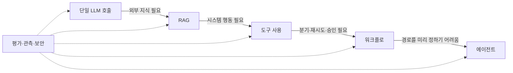
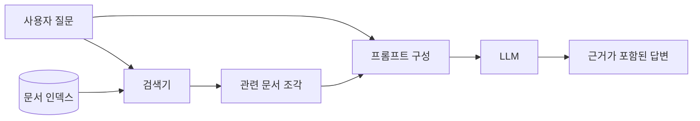

> LLM 애플리케이션은 단일 프롬프트에서 시작하지만, 지식·행동·상태·통제가 필요해지면서 여러 구성 요소를 가진 시스템으로 확장됩니다.
> 이 글은 단일 호출, RAG, 도구 사용, 워크플로, 에이전트의 차이를 한 흐름으로 연결하고 Java 예제로 경계를 설명합니다.
> 글을 읽고 나면 유행하는 구조를 그대로 도입하지 않고 현재 문제에 필요한 최소 아키텍처를 선택할 수 있습니다.

이 글은 2026년 6월 22일 기준의 논문과 공식 문서를 바탕으로 작성했습니다. 다만 특정 모델이나 프레임워크 버전보다 오래 유지되는 설계 원칙에 초점을 맞춥니다.

## 왜 단일 모델 호출만으로는 부족해졌을까?

초기 LLM 애플리케이션의 구조는 단순했습니다. 사용자의 입력과 개발자가 작성한 지시를 프롬프트에 넣고, 모델이 생성한 텍스트를 화면에 보여 주면 끝이었습니다. 문장 다듬기, 분류, 요약처럼 입력 안에 답을 만들 재료가 모두 있는 작업에는 지금도 이 구조가 가장 경제적입니다.

문제는 애플리케이션이 실제 업무를 맡기 시작하면서 생겼습니다. 모델은 오늘 변경된 사내 규정을 알지 못하고, 주문 데이터베이스를 직접 조회할 수도 없으며, 결제 취소가 허용되는지 최종 승인해서도 안 됩니다. 대화가 길어지면 상태가 필요하고, 실패한 작업을 재시도하려면 실행 이력도 남겨야 합니다.

따라서 아키텍처의 진화는 모델이 갑자기 다른 존재가 된 과정이 아닙니다. **모델 밖에 지식, 행동, 제어, 상태, 관찰 가능성을 차례로 배치한 과정**에 가깝습니다. 새 패턴이 이전 패턴을 없앤 것도 아닙니다. 복잡한 에이전트 안에도 요약이나 분류를 위한 단일 호출은 여전히 존재합니다.

## 다섯 단계로 보는 아키텍처의 변화

아래 구분은 제품이 반드시 순서대로 거쳐야 하는 성숙도 모델이 아닙니다. 해결할 문제가 늘어날 때 어떤 책임이 추가되는지 이해하기 위한 지도입니다.

| 단계 | 추가된 책임 | 잘 맞는 문제 | 새로 생기는 비용 |
|---|---|---|---|
| 단일 호출 | 프롬프트와 출력 형식 | 요약, 분류, 초안 | 출력 변동성 |
| RAG | 외부 지식 검색과 근거 구성 | 사내 문서 질의, 최신 정책 안내 | 검색 품질과 인덱스 운영 |
| 도구 사용 | 외부 시스템 조회·변경 | 주문 조회, 계산, 티켓 생성 | 권한, 검증, 부수 효과 |
| 워크플로 | 코드가 실행 순서와 상태를 통제 | 검토·승인·재시도가 있는 업무 | 상태 관리와 분기 복잡도 |
| 에이전트 | 모델이 다음 행동을 동적으로 선택 | 경로를 미리 열거하기 어려운 조사 | 비용, 지연, 예측 가능성 저하 |

이 표의 핵심은 “어느 단계가 더 고급인가?”가 아닙니다. **현재 실패 원인이 지식 부족인지, 행동 부족인지, 실행 제어 부족인지**를 먼저 구분해야 합니다. 지식이 부족한 서비스에 에이전트를 붙여도 검색 품질은 저절로 좋아지지 않습니다.



평가, 관측, 보안은 마지막에 붙이는 별도 단계가 아닙니다. 단일 호출부터 필요한 횡단 관심사이며, 구조가 복잡해질수록 관찰해야 할 대상만 늘어납니다.

## 1단계: 단일 호출과 구조화된 출력

단일 호출은 애플리케이션이 입력을 구성하고 모델 응답을 한 번 받아 처리하는 구조입니다. 흔히 `사용자 입력 → 프롬프트 → LLM → 응답`으로 표현합니다. 입력만으로 작업을 완료할 수 있고 외부 부수 효과가 없다면 좋은 기본값입니다.

운영 서비스에서는 자유로운 텍스트보다 구조화된 출력이 중요합니다. 예를 들어 문의 분류 결과를 `"환불 같음"`이라는 문장으로 받는 대신 `category`, `confidence`, `reason` 필드를 가진 객체로 받으면 다음 코드가 검증하기 쉬워집니다. 스키마를 쓴다고 의미적 정확성이 보장되지는 않지만, 최소한 파싱 실패와 허용되지 않은 값은 애플리케이션 경계에서 막을 수 있습니다.

이 단계에서 자주 하는 실수는 긴 시스템 프롬프트 하나에 정책, 예시, 대화 기록, 출력 규칙을 계속 추가하는 것입니다. 컨텍스트가 길어지면 비용이 늘고 어떤 지시가 결과를 바꿨는지 추적하기 어려워집니다. 프롬프트 개선만으로 해결되지 않는 지식 문제는 다음 단계로 넘겨야 합니다.

## 2단계: RAG로 지식을 모델 밖에 두기

RAG(Retrieval-Augmented Generation)는 질문과 관련된 자료를 외부 저장소에서 검색한 뒤, 검색 결과를 모델 입력에 함께 제공하는 패턴입니다. 2020년 RAG 논문은 모델 파라미터에 저장된 지식과 검색 가능한 외부 메모리를 결합하는 접근을 제시했습니다. 실무에서는 사내 문서, 상품 설명, 지원 정책처럼 자주 바뀌거나 출처를 보여 줘야 하는 지식에 주로 사용합니다.

전형적인 흐름은 문서 수집, 분할, 임베딩, 인덱싱을 미리 수행하고, 요청 시 질문을 검색 표현으로 바꿔 관련 조각을 찾는 것입니다. 검색된 조각은 출처 메타데이터와 함께 프롬프트에 들어가며, 응답은 그 근거를 인용할 수 있습니다.



RAG는 환각을 제거하는 마법이 아닙니다. 필요한 문서가 검색되지 않으면 모델은 근거를 받지 못하고, 오래된 문서가 상위에 나오면 잘못된 답을 그럴듯하게 만들 수 있습니다. 따라서 생성 답변만 평가하지 말고 “정답 문서가 상위 K개에 포함됐는가?”, “인용한 문장이 실제 근거를 지지하는가?”를 분리해서 측정해야 합니다.

또한 정확한 주문 상태나 계좌 잔액처럼 강한 정합성이 필요한 데이터는 벡터 인덱스의 복사본보다 원본 시스템을 조회하는 편이 맞습니다. RAG는 주로 **읽을 자료를 찾는 장치**이지, 트랜잭션 데이터베이스를 대신하는 장치가 아닙니다.

## 3단계: 도구 사용으로 읽기에서 행동으로

도구 사용 또는 도구 호출은 모델이 미리 등록된 함수의 이름과 인자를 구조화해 요청하고, 애플리케이션이 실제 함수를 실행한 뒤 결과를 모델에 돌려주는 패턴입니다. 모델이 SQL이나 HTTP를 마음대로 실행하는 것이 아니라, 애플리케이션이 공개한 좁은 인터페이스 안에서 행동하도록 만드는 것이 핵심입니다.

예를 들어 주문 조회 도구는 `getOrder(orderId)`만 노출할 수 있습니다. 애플리케이션은 주문 번호 형식, 현재 사용자의 소유권, 호출 시간 제한을 검사한 뒤 결과를 반환합니다. 모델은 그 결과를 읽기 쉬운 문장으로 설명하지만, 인증과 인가는 기존 백엔드가 계속 담당해야 합니다.

도구의 위험도도 구분해야 합니다.

- 조회 도구는 최소 권한과 데이터 마스킹을 적용합니다.
- 변경 도구는 입력 검증, 멱등성 키, 감사 로그를 추가합니다.
- 결제, 삭제, 외부 전송처럼 되돌리기 어려운 작업은 사람 또는 결정적 정책 코드의 승인을 거칩니다.

이 구분이 필요한 이유는 모델의 도구 호출이 **제안**이지 **권한 부여**가 아니기 때문입니다. 검색한 문서나 사용자 입력에 악의적인 지시가 섞이는 프롬프트 인젝션도 고려해야 합니다. 신뢰할 수 없는 텍스트와 시스템 지시를 분리하고, 모델이 무엇을 말했든 도구 실행 직전에 서버가 권한과 정책을 다시 확인해야 합니다.

## 4단계: 워크플로로 실행 경로를 통제하기

워크플로는 코드가 단계, 분기, 반복, 종료 조건을 미리 정의하는 구조입니다. LLM은 분류나 초안 작성처럼 일부 노드의 판단을 맡지만, 전체 실행 경로는 애플리케이션이 통제합니다. 승인 대기, 부분 재시도, 장애 후 재개가 필요해질 때 단순한 요청 핸들러보다 명시적인 상태 머신이나 그래프가 유리합니다.

고객 지원 자동화를 예로 들면 `문의 분류 → 정책 검색 → 주문 조회 → 환불 가능 여부 계산 → 상담원 승인 → 응답` 순서를 정할 수 있습니다. 분류 결과가 부정확해도 허용된 경로 안에서만 이동하며, 환불 정책은 LLM이 아니라 결정적 코드가 계산합니다. 각 단계의 입력과 출력을 저장하면 실패 지점부터 재개하거나 특정 노드만 다시 평가할 수 있습니다.

워크플로의 단점은 요구사항의 모든 경로를 코드로 표현해야 한다는 점입니다. 분기가 계속 늘어나면 그래프 자체가 제품 로직이 되므로 버전 관리, 마이그레이션, 상태 호환성을 설계해야 합니다. 그래도 경로가 알려진 업무라면 이 복잡성은 에이전트의 불확실성보다 다루기 쉽습니다.

## 5단계: 에이전트가 다음 행동을 선택하게 하기

에이전트는 모델이 목표와 현재 상태를 바탕으로 다음 도구 또는 다음 단계를 동적으로 선택하고, 결과를 관찰하면서 작업을 이어 가는 구조입니다. ReAct 연구는 언어적 추론과 외부 행동을 번갈아 수행하는 방식을 제시했습니다. 오늘날 구현은 내부 추론을 그대로 노출할 필요 없이 `계획 → 도구 호출 → 관찰 → 다음 행동 또는 종료`의 제어 루프로 이해할 수 있습니다.

워크플로와 에이전트의 차이는 LLM 사용 여부가 아닙니다. 둘 다 LLM을 사용할 수 있습니다. **워크플로는 코드가 경로를 정하고, 에이전트는 모델이 경로를 정한다**는 차이가 더 중요합니다.

에이전트는 조사 대상과 순서를 미리 열거하기 어려운 리서치, 여러 도구 중 상황에 맞는 조합을 찾아야 하는 진단에 유용합니다. 반대로 단계가 정해진 회원 가입, 금액 정산, 권한 변경을 굳이 에이전트로 만들면 테스트 공간과 실패 비용만 커질 수 있습니다.

멀티 에이전트도 같은 기준으로 판단해야 합니다. 역할별 컨텍스트와 권한을 실제로 분리해야 하거나, 독립 작업을 병렬화할 이유가 있을 때만 이점이 생깁니다. 하나의 에이전트가 충분한 작업을 이름만 다른 여러 에이전트로 나누면 호출 횟수, 상태 동기화, 장애 지점이 늘어납니다.

## 실전 예제: 고객 지원 흐름의 경계 나누기

이번 예제의 목표는 특정 SDK 사용법이 아니라 책임의 경계를 보여 주는 것입니다. `Retriever`는 정책 지식을 찾고, `LanguageModel`은 다음 행동을 제안하며, `OrderTool`은 원본 주문 시스템을 조회합니다. `SupportWorkflow`는 모델의 제안을 검증하고 실제 실행 여부를 결정합니다.

아래 코드는 Java 21 표준 라이브러리만 사용합니다. 가짜 어댑터를 넣었기 때문에 외부 API 없이 실행 흐름을 확인할 수 있습니다.

```java
import java.util.List;
import java.util.regex.Pattern;

public final class SupportWorkflowExample {
    enum Action {
        ANSWER_FROM_POLICY,
        LOOK_UP_ORDER
    }

    record Plan(Action action, String orderId, String draft) {}

    interface Retriever {
        List<String> search(String question);
    }

    interface LanguageModel {
        Plan plan(String question, List<String> evidence);
    }

    interface OrderTool {
        String findStatus(String orderId);
    }

    static final class SupportWorkflow {
        private static final Pattern ORDER_ID = Pattern.compile("ORD-[0-9]{6}");

        private final Retriever retriever;
        private final LanguageModel model;
        private final OrderTool orderTool;

        SupportWorkflow(
                Retriever retriever,
                LanguageModel model,
                OrderTool orderTool
        ) {
            this.retriever = retriever;
            this.model = model;
            this.orderTool = orderTool;
        }

        String handle(String question) {
            List<String> evidence = retriever.search(question);
            Plan plan = model.plan(question, evidence);

            return switch (plan.action()) {
                case ANSWER_FROM_POLICY -> plan.draft();
                case LOOK_UP_ORDER -> lookUpOrder(plan.orderId());
            };
        }

        private String lookUpOrder(String orderId) {
            if (orderId == null || !ORDER_ID.matcher(orderId).matches()) {
                return "주문 번호를 ORD-숫자 6자리 형식으로 확인해 주세요.";
            }

            String status = orderTool.findStatus(orderId);
            return "주문 " + orderId + "의 현재 상태는 " + status + "입니다.";
        }
    }

    public static void main(String[] args) {
        Retriever retriever = question -> List.of(
                "배송 시작 전에는 주문 취소를 요청할 수 있다."
        );
        LanguageModel model = (question, evidence) ->
                new Plan(Action.LOOK_UP_ORDER, "ORD-123456", "");
        OrderTool orderTool = orderId -> "배송 준비 중";

        SupportWorkflow workflow = new SupportWorkflow(
                retriever,
                model,
                orderTool
        );

        String answer = workflow.handle("ORD-123456 주문을 취소할 수 있나요?");
        System.out.println(answer);
    }
}
```

실행 결과는 다음과 같습니다.

```text
주문 ORD-123456의 현재 상태는 배송 준비 중입니다.
```

모델이 잘못된 주문 번호를 만들더라도 도구는 즉시 실행되지 않습니다. 워크플로가 형식을 검사하고 안전한 안내로 종료합니다. 실제 서비스에서는 여기에 현재 사용자가 해당 주문을 볼 권한이 있는지 확인하고, timeout과 회로 차단기, 감사 로그를 추가해야 합니다.

취소처럼 상태를 바꾸는 기능은 별도의 `CancelOrderTool`로 분리하는 편이 좋습니다. 모델이 취소를 제안하면 결정적 정책 코드가 가능 여부를 계산하고, 필요하면 사용자 확인을 받은 다음 멱등성 키와 함께 실행합니다. 읽기와 쓰기를 같은 범용 도구에 섞지 않으면 권한과 장애 대응이 단순해집니다.

## 구조가 바뀌면 테스트도 층별로 나뉜다

LLM 시스템을 최종 답변 몇 개로만 평가하면 어느 층이 실패했는지 알기 어렵습니다. 아키텍처의 경계와 같은 단위로 평가를 나눠야 합니다.

| 대상 | 확인할 질문 | 예시 지표 또는 테스트 |
|---|---|---|
| 모델 출력 | 스키마와 의미가 맞는가? | 파싱 성공률, 분류 정확도 |
| 검색 | 필요한 근거를 찾았는가? | Recall@K, 출처 최신성 |
| 도구 | 올바른 인자와 권한으로 실행됐는가? | 계약 테스트, 중복 실행 테스트 |
| 워크플로 | 허용된 경로로 종료됐는가? | 경로 테스트, 재개 테스트 |
| 전체 경험 | 답이 유용하고 비용·지연이 허용되는가? | 과업 성공률, p95 지연, 요청당 비용 |

오프라인 평가는 고정 데이터셋으로 변경 전후를 빠르게 비교하는 데 적합합니다. 온라인에서는 실제 트래픽의 지연, 오류, 도구 호출 수, 사람에게 이관된 비율을 관찰합니다. 두 평가를 함께 써야 테스트셋에는 잘 맞지만 운영에서 느리거나 비싼 변경을 찾을 수 있습니다.

로그에도 최종 프롬프트 전체를 무조건 남기기보다 추적 식별자, 프롬프트 버전, 모델 설정, 검색 문서 ID, 선택한 도구, 각 단계의 시간과 결과 상태를 구조화해 기록하는 편이 좋습니다. 개인정보와 비밀값은 수집 전에 마스킹하고, 원문 보관 기간과 접근 권한을 정해야 합니다.

## 자주 하는 실수와 주의사항

### 처음부터 에이전트로 시작한다

단일 호출이나 고정 워크플로로 풀 수 있는 문제를 에이전트로 만들면 가능한 실행 경로가 급격히 늘어납니다. 먼저 결정적 코드와 한 번의 모델 호출로 기준선을 만들고, 실제로 동적 경로가 필요한 지점을 확인한 뒤 제어 루프를 추가하는 편이 안전합니다.

### 긴 컨텍스트를 검색 설계의 대체재로 쓴다

모델이 긴 입력을 받을 수 있다고 모든 문서를 매번 넣을 필요는 없습니다. 비용과 지연이 늘 뿐 아니라 서로 충돌하는 정책이 함께 들어갈 수 있습니다. 문서의 소유자, 유효 기간, 접근 권한을 메타데이터로 관리하고 질문에 필요한 범위만 검색해야 합니다.

### 도구 설명만으로 보안을 해결한다

“다른 사용자의 주문을 조회하지 마라”라는 프롬프트는 접근 제어가 아닙니다. 사용자 인증 정보는 서버가 도구 실행 문맥에 주입하고, 대상 리소스에 대한 권한을 서버 코드가 검증해야 합니다. 모델이 생성한 사용자 ID나 역할을 그대로 신뢰하면 안 됩니다.

### 실패하면 전체 작업을 다시 실행한다

여러 단계가 있는 작업을 처음부터 재시도하면 이미 전송한 이메일이나 생성한 티켓이 중복될 수 있습니다. 조회와 생성 단계를 분리하고, 변경 작업에는 멱등성 키를 사용하며, 체크포인트에는 재개에 필요한 최소 상태를 저장해야 합니다.

### 모델 품질만 관찰한다

최종 답변이 나쁘다고 더 큰 모델로 바꾸기 전에 검색 누락, 도구 timeout, 잘못된 라우팅을 확인해야 합니다. 반대로 답변이 좋아 보여도 승인 없이 변경 도구가 실행됐다면 시스템은 실패한 것입니다. 품질과 안전, 비용과 지연을 같은 대시보드에서 보되 원인은 구성 요소별로 추적할 수 있어야 합니다.

## 어떤 아키텍처를 선택할까?

선택은 가장 단순한 구조에서 시작해 현재 요구사항이 해결되지 않을 때만 책임을 추가하면 됩니다.

- 입력 안의 정보로 변환할 수 있다면 단일 호출을 선택합니다.
- 답에 최신 또는 사내 근거가 필요하면 RAG를 추가합니다.
- 원본 시스템의 정확한 값을 읽거나 행동해야 하면 좁은 도구를 추가합니다.
- 단계와 승인 조건을 알고 있다면 코드 중심 워크플로를 선택합니다.
- 다음 단계를 사전에 열거하기 어렵고 탐색 가치가 실패 비용보다 크다면 에이전트를 검토합니다.

특히 금융 처리, 권한 변경, 데이터 삭제처럼 실수 비용이 큰 핵심 경로는 결정적 워크플로를 기본으로 두는 편이 좋습니다. 에이전트를 사용하더라도 조사나 제안까지만 맡기고, 실제 변경은 정책 엔진과 승인 단계 뒤에 배치할 수 있습니다.

아키텍처를 확장하기 전에는 네 가지 질문을 확인해 보세요.

1. 지금 실패하는 이유는 지식, 행동, 상태, 제어 중 무엇인가?
2. 추가 구성 요소의 품질을 독립적으로 측정할 수 있는가?
3. 모델이 잘못 판단했을 때 피해 범위가 어디까지인가?
4. 더 단순한 코드나 검색으로 같은 문제를 해결할 수 없는가?

이 질문에 답하지 못한 채 프레임워크부터 선택하면 데모는 빨리 만들 수 있어도 운영 문제의 원인을 찾기 어렵습니다. 반대로 책임과 실패 경계를 먼저 정하면 프레임워크는 구현 세부 사항으로 남습니다.

## 결론 및 도움말

> LLM 애플리케이션 아키텍처의 진화는 단일 호출을 버리고 에이전트로 이동한 역사가 아닙니다. 필요한 순간에 외부 지식은 RAG로, 행동은 제한된 도구로, 실행 제어는 워크플로로, 예측하기 어려운 탐색은 에이전트로 분리해 온 과정입니다.
>
> 좋은 출발점은 가장 작은 구조와 측정 가능한 기준선입니다. 모델 밖의 권한과 정책을 코드로 지키고 각 층을 독립적으로 평가한 뒤, 실제 병목이 확인될 때만 다음 책임을 추가하세요.

## 참고자료/레퍼런스

- [Retrieval-Augmented Generation for Knowledge-Intensive NLP Tasks](https://arxiv.org/abs/2005.11401)
- [ReAct: Synergizing Reasoning and Acting in Language Models](https://arxiv.org/abs/2210.03629)
- [Anthropic: Building effective agents](https://www.anthropic.com/engineering/building-effective-agents)
- [Spring AI 공식 문서: Retrieval Augmented Generation](https://docs.spring.io/spring-ai/reference/api/retrieval-augmented-generation.html)
- [Spring AI 공식 문서: Tool Calling](https://docs.spring.io/spring-ai/reference/api/tools.html)
- [OWASP GenAI Security Project: Prompt Injection](https://genai.owasp.org/llmrisk/llm01-prompt-injection/)
