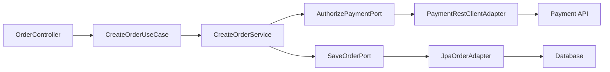

> 헥사고날 아키텍처에서 외부 API 호출을 유스케이스 안에 직접 넣으면 업무 규칙과 네트워크 실패가 한 클래스에 섞입니다.
> 이 글은 1탄의 주문 생성 예제에 결제 출력 포트를 추가하고, Spring Boot Java에서 어댑터와 실패 처리를 분리하는 방법을 다룹니다.
> 글을 읽고 나면 외부 API 변경, timeout, 4xx·5xx 오류를 유스케이스와 어댑터 중 어디에서 다뤄야 하는지 판단할 수 있습니다.

## 1탄에서 이어지는 문제

1탄에서는 주문 생성 유스케이스를 입력 포트, 저장 출력 포트, 웹 어댑터, JPA 어댑터로 나눴습니다. 그 구조만으로도 Controller와 JPA가 유스케이스 안으로 들어오지 않게 만들 수 있었습니다. 하지만 실제 서비스의 주문 생성은 보통 저장만으로 끝나지 않습니다.

예를 들어 주문을 만들기 전에 결제를 승인해야 한다고 해봅시다. 가장 쉬운 구현은 `CreateOrderService` 안에서 바로 HTTP 클라이언트를 호출하는 것입니다. 작은 예제에서는 빠르게 보이지만, 시간이 지나면 유스케이스가 결제 API URL, 인증 헤더, HTTP 상태 코드, timeout, 재시도 정책을 모두 알게 됩니다.

이 상태에서는 테스트도 흐려집니다. 주문 수량 검증을 확인하고 싶은데 외부 API mocking을 준비해야 합니다. 결제 API가 `402`, `409`, `500`을 반환할 때 주문을 어떻게 처리할지도 Controller, Service, HTTP 클라이언트 예외가 뒤섞인 채 결정되기 쉽습니다.

2탄의 목표는 이 문제를 작게 풀어보는 것입니다.

- 유스케이스는 “결제를 승인한다”는 포트만 안다.
- 외부 결제 API의 HTTP 세부사항은 어댑터에 둔다.
- 실패는 업무 실패와 기술 실패로 나눈다.
- 유스케이스 테스트는 fake 포트로 빠르게 검증한다.
- HTTP 어댑터 테스트는 실제 요청 모양과 오류 변환을 따로 확인한다.

이 글도 모든 운영 패턴을 넣지는 않습니다. circuit breaker, idempotency key 저장소, outbox, saga는 별도 글로 다룰 수 있는 주제입니다. 여기서는 초보자가 바로 적용할 수 있는 포트 경계와 실패 처리 기준에 집중합니다.

## 외부 API는 왜 출력 포트인가

헥사고날 아키텍처에서 출력 포트는 안쪽 애플리케이션이 바깥 기능을 필요로 할 때 정의하는 약속입니다. 데이터베이스 저장이 출력 포트였던 것처럼, 결제 승인도 출력 포트가 될 수 있습니다. 유스케이스 입장에서는 결제가 HTTP로 호출되는지, gRPC로 호출되는지, 테스트 fake인지 알 필요가 없습니다.

핵심은 기술 이름이 아니라 업무 행동으로 포트를 정의하는 것입니다.

| 나쁜 포트 이름 | 더 나은 포트 이름 | 이유 |
|---|---|---|
| `PaymentRestClientPort` | `AuthorizePaymentPort` | HTTP 기술보다 업무 행동이 드러남 |
| `WebClientPaymentGateway` | `PaymentGateway` | 구현 도구가 포트 이름에 새지 않음 |
| `ExternalApiPort` | `AuthorizePaymentPort` | 호출 목적이 구체적임 |

포트가 구체적일수록 유스케이스가 읽기 쉬워집니다. “외부 API를 호출한다”가 아니라 “결제를 승인한다”가 코드에 드러납니다. 반대로 포트가 너무 일반적이면 어댑터를 감쌌을 뿐, 업무 언어를 얻지 못합니다.

2탄에서는 주문 생성 흐름을 아래처럼 바꿉니다.



화살표를 보면 유스케이스는 포트에만 의존합니다. `PaymentRestClientAdapter`와 `JpaOrderAdapter`는 바깥쪽에서 포트를 구현합니다. 그래서 외부 결제 API가 바뀌어도 유스케이스가 직접 HTTP 상태 코드를 해석하지 않습니다.

## 예제 환경과 의존성

예제는 Java 21, Spring Boot 4.1 기준으로 작성합니다. 2026년 6월 26일 기준 Spring Framework 문서는 `RestClient`를 동기 HTTP 호출을 위한 fluent API로 설명합니다. 주문 생성 흐름이 Spring MVC 기반의 동기 처리라고 가정하므로 2탄에서는 `WebClient` 대신 `RestClient`를 사용합니다.

아래 Gradle 설정은 Spring MVC, validation, JPA, RestClient, 테스트에 필요한 기본 의존성을 보여줍니다.

```kotlin
plugins {
    java
    id("org.springframework.boot") version "4.1.0"
    id("io.spring.dependency-management") version "1.1.7"
}

java {
    toolchain {
        languageVersion = JavaLanguageVersion.of(21)
    }
}

repositories {
    mavenCentral()
}

dependencies {
    implementation("org.springframework.boot:spring-boot-starter-webmvc")
    implementation("org.springframework.boot:spring-boot-starter-data-jpa")
    implementation("org.springframework.boot:spring-boot-starter-validation")
    implementation("org.springframework.boot:spring-boot-starter-restclient")
    runtimeOnly("com.h2database:h2")

    testImplementation("org.springframework.boot:spring-boot-starter-test")
    testImplementation("org.springframework.boot:spring-boot-starter-restclient-test")
    testRuntimeOnly("org.junit.platform:junit-platform-launcher")
}
```

Spring Boot 4는 기능별 starter와 test starter가 더 세분화되어 있습니다. 실제 프로젝트가 Spring Boot 3.x라면 `spring-boot-starter-web`과 `spring-boot-starter-test` 중심으로 구성될 수 있습니다. 이 글의 설계 방향은 버전보다 포트 경계에 더 중요하게 의존합니다.

운영에서는 결제 API 주소, timeout, 인증 토큰을 코드에 하드코딩하지 않습니다. 먼저 설정 값을 분리합니다.

```yaml
clients:
  payment:
    base-url: https://payment.example.com
    api-key: ${PAYMENT_API_KEY}

spring:
  http:
    clients:
      connect-timeout: 1s
      read-timeout: 3s
```

예제에서는 이해를 위해 `api-key`를 property 이름으로 보여주지만 실제 값은 환경 변수나 비밀 저장소에서 주입해야 합니다. 로그와 예외 메시지에 키가 노출되지 않게 하는 것도 어댑터의 책임입니다.

## 결제 포트 정의하기

주문 유스케이스는 결제 시스템의 HTTP 계약을 알 필요가 없습니다. 대신 “이 주문 금액을 승인해 달라”는 출력 포트를 정의합니다.

```java
package com.example.order.application.port.out;

import java.math.BigDecimal;

public interface AuthorizePaymentPort {

    PaymentAuthorization authorize(PaymentCommand command);

    record PaymentCommand(
            String orderKey,
            BigDecimal amount
    ) {
    }

    record PaymentAuthorization(
            String paymentId,
            PaymentStatus status
    ) {
    }

    enum PaymentStatus {
        APPROVED
    }
}
```

이 포트는 의도적으로 작습니다. 승인에 필요한 값과 승인 결과만 둡니다. 결제사의 거래 ID, 원문 응답 코드, HTTP 헤더처럼 어댑터 바깥으로 나갈 필요가 없는 정보는 숨깁니다.

실무에서는 결제 승인에 idempotency key가 중요합니다. 같은 주문 생성 요청이 timeout 때문에 다시 들어왔을 때 중복 결제가 발생하면 안 되기 때문입니다. 이 글에서는 `orderKey`를 멱등성 식별자로 사용한다고 가정합니다. 실제 결제사 API가 멱등성 키를 어떤 헤더나 필드로 받는지는 반드시 계약서를 확인해야 합니다.

실패도 포트 언어로 표현합니다.

```java
package com.example.order.application.port.out;

public class PaymentDeclinedException extends RuntimeException {

    public PaymentDeclinedException(String message) {
        super(message);
    }
}
```

```java
package com.example.order.application.port.out;

public class PaymentUnavailableException extends RuntimeException {

    public PaymentUnavailableException(String message, Throwable cause) {
        super(message, cause);
    }
}
```

`PaymentDeclinedException`은 카드 한도 초과나 잔액 부족처럼 업무적으로 결제가 거절된 상황입니다. `PaymentUnavailableException`은 결제 시스템 장애, timeout, 일시적 5xx처럼 기술적으로 완료 여부를 확신하기 어려운 상황입니다. 이 둘을 구분해야 상위 계층이 사용자 메시지와 재시도 정책을 다르게 가져갈 수 있습니다.

## 유스케이스에 결제 흐름 추가하기

이제 1탄의 `CreateOrderService`에 결제 포트를 추가합니다. 흐름은 “주문 객체 생성 → 결제 승인 → 주문 저장”입니다.

```java
package com.example.order.application.service;

import com.example.order.application.port.in.CreateOrderUseCase;
import com.example.order.application.port.out.AuthorizePaymentPort;
import com.example.order.application.port.out.AuthorizePaymentPort.PaymentCommand;
import com.example.order.application.port.out.SaveOrderPort;
import com.example.order.domain.Order;
import org.springframework.stereotype.Service;
import org.springframework.transaction.annotation.Transactional;

@Service
public class CreateOrderService implements CreateOrderUseCase {

    private final AuthorizePaymentPort authorizePaymentPort;
    private final SaveOrderPort saveOrderPort;

    public CreateOrderService(
            AuthorizePaymentPort authorizePaymentPort,
            SaveOrderPort saveOrderPort
    ) {
        this.authorizePaymentPort = authorizePaymentPort;
        this.saveOrderPort = saveOrderPort;
    }

    @Override
    @Transactional
    public CreateOrderResult create(CreateOrderCommand command) {
        Order order = Order.create(
                command.productId(),
                command.quantity(),
                command.totalAmount()
        );

        authorizePaymentPort.authorize(new PaymentCommand(
                command.orderKey(),
                order.getTotalAmount()
        ));

        Order savedOrder = saveOrderPort.save(order);
        return new CreateOrderResult(savedOrder.getId());
    }
}
```

이 코드는 결제를 `RestClient`로 호출한다는 사실을 모릅니다. `PaymentDeclinedException`과 `PaymentUnavailableException`이 발생하면 유스케이스는 저장을 진행하지 않고 예외를 위로 올립니다. Controller나 예외 핸들러는 이 예외를 HTTP 응답으로 변환하면 됩니다.

여기서 트랜잭션 경계를 신중하게 봐야 합니다. 위 예제는 설명을 단순하게 하기 위해 하나의 메서드에 `@Transactional`을 둡니다. 하지만 실제 운영에서는 데이터베이스 트랜잭션을 연 채 외부 API를 오래 기다리면 커넥션과 lock 보유 시간이 늘어납니다. 결제 승인 전후로 어떤 데이터를 먼저 저장할지, 실패 시 어떤 보상 처리를 할지 요구사항에 맞게 설계해야 합니다.

`CreateOrderCommand`도 금액과 멱등성 키를 포함하도록 확장합니다.

```java
package com.example.order.application.port.in;

import java.math.BigDecimal;

public interface CreateOrderUseCase {

    CreateOrderResult create(CreateOrderCommand command);

    record CreateOrderCommand(
            String orderKey,
            Long productId,
            int quantity,
            BigDecimal totalAmount
    ) {
    }

    record CreateOrderResult(Long orderId) {
    }
}
```

금액 계산을 클라이언트 요청값에 그대로 맡기는 것은 위험합니다. 예제에서는 흐름을 줄이기 위해 command에 `totalAmount`를 넣었지만, 실무에서는 상품 가격을 서버에서 조회하고 쿠폰, 배송비, 할인 정책을 적용한 뒤 결제 금액을 계산해야 합니다.

도메인 모델도 금액을 갖도록 확장합니다.

```java
package com.example.order.domain;

import java.math.BigDecimal;
import java.util.Objects;

public class Order {

    private final Long id;
    private final Long productId;
    private final int quantity;
    private final BigDecimal totalAmount;

    private Order(Long id, Long productId, int quantity, BigDecimal totalAmount) {
        this.id = id;
        this.productId = Objects.requireNonNull(productId);
        this.quantity = quantity;
        this.totalAmount = Objects.requireNonNull(totalAmount);
    }

    public static Order create(Long productId, int quantity, BigDecimal totalAmount) {
        if (quantity < 1) {
            throw new IllegalArgumentException("quantity must be greater than zero");
        }
        if (totalAmount.signum() <= 0) {
            throw new IllegalArgumentException("totalAmount must be greater than zero");
        }
        return new Order(null, productId, quantity, totalAmount);
    }

    public Order withId(Long id) {
        return new Order(id, productId, quantity, totalAmount);
    }

    public Long getId() {
        return id;
    }

    public Long getProductId() {
        return productId;
    }

    public int getQuantity() {
        return quantity;
    }

    public BigDecimal getTotalAmount() {
        return totalAmount;
    }
}
```

도메인은 결제 API를 호출하지 않습니다. 도메인은 주문 금액이 올바른지 같은 자기 규칙을 지킵니다. 외부 시스템과 대화하는 흐름은 유스케이스가 포트를 통해 조정합니다.

## RestClient 결제 어댑터 만들기

이제 출력 포트를 구현하는 HTTP 어댑터를 만듭니다. 먼저 설정 값을 받을 properties 클래스를 둡니다.

```java
package com.example.order.adapter.out.payment;

import org.springframework.boot.context.properties.ConfigurationProperties;

import java.net.URI;

@ConfigurationProperties("clients.payment")
public record PaymentClientProperties(
        URI baseUrl,
        String apiKey
) {
}
```

어댑터는 `AuthorizePaymentPort`를 구현합니다. HTTP 요청 DTO와 응답 DTO는 어댑터 내부 타입으로 둬도 됩니다. 외부 API 계약이 바뀔 때 애플리케이션 포트가 함께 흔들리지 않게 하기 위해서입니다.

```java
package com.example.order.adapter.out.payment;

import com.example.order.application.port.out.AuthorizePaymentPort;
import com.example.order.application.port.out.PaymentDeclinedException;
import com.example.order.application.port.out.PaymentUnavailableException;
import org.springframework.http.HttpStatusCode;
import org.springframework.stereotype.Component;
import org.springframework.web.client.RestClient;
import org.springframework.web.client.RestClientException;

import java.math.BigDecimal;

@Component
public class PaymentRestClientAdapter implements AuthorizePaymentPort {

    private final RestClient restClient;

    public PaymentRestClientAdapter(RestClient.Builder builder, PaymentClientProperties properties) {
        this.restClient = builder
                .baseUrl(properties.baseUrl().toString())
                .defaultHeader("Authorization", "Bearer " + properties.apiKey())
                .build();
    }

    @Override
    public PaymentAuthorization authorize(PaymentCommand command) {
        try {
            PaymentResponse response = restClient.post()
                    .uri("/v1/payments/authorizations")
                    .header("Idempotency-Key", command.orderKey())
                    .body(new PaymentRequest(command.orderKey(), command.amount()))
                    .retrieve()
                    .onStatus(HttpStatusCode::is4xxClientError, (request, clientResponse) -> {
                        throw new PaymentDeclinedException("payment was declined");
                    })
                    .onStatus(HttpStatusCode::is5xxServerError, (request, clientResponse) -> {
                        throw new PaymentUnavailableException("payment service failed", null);
                    })
                    .body(PaymentResponse.class);

            if (!"APPROVED".equals(response.status())) {
                throw new PaymentDeclinedException("payment was not approved");
            }

            return new PaymentAuthorization(response.paymentId(), PaymentStatus.APPROVED);
        }
        catch (PaymentDeclinedException ex) {
            throw ex;
        }
        catch (RestClientException ex) {
            throw new PaymentUnavailableException("payment service is unavailable", ex);
        }
    }

    record PaymentRequest(String orderKey, BigDecimal amount) {
    }

    record PaymentResponse(String paymentId, String status) {
    }
}
```

이 코드는 결제 API의 4xx를 업무 거절로, 5xx와 네트워크 예외를 일시적 사용 불가로 변환합니다. 실제 결제 API에서는 모든 4xx가 결제 거절은 아닙니다. 인증 실패, 잘못된 요청 형식, 중복 키 충돌처럼 개발자가 바로 봐야 하는 오류도 있으므로 상태 코드와 오류 코드를 계약에 맞게 더 세밀하게 나눠야 합니다.

또 하나의 주의점은 timeout입니다. 위 예제는 `spring.http.clients.*` 공통 설정으로 connect timeout과 read timeout을 둔다고 가정합니다. 결제 API만 다른 timeout이 필요하다면 별도 `RestClientCustomizer`나 전용 request factory 설정을 추가해야 합니다. 중요한 것은 유스케이스가 timeout 세부사항을 알지 않게 하는 것입니다.

## 설정 클래스에서 어댑터 준비하기

properties가 동작하려면 설정 클래스로 활성화해야 합니다. 전역 `RestClient.Builder`를 주입받으면 Spring Boot가 준비한 message converter와 customizer를 함께 사용할 수 있습니다.

```java
package com.example.order.adapter.out.payment;

import org.springframework.boot.context.properties.EnableConfigurationProperties;
import org.springframework.context.annotation.Configuration;

@Configuration(proxyBeanMethods = false)
@EnableConfigurationProperties(PaymentClientProperties.class)
public class PaymentAdapterConfiguration {
}
```

어댑터가 `@Component`로 등록되어 있으므로 별도 Bean 메서드는 필요하지 않습니다. 더 엄격하게 애플리케이션 코어에서 Spring 의존성을 줄이고 싶다면, 코어 클래스에는 어노테이션을 붙이지 않고 바깥 설정 클래스에서 유스케이스 구현체를 Bean으로 등록할 수 있습니다.

예를 들면 다음과 같습니다.

```java
package com.example.order.adapter.config;

import com.example.order.application.port.out.AuthorizePaymentPort;
import com.example.order.application.port.out.SaveOrderPort;
import com.example.order.application.service.CreateOrderService;
import org.springframework.context.annotation.Bean;
import org.springframework.context.annotation.Configuration;

@Configuration(proxyBeanMethods = false)
public class UseCaseConfiguration {

    @Bean
    CreateOrderService createOrderService(
            AuthorizePaymentPort authorizePaymentPort,
            SaveOrderPort saveOrderPort
    ) {
        return new CreateOrderService(authorizePaymentPort, saveOrderPort);
    }
}
```

이 방식은 코어 코드에서 `@Service`를 제거할 수 있어 의존성 방향이 더 깨끗해집니다. 대신 설정 코드가 늘어납니다. 팀이 구조를 아직 익히는 중이라면 1탄처럼 `@Service`를 사용해 시작하고, 경계가 안정된 뒤 설정 분리로 옮겨도 됩니다.

## 유스케이스 테스트는 외부 API를 몰라야 한다

유스케이스 테스트에서는 HTTP 서버를 띄울 필요가 없습니다. 결제 포트를 fake로 대체하면 주문 흐름만 검증할 수 있습니다.

```java
package com.example.order.application.service;

import com.example.order.application.port.in.CreateOrderUseCase.CreateOrderCommand;
import com.example.order.application.port.out.AuthorizePaymentPort;
import com.example.order.application.port.out.AuthorizePaymentPort.PaymentAuthorization;
import com.example.order.application.port.out.AuthorizePaymentPort.PaymentStatus;
import com.example.order.application.port.out.PaymentDeclinedException;
import com.example.order.application.port.out.SaveOrderPort;
import org.junit.jupiter.api.Test;

import java.math.BigDecimal;

import static org.assertj.core.api.Assertions.assertThat;
import static org.assertj.core.api.Assertions.assertThatThrownBy;

class CreateOrderServiceTest {

    @Test
    void createsOrderAfterPaymentApproved() {
        AuthorizePaymentPort paymentPort = command ->
                new PaymentAuthorization("pay-1", PaymentStatus.APPROVED);
        SaveOrderPort saveOrderPort = order -> order.withId(1L);
        CreateOrderService service = new CreateOrderService(paymentPort, saveOrderPort);

        var result = service.create(new CreateOrderCommand(
                "order-1",
                10L,
                2,
                BigDecimal.valueOf(20000)
        ));

        assertThat(result.orderId()).isEqualTo(1L);
    }

    @Test
    void doesNotSaveOrderWhenPaymentDeclined() {
        AuthorizePaymentPort paymentPort = command -> {
            throw new PaymentDeclinedException("payment was declined");
        };
        SaveOrderPort saveOrderPort = order -> {
            throw new AssertionError("save must not be called");
        };
        CreateOrderService service = new CreateOrderService(paymentPort, saveOrderPort);

        assertThatThrownBy(() -> service.create(new CreateOrderCommand(
                "order-1",
                10L,
                2,
                BigDecimal.valueOf(20000)
        ))).isInstanceOf(PaymentDeclinedException.class);
    }
}
```

이 테스트의 관심사는 “결제가 승인되면 저장한다”와 “결제가 거절되면 저장하지 않는다”입니다. HTTP 상태 코드나 JSON 필드는 등장하지 않습니다. 그런 세부사항은 결제 어댑터 테스트로 옮겨야 합니다.

fake 포트를 사용할 때는 실제 어댑터와 너무 다르게 행동하지 않도록 주의합니다. 예를 들어 실제 결제 API가 같은 `orderKey` 중복 요청을 거절하는데 fake가 항상 승인한다면 멱등성 관련 버그를 놓칠 수 있습니다. 중요한 계약은 fake에도 반영하거나 별도 통합 테스트로 보완합니다.

## HTTP 어댑터 테스트는 요청과 변환을 본다

결제 어댑터 테스트는 유스케이스 테스트와 목적이 다릅니다. 여기서는 실제 HTTP 요청 경로, 헤더, 본문, 상태 코드 변환을 확인합니다. Spring의 `MockRestServiceServer`나 로컬 HTTP 서버를 사용할 수 있습니다.

아래 예제는 `MockRestServiceServer`로 `RestClient` 요청을 검증하는 흐름을 보여줍니다.

```java
package com.example.order.adapter.out.payment;

import com.example.order.application.port.out.AuthorizePaymentPort.PaymentCommand;
import com.example.order.application.port.out.PaymentDeclinedException;
import com.example.order.application.port.out.PaymentUnavailableException;
import org.junit.jupiter.api.BeforeEach;
import org.junit.jupiter.api.Test;
import org.springframework.http.MediaType;
import org.springframework.test.web.client.MockRestServiceServer;
import org.springframework.web.client.RestClient;

import java.math.BigDecimal;
import java.net.URI;

import static org.assertj.core.api.Assertions.assertThat;
import static org.assertj.core.api.Assertions.assertThatThrownBy;
import static org.springframework.test.web.client.match.MockRestRequestMatchers.header;
import static org.springframework.test.web.client.match.MockRestRequestMatchers.jsonPath;
import static org.springframework.test.web.client.match.MockRestRequestMatchers.requestTo;
import static org.springframework.test.web.client.response.MockRestResponseCreators.withServerError;
import static org.springframework.test.web.client.response.MockRestResponseCreators.withSuccess;
import static org.springframework.test.web.client.response.MockRestResponseCreators.withUnauthorizedRequest;

class PaymentRestClientAdapterTest {

    private MockRestServiceServer server;
    private PaymentRestClientAdapter adapter;

    @BeforeEach
    void setUp() {
        RestClient.Builder builder = RestClient.builder();
        server = MockRestServiceServer.bindTo(builder).build();
        adapter = new PaymentRestClientAdapter(
                builder,
                new PaymentClientProperties(
                        URI.create("https://payment.example.com"),
                        "test-api-key"
                )
        );
    }

    @Test
    void sendsAuthorizationRequest() {
        server.expect(requestTo("https://payment.example.com/v1/payments/authorizations"))
                .andExpect(header("Idempotency-Key", "order-1"))
                .andExpect(jsonPath("$.amount").value(20000))
                .andRespond(withSuccess("""
                        {"paymentId":"pay-1","status":"APPROVED"}
                        """, MediaType.APPLICATION_JSON));

        var result = adapter.authorize(new PaymentCommand(
                "order-1",
                BigDecimal.valueOf(20000)
        ));

        assertThat(result.paymentId()).isEqualTo("pay-1");
        server.verify();
    }

    @Test
    void mapsClientErrorToDeclined() {
        server.expect(requestTo("https://payment.example.com/v1/payments/authorizations"))
                .andRespond(withUnauthorizedRequest());

        assertThatThrownBy(() -> adapter.authorize(new PaymentCommand(
                "order-1",
                BigDecimal.valueOf(20000)
        ))).isInstanceOf(PaymentDeclinedException.class);
    }

    @Test
    void mapsServerErrorToUnavailable() {
        server.expect(requestTo("https://payment.example.com/v1/payments/authorizations"))
                .andRespond(withServerError());

        assertThatThrownBy(() -> adapter.authorize(new PaymentCommand(
                "order-1",
                BigDecimal.valueOf(20000)
        ))).isInstanceOf(PaymentUnavailableException.class);
    }
}
```

이 테스트는 포트가 아니라 어댑터의 책임을 검증합니다. 요청 URL과 멱등성 헤더가 맞는지, 성공 응답을 포트 결과로 바꾸는지, 4xx와 5xx를 서로 다른 예외로 바꾸는지를 봅니다.

운영에 가까운 검증이 필요하면 실제 HTTP 서버를 띄우는 테스트도 추가할 수 있습니다. 다만 모든 유스케이스 테스트를 통합 테스트로 만들 필요는 없습니다. 빠른 코어 테스트와 어댑터 계약 테스트를 나누는 것이 헥사고날 구조의 장점입니다.

## 실패 처리는 어디에 둘까

외부 API 실패는 크게 세 층에서 다룹니다.

| 위치 | 책임 | 예시 |
|---|---|---|
| 어댑터 | HTTP 세부사항을 포트 예외로 변환 | `401`, `402`, `500`, timeout 해석 |
| 유스케이스 | 업무 흐름 결정 | 결제 실패 시 주문 저장 중단 |
| 입력 어댑터 | 사용자에게 보여줄 응답 변환 | `PaymentDeclinedException`을 `409`로 변환 |

어댑터는 외부 시스템 언어를 내부 포트 언어로 번역합니다. 결제 API의 `PAYMENT_LIMIT_EXCEEDED` 같은 오류 코드를 `PaymentDeclinedException`으로 바꾸는 곳입니다. 유스케이스는 그 예외가 발생했을 때 주문을 저장하지 않을지, 실패 주문으로 저장할지, 보상 이벤트를 발행할지를 결정합니다.

Controller나 `@ControllerAdvice`는 마지막에 HTTP 응답을 만듭니다.

```java
package com.example.order.adapter.in.web;

import com.example.order.application.port.out.PaymentDeclinedException;
import com.example.order.application.port.out.PaymentUnavailableException;
import org.springframework.http.HttpStatus;
import org.springframework.web.bind.annotation.ExceptionHandler;
import org.springframework.web.bind.annotation.ResponseStatus;
import org.springframework.web.bind.annotation.RestControllerAdvice;

@RestControllerAdvice
public class OrderExceptionHandler {

    @ExceptionHandler(PaymentDeclinedException.class)
    @ResponseStatus(HttpStatus.CONFLICT)
    ErrorResponse handlePaymentDeclined(PaymentDeclinedException ex) {
        return new ErrorResponse("PAYMENT_DECLINED", "결제가 승인되지 않았습니다.");
    }

    @ExceptionHandler(PaymentUnavailableException.class)
    @ResponseStatus(HttpStatus.SERVICE_UNAVAILABLE)
    ErrorResponse handlePaymentUnavailable(PaymentUnavailableException ex) {
        return new ErrorResponse("PAYMENT_UNAVAILABLE", "결제 시스템을 잠시 사용할 수 없습니다.");
    }

    record ErrorResponse(String code, String message) {
    }
}
```

예외 메시지에 외부 API 원문을 그대로 넣지 않는 것이 좋습니다. 원문에는 카드사 코드, 내부 사유, 추적 ID, 개인정보가 들어갈 수 있습니다. 사용자 메시지와 운영 로그를 분리하고, 로그에도 토큰과 원문 요청·응답을 그대로 남기지 않습니다.

## 트랜잭션과 외부 호출 순서

초보자가 가장 많이 놓치는 부분은 트랜잭션입니다. 데이터베이스 트랜잭션 안에서 외부 API를 호출하면 외부 시스템이 느려지는 동안 DB 커넥션과 lock이 유지될 수 있습니다. 트래픽이 많아지면 작은 지연도 전체 서비스 지연으로 번집니다.

주문과 결제가 함께 있는 흐름에는 여러 선택지가 있습니다.

| 방식 | 장점 | 주의할 점 |
|---|---|---|
| 결제 승인 후 주문 저장 | 실패 주문이 적음 | 결제 성공 후 저장 실패 보상 필요 |
| 주문 대기 상태 저장 후 결제 | 상태 추적이 쉬움 | 실패 상태와 재처리 흐름 필요 |
| 주문 저장 후 비동기 결제 | 응답이 빠름 | 사용자 경험과 일관성 설계 필요 |

이 글의 예제는 단순화를 위해 결제 승인 후 주문 저장을 사용했습니다. 하지만 운영에서는 저장 실패, 중복 요청, 결제 성공 후 응답 유실 같은 상황을 반드시 다뤄야 합니다. 특히 결제는 금전이 걸린 작업이므로 재시도와 보상 처리를 “나중에 생각할 일”로 두면 위험합니다.

헥사고날 아키텍처는 이 문제를 자동으로 해결하지 않습니다. 다만 결제 포트를 분리해두면 나중에 동기 결제 어댑터를 메시지 기반 어댑터로 바꾸거나, 보상 포트를 추가할 때 변경 범위를 줄일 수 있습니다.

## 운영에서 확인할 것

외부 API 포트를 만들었다면 운영 지표도 포트 단위로 생각해야 합니다. 단순히 전체 주문 생성 실패율만 보면 결제 거절인지, 결제 시스템 장애인지, 우리 데이터베이스 문제인지 구분하기 어렵습니다.

결제 어댑터에서는 다음 신호를 남기는 것이 좋습니다.

- 결제 API 호출 수와 성공·거절·장애 비율
- p95, p99 지연 시간
- timeout 수
- 멱등성 키 중복 응답 수
- 외부 API 오류 코드 분포

metric tag에는 주문 ID, 사용자 ID, 카드 번호 같은 높은 cardinality 값이나 민감 정보를 넣지 않습니다. `payment`, `authorize`, `declined`, `unavailable`처럼 낮은 cardinality 값으로 관찰 가능한 신호를 만듭니다.

로그도 마찬가지입니다. 결제 요청 원문과 응답 원문을 남기면 장애 분석은 쉬워 보이지만 보안 사고의 원인이 될 수 있습니다. 추적 ID, 포트 이름, 상태 분류, 외부 오류 코드 정도로 시작하고, 본문이 꼭 필요하면 마스킹과 샘플링을 적용합니다.

## 자주 하는 실수와 주의사항

### 포트가 외부 API 스펙을 그대로 복사한다

외부 API 요청 필드가 20개라고 해서 포트 command도 20개를 그대로 가져올 필요는 없습니다. 유스케이스가 의미 있게 제공할 수 있는 값만 포트에 둡니다. 나머지는 어댑터에서 기본값, 설정, 계약에 맞춰 채웁니다.

### 4xx를 전부 사용자 실수로 본다

결제 API의 4xx 안에는 사용자 결제 거절뿐 아니라 인증 실패, 요청 형식 오류, 중복 요청 충돌이 섞일 수 있습니다. 개발자가 고쳐야 하는 오류와 사용자에게 안내할 오류를 구분해야 합니다. 가능하면 외부 오류 코드를 읽어 포트 예외를 더 세밀하게 나눕니다.

### 네트워크 timeout 뒤에 무조건 재시도한다

timeout은 요청이 처리되지 않았다는 뜻이 아닙니다. 결제 시스템이 승인했지만 응답만 늦었을 수도 있습니다. 재시도하려면 멱등성 키와 결제사의 중복 처리 보장이 먼저 필요합니다.

### 유스케이스 테스트에서 HTTP mocking을 한다

유스케이스 테스트가 HTTP 경로와 JSON 필드를 검증하기 시작하면 테스트가 구현 세부사항에 묶입니다. 유스케이스 테스트는 포트의 성공과 실패만 다루고, HTTP 계약은 어댑터 테스트로 분리합니다.

### 예외를 모두 `RuntimeException` 하나로 감싼다

업무 거절, 외부 장애, 개발자 설정 오류를 같은 예외로 만들면 상위 계층이 올바른 결정을 할 수 없습니다. 최소한 복구 가능한 업무 실패와 일시적 기술 실패는 나누는 것이 좋습니다.

## 적용 전 체크리스트

- 외부 API 호출이 유스케이스 안에서 직접 `RestClient`나 `WebClient`를 사용하지 않는가?
- 출력 포트 이름이 기술이 아니라 업무 행동을 표현하는가?
- 포트 command와 result가 외부 API DTO를 그대로 복사하지 않는가?
- 4xx, 5xx, timeout을 서로 다른 의미로 변환하는가?
- 결제 같은 멱등성이 중요한 호출에 idempotency key가 있는가?
- 데이터베이스 트랜잭션 안에서 외부 API를 오래 기다리지 않는가?
- 유스케이스 테스트와 HTTP 어댑터 테스트가 분리되어 있는가?
- 로그와 metric에 토큰, 개인정보, 높은 cardinality 값이 들어가지 않는가?

체크리스트는 구조를 복잡하게 만들기 위한 것이 아닙니다. 외부 시스템이 느리거나 실패할 때 우리 코드가 무엇을 알고, 무엇을 숨기고, 어디서 결정을 내리는지 분명하게 만드는 데 목적이 있습니다.

## 결론 및 도움말

> 헥사고날 아키텍처에서 외부 API는 출력 포트로 분리하기 좋은 대상입니다. 유스케이스는 “결제를 승인한다”는 업무 행동만 알고, RestClient 요청 경로와 상태 코드 변환은 어댑터에 둡니다.
>
> 2탄의 핵심은 실패를 숨기지 않고 이름 붙이는 것입니다. 결제 거절과 결제 시스템 장애를 구분하고, 유스케이스 테스트와 어댑터 테스트를 나누면 변경과 장애에 훨씬 침착하게 대응할 수 있습니다.

## 참고자료/레퍼런스

- [Alistair Cockburn - Hexagonal Architecture](https://alistair.cockburn.us/hexagonal-architecture)
- [Spring Framework REST Clients](https://docs.spring.io/spring-framework/reference/integration/rest-clients.html)
- [Spring Boot Calling REST Services](https://docs.spring.io/spring-boot/reference/io/rest-client.html)
- [Spring Boot Testing](https://docs.spring.io/spring-boot/reference/testing/spring-boot-applications.html)

