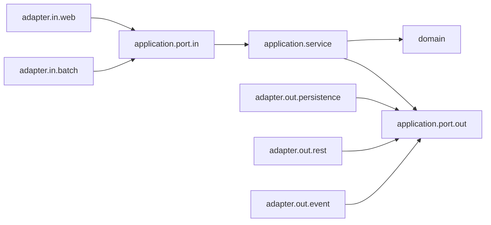

> 헥사고날 아키텍처는 한 번 패키지를 나누는 것으로 끝나지 않고, 시간이 지나도 경계가 무너지지 않게 지켜야 합니다.
> 이 글은 Spring Boot Java 프로젝트에서 아키텍처 테스트, 이벤트 분리, 관측성, 운영 체크리스트로 포트와 어댑터 구조를 유지하는 방법을 다룹니다.
> 글을 읽고 나면 “잘 만든 예제”를 넘어 팀 프로젝트에서 헥사고날 구조를 어떻게 관리할지 판단할 수 있습니다.

## 최종편에서 다루는 문제

1탄에서는 Controller, 유스케이스, 저장 포트, JPA 어댑터를 나눴습니다. 2탄에서는 외부 결제 API를 출력 포트로 분리하고 실패를 업무 실패와 기술 실패로 나눴습니다. 여기까지 하면 “헥사고날 아키텍처를 적용했다”는 느낌은 듭니다.

하지만 실무의 어려움은 그 다음부터 시작됩니다. 처음에는 잘 나뉘어 있던 패키지가 몇 달 뒤에는 다시 섞입니다. 급한 장애 수정에서 유스케이스가 JPA Entity를 직접 보고, Controller가 도메인 객체를 만들고, 외부 API 오류 코드가 서비스 계층에 흘러 들어옵니다. 리뷰어가 매번 잡아내기도 어렵습니다.

최종편의 목표는 구조를 오래 유지하는 방법입니다. 멋진 폴더명보다 중요한 것은 팀이 계속 지킬 수 있는 규칙입니다.

- 패키지 경계를 단순하게 정한다.
- 의존성 방향을 테스트로 검증한다.
- 이벤트와 부수 효과를 유스케이스 바깥으로 밀어낸다.
- 운영 지표와 로그를 포트 단위로 관찰한다.
- 헥사고날 구조가 과한 상황을 구분한다.

이 글은 Java 21, Spring Boot 4.1 기준으로 설명합니다. 2026년 6월 27일 기준 공식 문서에서 Spring Boot는 Actuator 관측성에 Micrometer Observation을 사용하고, Spring Framework는 트랜잭션에 묶인 이벤트 처리를 위해 `@TransactionalEventListener`를 제공합니다. 버전이 다른 프로젝트라면 API 이름은 확인하되, 구조 원칙은 그대로 적용할 수 있습니다.

## 먼저 정해야 할 팀 규칙

헥사고날 아키텍처는 팀 규칙이 없으면 금방 개인 취향 싸움이 됩니다. 누군가는 도메인 모델을 JPA Entity와 합치고 싶어 하고, 누군가는 Spring 어노테이션을 코어에서 모두 제거하고 싶어 합니다. 둘 다 가능한 선택이지만, 한 프로젝트 안에서 기준이 흔들리면 유지보수가 어려워집니다.

초보 팀이라면 처음부터 너무 엄격하게 시작하지 않는 편이 좋습니다. 아래 정도의 규칙이면 충분히 실용적입니다.

| 규칙 | 이유 | 허용할 타협 |
|---|---|---|
| `domain`은 Spring과 JPA를 모른다 | 업무 규칙을 기술에서 분리 | 값 검증에 Java 표준 API 사용 |
| `application`은 입력/출력 포트에 의존한다 | 유스케이스 테스트를 단순하게 유지 | `@Service`, `@Transactional`은 초기에는 허용 |
| `adapter`는 포트를 구현하거나 호출한다 | 기술 세부사항을 바깥으로 격리 | 매핑 코드가 작으면 어댑터 안에 둠 |
| 외부 API DTO는 어댑터 밖으로 나가지 않는다 | 외부 계약 변경의 전파를 줄임 | 내부 API처럼 안정된 계약은 예외 검토 |
| 아키텍처 규칙은 테스트로 확인한다 | 리뷰 누락을 줄임 | 처음에는 핵심 규칙 2~3개만 테스트 |

규칙은 문서로 남겨야 합니다. README, ADR(Architecture Decision Record), 팀 위키 어디든 좋습니다. 중요한 것은 새 팀원이 “어디에 클래스를 둬야 하지?”라고 물었을 때 같은 답을 받을 수 있어야 한다는 점입니다.

## 패키지 구조를 운영 기준으로 다듬기

1·2탄의 예제는 주문 도메인 하나만 다뤘습니다. 실제 서비스에는 주문, 결제, 배송, 회원, 쿠폰 같은 여러 업무 영역이 생깁니다. 이때 모든 도메인을 한 `domain`, 한 `application`, 한 `adapter` 아래에 넣으면 패키지가 금방 커집니다.

작은 프로젝트는 기술 계층 기준 구조로도 충분합니다.

```text
com.example
├── domain
├── application
└── adapter
```

하지만 업무 영역이 늘어나면 기능 기준으로 자르는 편이 읽기 쉽습니다.

```text
com.example
├── order
│   ├── domain
│   ├── application
│   └── adapter
├── payment
│   ├── domain
│   ├── application
│   └── adapter
└── shipping
    ├── domain
    ├── application
    └── adapter
```

기능 기준 구조의 장점은 변경 범위가 잘 보인다는 것입니다. 주문 정책을 바꿀 때 `order` 모듈 안에서 대부분의 코드를 찾을 수 있습니다. 반대로 공통 `domain` 패키지 하나에 모든 모델이 모이면 서로 다른 업무 영역의 모델이 쉽게 섞입니다.

이 구조는 Spring Modulith와도 잘 맞습니다. Spring Modulith는 Spring Boot 애플리케이션을 도메인 중심의 논리 모듈로 구성하고 검증하는 도구입니다. 반드시 도입해야 하는 것은 아니지만, 모듈 경계를 명시하고 문서화하고 싶다면 검토할 만합니다.

처음부터 Spring Modulith를 넣지 않아도 됩니다. 먼저 패키지 경계를 일관되게 만들고, 경계 위반이 자주 발생할 때 도구를 추가해도 늦지 않습니다.

## 의존성 방향을 그림으로 고정하기

운영 가능한 구조는 설명 가능한 구조입니다. 아래 흐름을 팀의 기본 그림으로 삼으면 리뷰와 설계 토론이 쉬워집니다.



그림에서 중요한 점은 `adapter`가 안쪽 포트에 의존한다는 것입니다. 유스케이스가 JPA 어댑터나 REST 어댑터를 직접 import하지 않습니다. 포트는 안쪽에 있고 구현체는 바깥쪽에 있습니다.

이 규칙을 문장으로 바꾸면 다음과 같습니다.

- `domain`은 `application`과 `adapter`를 모른다.
- `application`은 `adapter`를 모른다.
- `adapter.in`은 입력 포트를 호출한다.
- `adapter.out`은 출력 포트를 구현한다.
- 서로 다른 업무 모듈은 공개된 입력 포트나 이벤트로만 대화한다.

마지막 규칙은 특히 중요합니다. `order` 유스케이스가 `payment.adapter.out.persistence.PaymentJpaEntity`를 직접 조회하기 시작하면 모듈 경계가 무너집니다. 필요한 정보가 있다면 `payment` 모듈의 입력 포트를 호출하거나, 이벤트와 읽기 모델을 별도로 설계해야 합니다.

## ArchUnit으로 구조를 테스트하기

리뷰만으로 의존성 방향을 지키기는 어렵습니다. 그래서 아키텍처 규칙을 테스트로 둡니다. ArchUnit은 Java bytecode를 분석해 패키지 의존성, 클래스 이름, 어노테이션 사용 같은 규칙을 검증할 수 있는 라이브러리입니다.

먼저 테스트 의존성을 추가합니다.

```kotlin
dependencies {
    testImplementation("com.tngtech.archunit:archunit-junit5:1.4.2")
}
```

아래 테스트는 가장 기본적인 규칙을 검증합니다. `domain`은 `application`이나 `adapter`에 의존하지 못하고, `application`은 `adapter`에 의존하지 못합니다.

```java
package com.example.architecture;

import com.tngtech.archunit.core.importer.ImportOption;
import com.tngtech.archunit.junit.AnalyzeClasses;
import com.tngtech.archunit.junit.ArchTest;
import com.tngtech.archunit.lang.ArchRule;

import static com.tngtech.archunit.lang.syntax.ArchRuleDefinition.noClasses;

@AnalyzeClasses(
        packages = "com.example",
        importOptions = ImportOption.DoNotIncludeTests.class
)
class HexagonalArchitectureTest {

    @ArchTest
    static final ArchRule domain_should_not_depend_on_application_or_adapter =
            noClasses()
                    .that()
                    .resideInAPackage("..domain..")
                    .should()
                    .dependOnClassesThat()
                    .resideInAnyPackage("..application..", "..adapter..");

    @ArchTest
    static final ArchRule application_should_not_depend_on_adapter =
            noClasses()
                    .that()
                    .resideInAPackage("..application..")
                    .should()
                    .dependOnClassesThat()
                    .resideInAPackage("..adapter..");
}
```

이 테스트는 단순하지만 효과가 큽니다. 누군가 급하게 `CreateOrderService`에서 `OrderJpaEntity`를 import하면 CI에서 바로 실패합니다. 사람의 기억에 맡기던 규칙을 자동화한 것입니다.

다음으로 어댑터 방향도 검증할 수 있습니다.

```java
package com.example.architecture;

import com.tngtech.archunit.core.importer.ImportOption;
import com.tngtech.archunit.junit.AnalyzeClasses;
import com.tngtech.archunit.junit.ArchTest;
import com.tngtech.archunit.lang.ArchRule;

import static com.tngtech.archunit.lang.syntax.ArchRuleDefinition.classes;

@AnalyzeClasses(
        packages = "com.example",
        importOptions = ImportOption.DoNotIncludeTests.class
)
class AdapterNamingTest {

    @ArchTest
    static final ArchRule web_input_adapters_should_be_named_controller =
            classes()
                    .that()
                    .resideInAPackage("..adapter.in.web..")
                    .should()
                    .haveSimpleNameEndingWith("Controller");

    @ArchTest
    static final ArchRule event_input_adapters_should_be_named_listener =
            classes()
                    .that()
                    .resideInAPackage("..adapter.in.event..")
                    .should()
                    .haveSimpleNameEndingWith("Listener");

    @ArchTest
    static final ArchRule output_adapters_should_be_named_adapter =
            classes()
                    .that()
                    .resideInAPackage("..adapter.out..")
                    .should()
                    .haveSimpleNameEndingWith("Adapter");
}
```

이름 규칙은 필수는 아닙니다. 팀이 `Gateway`, `Client`, `PersistenceAdapter` 같은 이름을 쓰기로 했다면 그 기준에 맞추면 됩니다. 중요한 것은 자동화할 가치가 있는 규칙만 테스트하는 것입니다. 너무 많은 규칙을 한 번에 넣으면 테스트가 팀의 발목을 잡는 느낌을 줄 수 있습니다.

## 도메인 이벤트는 어디에 둘까

2탄에서는 결제 승인 후 주문을 저장하는 동기 흐름을 다뤘습니다. 운영에서는 주문 생성 뒤 알림, 쿠폰 사용 처리, 배송 준비 요청, 검색 인덱스 갱신 같은 부수 효과가 붙습니다. 이 모든 것을 `CreateOrderService` 안에 직접 넣으면 유스케이스가 다시 비대해집니다.

이때 도메인 이벤트 또는 애플리케이션 이벤트를 사용할 수 있습니다. 이벤트는 “이미 일어난 일”을 표현합니다. 명령이 “주문을 생성하라”라면 이벤트는 “주문이 생성되었다”입니다.

먼저 이벤트를 애플리케이션 안쪽 언어로 정의합니다.

```java
package com.example.order.application.event;

import java.time.Instant;

public record OrderCreatedEvent(
        Long orderId,
        Long productId,
        Instant occurredAt
) {
}
```

유스케이스는 주문 저장 후 이벤트 발행 포트를 호출합니다.

```java
package com.example.order.application.port.out;

import com.example.order.application.event.OrderCreatedEvent;

public interface PublishOrderEventPort {

    void publish(OrderCreatedEvent event);
}
```

유스케이스는 이벤트가 Kafka로 나가는지, Spring ApplicationEvent로 발행되는지, outbox 테이블에 저장되는지 모릅니다.

```java
package com.example.order.application.service;

import com.example.order.application.event.OrderCreatedEvent;
import com.example.order.application.port.out.PublishOrderEventPort;
import com.example.order.application.port.out.SaveOrderPort;
import com.example.order.domain.Order;

import java.time.Clock;
import java.time.Instant;

public class CreateOrderService {

    private final SaveOrderPort saveOrderPort;
    private final PublishOrderEventPort publishOrderEventPort;
    private final Clock clock;

    public CreateOrderService(
            SaveOrderPort saveOrderPort,
            PublishOrderEventPort publishOrderEventPort,
            Clock clock
    ) {
        this.saveOrderPort = saveOrderPort;
        this.publishOrderEventPort = publishOrderEventPort;
        this.clock = clock;
    }

    public Long create(Long productId, int quantity) {
        Order order = Order.create(productId, quantity);
        Order savedOrder = saveOrderPort.save(order);

        publishOrderEventPort.publish(new OrderCreatedEvent(
                savedOrder.getId(),
                savedOrder.getProductId(),
                Instant.now(clock)
        ));

        return savedOrder.getId();
    }
}
```

실무에서는 이벤트 발행 시점이 중요합니다. 데이터베이스 트랜잭션이 rollback됐는데 “주문 생성됨” 이벤트가 이미 나가면 장애가 됩니다. Spring Framework의 `@TransactionalEventListener`는 트랜잭션 commit 이후 같은 특정 단계에 이벤트 리스너를 묶을 수 있습니다. 다만 이 기능도 프로세스 내부 이벤트이므로, 외부 메시지 브로커까지 확실히 전달해야 한다면 outbox 패턴을 검토해야 합니다.

Spring ApplicationEvent 어댑터는 다음처럼 만들 수 있습니다.

```java
package com.example.order.adapter.out.event;

import com.example.order.application.event.OrderCreatedEvent;
import com.example.order.application.port.out.PublishOrderEventPort;
import org.springframework.context.ApplicationEventPublisher;
import org.springframework.stereotype.Component;

@Component
public class SpringOrderEventAdapter implements PublishOrderEventPort {

    private final ApplicationEventPublisher publisher;

    public SpringOrderEventAdapter(ApplicationEventPublisher publisher) {
        this.publisher = publisher;
    }

    @Override
    public void publish(OrderCreatedEvent event) {
        publisher.publishEvent(event);
    }
}
```

이벤트를 받는 쪽은 별도 입력 어댑터로 볼 수 있습니다.

```java
package com.example.order.adapter.in.event;

import com.example.order.application.event.OrderCreatedEvent;
import org.springframework.stereotype.Component;
import org.springframework.transaction.event.TransactionalEventListener;

@Component
public class OrderCreatedEventListener {

    @TransactionalEventListener
    public void handle(OrderCreatedEvent event) {
        // 알림, 검색 인덱스 갱신, 후속 작업 요청 등을 호출한다.
    }
}
```

이벤트를 쓰면 코드가 느슨해지지만 흐름이 눈에 덜 보입니다. 초보 팀이라면 모든 후속 작업을 이벤트로 바꾸지 말고, 정말 유스케이스의 핵심 흐름에서 분리해도 되는 부수 효과부터 적용하는 것이 좋습니다.

## 관측성도 포트 단위로 생각하기

운영에서는 “주문 생성이 실패했다”만으로 부족합니다. 저장 포트가 느린지, 결제 포트가 실패하는지, 이벤트 발행이 막히는지 알아야 합니다. 헥사고날 구조는 포트라는 경계를 이미 갖고 있으므로 관측성도 그 단위로 설계하기 좋습니다.

Spring Boot Actuator의 관측성 문서는 logging, metrics, traces를 관측성의 세 축으로 설명합니다. Spring Boot는 Micrometer Observation을 사용하므로, 필요한 지점에서 `ObservationRegistry`를 주입받아 커스텀 관측을 만들 수 있습니다.

아래 코드는 결제 포트 어댑터에서 관측 이름을 명시하는 간단한 예입니다.

```java
package com.example.order.adapter.out.payment;

import com.example.order.application.port.out.AuthorizePaymentPort;
import io.micrometer.observation.Observation;
import io.micrometer.observation.ObservationRegistry;
import org.springframework.stereotype.Component;

@Component
public class ObservedPaymentAdapter implements AuthorizePaymentPort {

    private final PaymentRestClientAdapter delegate;
    private final ObservationRegistry observationRegistry;

    public ObservedPaymentAdapter(
            PaymentRestClientAdapter delegate,
            ObservationRegistry observationRegistry
    ) {
        this.delegate = delegate;
        this.observationRegistry = observationRegistry;
    }

    @Override
    public PaymentAuthorization authorize(PaymentCommand command) {
        return Observation
                .createNotStarted("order.payment.authorize", observationRegistry)
                .lowCardinalityKeyValue("port", "AuthorizePaymentPort")
                .observe(() -> delegate.authorize(command));
    }
}
```

metric tag에 `orderId`, `userId`, `paymentId`처럼 값이 계속 늘어나는 정보를 넣으면 시계열 수가 폭발합니다. 포트 이름, 결과 분류, 외부 시스템 이름처럼 낮은 cardinality 값을 사용해야 합니다. 상세 식별자는 trace나 로그에서 보되, 개인정보와 결제 정보는 반드시 마스킹합니다.

관측성을 어디에 둘지도 선택해야 합니다.

| 위치 | 장점 | 주의할 점 |
|---|---|---|
| 어댑터 내부 | 외부 시스템별 지표가 정확함 | 모든 어댑터에 반복 코드가 생김 |
| decorator 어댑터 | 관측 로직을 분리하기 쉬움 | Bean 등록이 조금 복잡해짐 |
| AOP | 적용 범위가 넓음 | 어떤 포트가 관측되는지 숨겨질 수 있음 |

처음에는 중요한 출력 포트 한두 개에 명시적으로 넣는 편이 좋습니다. 결제, 외부 배송, 메시지 발행처럼 장애 영향이 큰 포트부터 관찰하고, 반복이 명확해질 때 공통화합니다.

## Spring 의존성을 얼마나 제거해야 할까

헥사고날 아키텍처를 배우다 보면 “코어에는 Spring 어노테이션이 하나도 없어야 한다”는 말을 자주 봅니다. 방향은 맞지만 모든 팀에 같은 강도로 적용할 필요는 없습니다.

선택지는 크게 세 가지입니다.

| 방식 | 예시 | 적합한 상황 |
|---|---|---|
| 실용형 | 유스케이스에 `@Service`, `@Transactional` 사용 | 팀이 Spring 중심이고 빠른 이해가 중요 |
| 절충형 | 유스케이스는 순수 Java, 설정 클래스에서 Bean 등록 | 코어 테스트와 경계 보호를 강화하고 싶음 |
| 엄격형 | 코어 모듈을 별도 Gradle module로 분리 | 장기 제품, 여러 어댑터, 강한 독립성 필요 |

처음부터 엄격형으로 가면 빌드와 설정이 복잡해집니다. 반대로 프로젝트가 커졌는데도 모든 코드가 Spring Bean끼리 직접 연결되면 경계가 약해집니다. 1·2탄 예제처럼 시작하고, 팀이 구조에 익숙해지면 유스케이스를 순수 Java로 옮기는 순서가 현실적입니다.

순수 Java 유스케이스는 다음처럼 설정에서 조립합니다.

```java
package com.example.order.adapter.config;

import com.example.order.application.port.out.PublishOrderEventPort;
import com.example.order.application.port.out.SaveOrderPort;
import com.example.order.application.service.CreateOrderService;
import org.springframework.context.annotation.Bean;
import org.springframework.context.annotation.Configuration;

import java.time.Clock;

@Configuration(proxyBeanMethods = false)
public class OrderUseCaseConfiguration {

    @Bean
    CreateOrderService createOrderService(
            SaveOrderPort saveOrderPort,
            PublishOrderEventPort publishOrderEventPort
    ) {
        return new CreateOrderService(
                saveOrderPort,
                publishOrderEventPort,
                Clock.systemUTC()
        );
    }
}
```

이 방식은 테스트에서 `new CreateOrderService(...)`로 바로 만들 수 있고, Spring 설정은 바깥으로 이동합니다. 대신 Bean 구성 코드가 늘어나므로 작은 프로젝트에서는 과하다고 느낄 수 있습니다.

## 언제 멈춰야 할까

헥사고날 아키텍처는 좋은 도구지만 모든 코드에 같은 강도로 적용하면 피곤한 구조가 됩니다. 단순 조회 API 하나를 만들기 위해 입력 포트, 출력 포트, mapper, adapter, event, 테스트를 모두 만들면 개발자가 구조를 피하고 싶어집니다.

멈춰야 할 신호는 다음과 같습니다.

- 업무 규칙이 거의 없고 데이터 조회만 한다.
- 변경 가능성이 낮은 내부 관리자 기능이다.
- 포트가 실제 추상화가 아니라 이름만 바꾼 wrapper다.
- 테스트가 쉬워지지 않고 오히려 mocking만 늘었다.
- 팀원이 구조를 이해하지 못해 매번 같은 설명이 필요하다.

반대로 적극 적용할 신호도 있습니다.

- 외부 시스템 실패가 서비스 장애로 자주 번진다.
- 같은 유스케이스를 REST, batch, message listener가 함께 사용한다.
- 도메인 규칙이 테스트하기 어렵다.
- JPA, Redis, Kafka, 외부 API가 서비스 클래스에 한꺼번에 들어온다.
- 변경 때마다 예상하지 못한 계층이 깨진다.

구조는 비용입니다. 비용을 냈다면 테스트, 변경 용이성, 장애 격리, 운영 가시성 중 하나는 반드시 좋아져야 합니다. 좋아진 것이 없다면 구조를 줄이는 편이 맞습니다.

## 최종 체크리스트

3탄까지 적용했다면 아래 질문으로 프로젝트를 점검해 볼 수 있습니다.

- `domain`이 Spring, JPA, 외부 API DTO를 import하지 않는가?
- `application`이 `adapter` 구현체를 직접 참조하지 않는가?
- 입력 포트와 출력 포트가 업무 행동 중심 이름을 갖는가?
- 외부 API 실패가 업무 실패와 기술 실패로 구분되는가?
- 데이터베이스 트랜잭션 안에서 느린 외부 호출을 오래 기다리지 않는가?
- 이벤트 발행 시점이 transaction commit과 어긋나지 않는가?
- 중요한 의존성 방향을 ArchUnit 같은 테스트로 검증하는가?
- 포트별 성공, 실패, 지연, timeout을 관측할 수 있는가?
- metric tag에 개인정보나 높은 cardinality 값이 들어가지 않는가?
- 단순 CRUD에 과한 구조를 강요하지 않는가?

이 체크리스트를 전부 하루 만에 만족시킬 필요는 없습니다. 가장 자주 깨지는 경계부터 하나씩 자동화하는 것이 좋습니다. 보통은 `application -> adapter` 의존 금지 테스트와 핵심 외부 포트 관측부터 시작하면 효과가 큽니다.

## 결론 및 도움말

> 헥사고날 아키텍처의 최종 목표는 예쁜 패키지 구조가 아니라 오래 유지되는 경계입니다. 패키지 규칙을 문서화하고, ArchUnit 같은 테스트로 의존성 방향을 검증하고, 이벤트와 관측성을 포트 단위로 관리하면 구조가 운영 속에서도 버틸 수 있습니다.
>
> 1탄은 기본 구조, 2탄은 외부 API 실패 처리, 3탄은 구조 유지와 운영 관점입니다. 이제 새 기능을 만들 때마다 “이 코드는 업무 규칙인가, 입력 어댑터인가, 출력 어댑터인가?”를 먼저 묻는 습관을 들이면 됩니다.

## 참고자료/레퍼런스

- [Alistair Cockburn - Hexagonal Architecture](https://alistair.cockburn.us/hexagonal-architecture)
- [ArchUnit User Guide](https://www.archunit.org/userguide/html/000_Index.html)
- [Spring Modulith Reference](https://docs.spring.io/spring-modulith/reference/index.html)
- [Spring Boot Observability](https://docs.spring.io/spring-boot/reference/actuator/observability.html)
- [Spring Framework Transaction-bound Events](https://docs.spring.io/spring-framework/reference/data-access/transaction/event.html)

