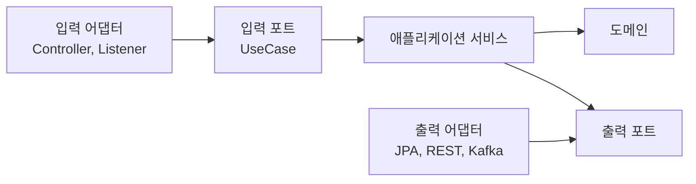

> 헥사고날 아키텍처를 실제 프로젝트에 적용하면 “이 클래스는 어디에 두지?” 같은 애매한 질문이 계속 생깁니다.
> 이 글은 Spring Boot Java 기준으로 명확히 지킬 원칙과 상황별로 달라지는 판단 기준을 Q&A 형식으로 정리합니다.
> 글을 읽고 나면 포트, 어댑터, DTO, 도메인, 트랜잭션, 테스트 경계를 팀에서 일관되게 결정할 수 있습니다.

## 이 글의 위치와 전제

앞선 글에서는 헥사고날 아키텍처의 기본 구조, 외부 API 포트, 운영까지 구조를 지키는 방법을 다뤘습니다. 이번 글은 그 내용을 실제 프로젝트에서 적용할 때 자주 부딪히는 애매한 질문을 모아 정리합니다. 그래서 새 기능 구현 튜토리얼이라기보다 팀에서 같이 볼 수 있는 의사결정 가이드에 가깝습니다.

이 글의 기준은 Java 21, Spring Boot 4.1, Spring MVC 또는 일반적인 백엔드 애플리케이션입니다. Kotlin, WebFlux, 메시지 기반 서비스에도 원칙은 비슷하게 적용할 수 있지만, 예시는 Java와 Spring Boot 중심으로 작성합니다.

헥사고날 아키텍처의 핵심은 단순합니다.



그림에서 중요한 것은 포트와 어댑터라는 이름보다 의존성 방향입니다. 안쪽 코드는 바깥 기술을 몰라야 합니다. 바깥 코드는 안쪽 포트에 맞춰 들어오거나 포트를 구현합니다.

하지만 현실의 코드는 깔끔한 그림보다 훨씬 애매합니다. DTO는 어디에 둘지, JPA Entity를 도메인으로 써도 되는지, Service 이름은 어떻게 나눌지, validation은 어느 계층에서 할지 같은 질문이 계속 나옵니다. 이 글은 그 질문에 “항상 정답은 이것”이라고 답하지 않습니다. 대신 판단 기준과 안전한 기본값을 제공합니다.

## 먼저 지킬 명확한 기준

헥사고날 아키텍처를 적용할 때 팀에서 먼저 합의할 기준은 많지 않습니다. 아래 기준만 지켜도 구조가 크게 무너지지 않습니다.

| 기준 | 기본 결정 | 이유 |
|---|---|---|
| 도메인 | Spring, JPA, Web DTO를 모른다 | 업무 규칙을 기술 변경에서 보호 |
| 애플리케이션 서비스 | 유스케이스 흐름과 트랜잭션을 조정한다 | Controller와 Repository 사이 중간 호출자가 되지 않게 함 |
| 입력 포트 | 외부에서 실행할 유스케이스를 표현한다 | REST, batch, message listener가 같은 기능을 호출 가능 |
| 출력 포트 | 유스케이스가 필요한 외부 능력을 표현한다 | DB, 외부 API, 메시지 발행 구현을 교체 가능 |
| 입력 어댑터 | 요청을 command로 바꾸고 응답을 만든다 | HTTP 세부사항을 유스케이스에서 제거 |
| 출력 어댑터 | 포트를 기술로 구현한다 | JPA, RestClient, Kafka를 바깥에 가둠 |

가장 중요한 금지 규칙도 명확합니다.

- `domain`에서 `org.springframework`, `jakarta.persistence`, 웹 요청 DTO를 import하지 않는다.
- `application`에서 `adapter` 패키지 클래스를 import하지 않는다.
- Controller가 JPA Repository나 외부 API client를 직접 호출하지 않는다.
- 출력 포트 이름에 `Jpa`, `RestClient`, `Kafka` 같은 구현 기술을 넣지 않는다.
- 외부 API 응답 DTO를 유스케이스 결과로 그대로 반환하지 않는다.

이 규칙들은 취향이 아니라 변경 방향을 통제하기 위한 장치입니다. 한 번 깨져도 앱은 동작합니다. 하지만 깨진 경계가 반복되면 서비스 클래스가 다시 모든 기술을 끌어안게 됩니다.

## 애매한 것들을 판단하는 5가지 질문

어떤 클래스를 어디에 둘지 애매할 때는 아래 질문을 순서대로 던져보면 좋습니다.

| 질문 | Yes라면 | No라면 |
|---|---|---|
| 이 클래스가 업무 규칙을 표현하는가? | `domain` 후보 | 다음 질문 |
| 유스케이스 흐름을 조정하는가? | `application.service` 후보 | 다음 질문 |
| 외부에서 유스케이스를 호출하기 위한 계약인가? | 입력 포트 후보 | 다음 질문 |
| 유스케이스가 바깥 기능을 사용하기 위한 계약인가? | 출력 포트 후보 | 다음 질문 |
| 특정 기술이나 입출력 형식에 묶여 있는가? | `adapter` 후보 | 공통 유틸 또는 재검토 |

예를 들어 `CreateOrderRequest`는 HTTP 요청 JSON에 묶여 있으므로 입력 어댑터에 둡니다. `CreateOrderCommand`는 유스케이스 입력 계약이므로 입력 포트 또는 application 계층에 둡니다. `Order`는 주문 수량, 금액, 상태 전이를 표현하므로 domain에 둡니다.

반대로 `OrderJpaEntity`는 `@Entity`, table, column, lazy loading 같은 영속성 기술에 묶입니다. 이 경우 출력 어댑터에 두는 것이 안전한 기본값입니다. 만약 팀이 JPA Entity를 도메인 모델로 쓰기로 합의했다면 그 자체가 틀린 것은 아니지만, 도메인이 JPA 제약에 묶이는 비용을 알고 선택해야 합니다.

## 빠른 배치 가이드

아래 표는 실무에서 자주 나오는 클래스의 기본 위치입니다.

| 클래스/개념 | 기본 위치 | 애매할 때 판단 |
|---|---|---|
| `Order` | `domain` | 업무 규칙과 상태 전이가 있으면 domain |
| `Money`, `OrderStatus` | `domain` | 여러 계층에서 쓰여도 업무 의미가 있으면 domain |
| `CreateOrderUseCase` | `application.port.in` | 외부가 호출할 기능이면 입력 포트 |
| `CreateOrderCommand` | `application.port.in` | 유스케이스 입력이면 application |
| `SaveOrderPort` | `application.port.out` | 유스케이스가 저장을 필요로 하면 출력 포트 |
| `OrderController` | `adapter.in.web` | HTTP 요청/응답 변환 담당 |
| `OrderJpaEntity` | `adapter.out.persistence` | JPA 어노테이션이 있으면 어댑터 기본 |
| `SpringDataOrderRepository` | `adapter.out.persistence` | Spring Data 구현 세부사항 |
| `PaymentRestClientAdapter` | `adapter.out.payment` | 외부 API 호출 구현 |
| `OrderCreatedEvent` | `application.event` 또는 `domain` | 업무 사건이면 안쪽, 브로커 메시지면 어댑터 |
| `KafkaOrderMessage` | `adapter.out.messaging` | Kafka topic 계약에 묶이면 어댑터 |
| `GlobalExceptionHandler` | `adapter.in.web` | HTTP 응답 변환이므로 웹 어댑터 |
| `Clock`, `UuidGenerator` 포트 | `application.port.out` | 테스트 제어가 필요하면 포트로 분리 |

표의 “기본 위치”는 출발점입니다. 예외는 가능합니다. 다만 예외를 만들 때는 “왜 이 프로젝트에서는 예외인지”를 README나 ADR에 남기는 편이 좋습니다.

## Q&A: 구조와 패키지

### Q1. Controller, Service, Repository 구조와 뭐가 다른가요?

Controller, Service, Repository 계층형 구조는 웹 요청에서 데이터베이스까지 흐름을 빠르게 만들기 좋습니다. 헥사고날 아키텍처는 여기서 한 단계 더 나아가 Service가 구체 Repository나 외부 API client를 직접 알지 않게 만듭니다.

차이는 “Service가 무엇을 의존하는가”에서 드러납니다.

```java
// 계층형 구조에서 흔한 형태
public class OrderService {

    private final OrderRepository orderRepository;
    private final PaymentClient paymentClient;
}
```

```java
// 헥사고날 구조에서 선호하는 형태
public class CreateOrderService {

    private final SaveOrderPort saveOrderPort;
    private final AuthorizePaymentPort authorizePaymentPort;
}
```

두 코드 모두 동작합니다. 하지만 두 번째 코드는 유스케이스가 “저장”과 “결제 승인”이라는 업무 능력에 의존합니다. JPA인지 REST API인지는 바깥 어댑터가 결정합니다.

### Q2. 패키지는 계층 기준과 기능 기준 중 어느 쪽이 좋은가요?

작은 프로젝트는 계층 기준도 괜찮습니다.

```text
com.example
├── domain
├── application
└── adapter
```

업무 영역이 늘어나면 기능 기준을 추천합니다.

```text
com.example
├── order
│   ├── domain
│   ├── application
│   └── adapter
└── payment
    ├── domain
    ├── application
    └── adapter
```

기능 기준은 변경 범위를 좁게 보여줍니다. 주문 정책을 바꿀 때 `order` 패키지 안에서 대부분의 코드를 찾을 수 있습니다. 단, 공통 모듈을 너무 쉽게 만들면 다시 모든 도메인이 얽힙니다. 공통화는 두세 번 반복된 뒤에 해도 늦지 않습니다.

### Q3. `application.service`의 Service와 Spring Service는 같은 뜻인가요?

같지 않습니다. 여기서 service는 유스케이스 흐름을 조정하는 애플리케이션 서비스입니다. Spring의 `@Service`는 Bean 등록을 위한 stereotype annotation입니다.

초기에는 애플리케이션 서비스에 `@Service`를 붙여도 됩니다.

```java
@Service
public class CreateOrderService implements CreateOrderUseCase {
}
```

더 엄격하게 가고 싶다면 `@Service`를 제거하고 설정 클래스에서 Bean으로 등록합니다.

```java
@Configuration(proxyBeanMethods = false)
public class UseCaseConfiguration {

    @Bean
    CreateOrderService createOrderService(SaveOrderPort saveOrderPort) {
        return new CreateOrderService(saveOrderPort);
    }
}
```

처음부터 무조건 순수 Java로 만들 필요는 없습니다. 팀이 Spring Boot 중심이라면 `@Service`로 시작하고, 테스트나 모듈 분리 필요가 커질 때 설정 분리로 옮기는 방식이 현실적입니다.

## Q&A: 도메인과 DTO

### Q4. JPA Entity를 도메인 모델로 써도 되나요?

가능하지만 기본값으로 추천하지는 않습니다. JPA Entity는 table mapping, proxy, lazy loading, protected constructor 같은 영속성 기술의 영향을 받습니다. 도메인 모델이 JPA 규칙에 묶이면 테스트와 상태 제어가 어려워질 수 있습니다.

분리하는 방식은 다음처럼 명확합니다.

```java
// domain
public class Order {

    private final Long id;
    private final int quantity;

    public static Order create(int quantity) {
        if (quantity < 1) {
            throw new IllegalArgumentException("quantity must be positive");
        }
        return new Order(null, quantity);
    }
}
```

```java
// adapter.out.persistence
@Entity
@Table(name = "orders")
public class OrderJpaEntity {

    @Id
    @GeneratedValue(strategy = GenerationType.IDENTITY)
    private Long id;

    private int quantity;
}
```

분리하면 mapper 코드가 늘어납니다. 반대로 합치면 빠르게 개발할 수 있습니다. 판단 기준은 단순합니다. 도메인 규칙이 많고 오래 유지될 모델이면 분리하고, 단순 CRUD라면 합쳐도 됩니다.

### Q5. Request DTO와 Command는 왜 나누나요?

Request DTO는 HTTP 계약입니다. `@RequestBody`, validation annotation, JSON 필드명, API 버전의 영향을 받습니다. Command는 유스케이스 입력입니다. HTTP가 아니라 batch나 message listener에서도 만들 수 있어야 합니다.

```java
// adapter.in.web
public record CreateOrderRequest(
        Long productId,
        int quantity
) {
}
```

```java
// application.port.in
public record CreateOrderCommand(
        Long productId,
        int quantity
) {
}
```

필드가 똑같아 보여도 의미가 다릅니다. 처음에는 중복처럼 보이지만 API 계약과 유스케이스 계약이 달라지는 순간 분리의 이점이 생깁니다. 다만 정말 작은 CRUD에서는 하나로 시작하고 변경이 생길 때 나눠도 됩니다.

### Q6. Response DTO에 도메인 객체를 그대로 반환해도 되나요?

권장하지 않습니다. 도메인 객체를 그대로 반환하면 내부 모델 변경이 API 응답 변경으로 이어집니다. API는 외부 계약이므로 입력 어댑터에서 response DTO로 변환하는 편이 안전합니다.

```java
public record OrderResponse(
        Long orderId,
        String status
) {
    static OrderResponse from(Order order) {
        return new OrderResponse(order.getId(), order.getStatus().name());
    }
}
```

이 변환은 웹 어댑터의 책임입니다. 도메인 모델이 JSON 응답 모양을 알 필요는 없습니다.

### Q7. Validation은 Controller에 둘까요, 도메인에 둘까요?

둘 다 역할이 다릅니다. Controller validation은 요청 형식 검증입니다. 도메인 validation은 업무 규칙 검증입니다.

```java
public record CreateOrderRequest(
        @NotNull Long productId,
        @Min(1) int quantity
) {
}
```

```java
public static Order create(Long productId, int quantity) {
    if (quantity < 1) {
        throw new IllegalArgumentException("quantity must be positive");
    }
    return new Order(productId, quantity);
}
```

중복처럼 보여도 의도적으로 중복될 수 있습니다. HTTP가 아닌 다른 입력 어댑터가 유스케이스를 호출할 수 있기 때문입니다. 핵심 업무 규칙은 도메인이나 유스케이스 안쪽에 남겨야 합니다.

## Q&A: 포트와 유스케이스

### Q8. 입력 포트는 꼭 인터페이스여야 하나요?

항상 그렇지는 않습니다. 입력 포트 인터페이스를 만들면 Controller가 구현체가 아니라 계약에 의존한다는 장점이 있습니다. 하지만 구현체가 하나뿐이고 교체 가능성이 거의 없다면 클래스 자체를 유스케이스로 사용해도 됩니다.

```java
public interface CreateOrderUseCase {

    CreateOrderResult create(CreateOrderCommand command);
}
```

입력 포트 인터페이스를 추천하는 상황은 다음과 같습니다.

- 같은 유스케이스를 REST, batch, message listener가 함께 호출한다.
- 테스트에서 구현체를 쉽게 대체하고 싶다.
- 팀 규칙으로 입력 포트를 명시하기로 했다.
- 유스케이스 목록을 API처럼 읽히게 만들고 싶다.

작은 서비스라면 `CreateOrderService`를 바로 주입해도 됩니다. 다만 그 경우에도 Controller가 저장소나 외부 API client를 직접 호출하지 않는 기준은 지켜야 합니다.

### Q9. 출력 포트는 언제 만들어야 하나요?

유스케이스가 바깥 세계의 능력을 필요로 할 때 만듭니다. 데이터 저장, 외부 API 호출, 메시지 발행, 현재 시각 조회, UUID 생성, 파일 저장이 대표적입니다.

하지만 모든 라이브러리를 포트로 감쌀 필요는 없습니다. 기준은 “바꾸거나 테스트에서 제어할 필요가 있는가”입니다.

| 대상 | 포트 추천 여부 | 이유 |
|---|---|---|
| 주문 저장 | 추천 | DB 구현과 테스트 fake를 분리 |
| 결제 승인 API | 추천 | 외부 실패와 계약 변경 격리 |
| 현재 시각 | 상황에 따라 추천 | 시간 테스트가 중요하면 `Clock` 주입 |
| 문자열 trim | 비추천 | Java 표준 기능까지 포트화할 필요 없음 |
| JSON 직렬화 | 보통 비추천 | 어댑터 내부 세부사항인 경우가 많음 |
| 파일 업로드 | 추천 | 로컬, S3, 테스트 fake 교체 가능 |

포트는 추상화 비용이 있습니다. 이름만 바꾼 wrapper가 되면 코드만 늘어납니다. 유스케이스가 진짜로 필요로 하는 행동을 포트로 정의하세요.

### Q10. 출력 포트는 Repository처럼 크게 만들어도 되나요?

가능하면 작게 만드세요. `OrderRepositoryPort` 하나에 저장, 조회, 삭제, 통계, 잠금, 검색을 모두 넣으면 결국 거대한 repository가 됩니다.

유스케이스 기준으로 나누면 더 선명합니다.

```java
public interface SaveOrderPort {

    Order save(Order order);
}
```

```java
public interface LoadOrderPort {

    Optional<Order> loadById(Long orderId);
}
```

포트가 너무 많아지는 것도 부담입니다. 같은 어댑터가 여러 포트를 구현해도 됩니다. 중요한 것은 유스케이스가 필요하지 않은 메서드까지 보지 않게 하는 것입니다.

### Q11. 유스케이스 하나가 여러 출력 포트를 호출해도 되나요?

됩니다. 애플리케이션 서비스의 역할은 유스케이스 흐름을 조정하는 것입니다. 주문 생성에서 상품 조회, 결제 승인, 주문 저장, 이벤트 발행을 순서대로 호출할 수 있습니다.

문제는 출력 포트가 많다는 사실 자체가 아니라 유스케이스가 너무 많은 책임을 갖는 경우입니다. 아래 신호가 보이면 나눌지 검토합니다.

- 한 메서드가 여러 업무 정책을 모두 결정한다.
- 실패 처리 분기가 지나치게 많다.
- 트랜잭션 경계가 설명되지 않는다.
- 테스트 setup이 지나치게 길어진다.
- 일부 흐름을 다른 입력 어댑터에서도 재사용하고 싶다.

유스케이스를 잘게 나누되, 단순히 코드 줄 수를 줄이기 위한 private method 쪼개기는 큰 도움이 되지 않습니다. 업무 흐름의 단위가 달라질 때 나누는 것이 좋습니다.

## Q&A: 어댑터와 외부 기술

### Q12. Adapter와 Mapper는 어디까지 분리하나요?

작은 매핑은 어댑터 안에 둬도 됩니다.

```java
public Order save(Order order) {
    OrderJpaEntity entity = new OrderJpaEntity(order.getId(), order.getQuantity());
    OrderJpaEntity saved = repository.save(entity);
    return new Order(saved.getId(), saved.getQuantity());
}
```

매핑이 여러 곳에서 반복되거나 변환 규칙이 길어지면 별도 mapper로 분리합니다. mapper는 보통 어댑터 내부에 둡니다. JPA Entity와 도메인 사이 변환이라면 `adapter.out.persistence` 안에 두는 것이 자연스럽습니다.

도메인 객체가 `toEntity()`를 직접 갖는 방식은 피하는 편이 좋습니다. 도메인이 JPA Entity를 알게 되기 때문입니다.

### Q13. 외부 API Client DTO는 어디에 두나요?

외부 API DTO는 출력 어댑터 안에 둡니다. 외부 API의 요청/응답 필드는 상대 시스템 계약에 묶여 있습니다. 이 DTO가 application 계층으로 들어오면 외부 계약 변경이 유스케이스까지 전파됩니다.

```java
package com.example.order.adapter.out.payment;

record PaymentApiRequest(String orderKey, long amount) {
}

record PaymentApiResponse(String paymentId, String status, String errorCode) {
}
```

포트는 내부 언어를 유지합니다.

```java
package com.example.order.application.port.out;

public interface AuthorizePaymentPort {

    PaymentAuthorization authorize(PaymentCommand command);
}
```

어댑터는 외부 DTO를 포트 command/result로 변환합니다. 이 번역이 어댑터의 핵심 역할입니다.

### Q14. Kafka Consumer는 입력 어댑터인가요?

대부분 입력 어댑터입니다. Kafka message를 받아 유스케이스를 호출하기 때문입니다. REST Controller가 HTTP 요청을 command로 바꾸듯, Kafka listener는 message payload를 command로 바꿉니다.

```java
package com.example.order.adapter.in.messaging;

@Component
public class OrderMessageListener {

    private final CreateOrderUseCase createOrderUseCase;

    public void handle(OrderMessage message) {
        createOrderUseCase.create(message.toCommand());
    }
}
```

반대로 Kafka Producer는 출력 어댑터입니다. 유스케이스가 “이벤트를 발행한다”는 출력 포트를 호출하고, Kafka 어댑터가 topic과 payload로 변환합니다.

### Q15. Scheduler나 Batch Job은 어디에 두나요?

입력 어댑터입니다. 사용자의 HTTP 요청 대신 시간이나 job trigger가 유스케이스를 호출할 뿐입니다.

```java
package com.example.order.adapter.in.batch;

@Component
public class ExpireOrderJob {

    private final ExpireOrderUseCase expireOrderUseCase;

    @Scheduled(cron = "0 */5 * * * *")
    public void run() {
        expireOrderUseCase.expireOverdueOrders();
    }
}
```

스케줄러 안에 업무 규칙을 직접 넣지 마세요. 스케줄러는 “언제 실행할지”만 알고, “무엇을 할지”는 입력 포트 너머 유스케이스가 결정합니다.

## Q&A: 트랜잭션과 이벤트

### Q16. `@Transactional`은 application에 둬도 되나요?

Spring 의존성을 어느 정도 허용하는 실용형 구조라면 application service에 둘 수 있습니다. 트랜잭션은 보통 유스케이스 단위로 결정되기 때문입니다.

```java
@Transactional
public CreateOrderResult create(CreateOrderCommand command) {
    Order order = Order.create(command.productId(), command.quantity());
    Order saved = saveOrderPort.save(order);
    return new CreateOrderResult(saved.getId());
}
```

더 엄격하게 가려면 트랜잭션을 바깥 설정이나 decorator로 이동할 수 있습니다. 하지만 초보 팀이 처음부터 트랜잭션 decorator를 만들면 구조가 어려워질 수 있습니다. 핵심은 유스케이스가 JPA 구현체를 직접 알지 않는 것입니다.

### Q17. 외부 API 호출은 트랜잭션 안에서 해도 되나요?

가능은 하지만 조심해야 합니다. DB 트랜잭션을 연 상태로 외부 API를 기다리면 DB connection과 lock을 오래 잡을 수 있습니다. 외부 API가 느려지면 내부 DB까지 영향을 받습니다.

판단 기준은 다음과 같습니다.

| 상황 | 권장 |
|---|---|
| 짧고 실패 영향이 작은 내부 API | 제한적으로 허용 |
| 결제, 배송, 재고 같은 외부 시스템 | 트랜잭션 경계 재검토 |
| 응답 유실이 치명적인 호출 | 멱등성 키와 상태 저장 필요 |
| 후속 작업이 비동기로 가능 | 이벤트/outbox 검토 |

결제처럼 중요한 흐름은 “결제 성공 후 주문 저장 실패”와 “주문 저장 후 결제 실패”를 모두 설계해야 합니다. 헥사고날 아키텍처는 이 문제를 자동으로 해결하지 않습니다. 다만 포트가 있으면 동기 API 호출을 메시지 기반 어댑터로 바꾸는 선택지가 생깁니다.

### Q18. Domain Event와 Application Event는 어떻게 구분하나요?

Domain Event는 도메인에서 의미 있는 사건입니다. 예를 들어 “주문이 생성되었다”, “결제가 승인되었다”는 업무 사건입니다. Application Event는 애플리케이션 흐름에서 후속 작업을 분리하기 위한 알림으로 쓰는 경우가 많습니다.

실무에서는 엄격히 구분하기보다 아래 기준이 유용합니다.

| 질문 | 위치 |
|---|---|
| 도메인 상태 변화 자체가 사건인가? | `domain` 또는 `application.event` |
| 특정 기술 메시지 형식인가? | `adapter` |
| Kafka topic payload인가? | `adapter.out.messaging` |
| 유스케이스 후속 작업을 분리하려는가? | `application.event` |

처음에는 `application.event`에 두는 것이 안전합니다. 도메인 모델이 이벤트 목록까지 관리해야 할 만큼 복잡해졌을 때 domain event로 발전시켜도 됩니다.

### Q19. 이벤트 발행 포트는 꼭 필요한가요?

외부 메시지 브로커나 outbox로 나가야 한다면 추천합니다. 유스케이스가 KafkaTemplate이나 ApplicationEventPublisher를 직접 알면 기술에 묶입니다.

```java
public interface PublishOrderEventPort {

    void publish(OrderCreatedEvent event);
}
```

작은 내부 이벤트라면 Spring `ApplicationEventPublisher`를 application service에서 직접 쓸 수도 있습니다. 다만 그 순간 application이 Spring에 의존한다는 사실을 팀이 알고 있어야 합니다. 구조를 엄격하게 유지하려면 발행도 출력 포트로 둡니다.

## Q&A: 테스트와 운영

### Q20. 어떤 테스트를 어디까지 작성해야 하나요?

헥사고날 구조에서는 테스트 목적을 나누기 쉽습니다.

| 테스트 | 검증 대상 | 도구 예시 |
|---|---|---|
| 도메인 테스트 | 업무 규칙 | JUnit, AssertJ |
| 유스케이스 테스트 | 포트 성공/실패에 따른 흐름 | fake port, mock |
| 웹 어댑터 테스트 | HTTP status, JSON, validation | `@WebMvcTest` |
| JPA 어댑터 테스트 | mapping, query, constraint | `@DataJpaTest` |
| 외부 API 어댑터 테스트 | URL, header, status mapping | MockWebServer, MockRestServiceServer |
| 아키텍처 테스트 | 의존성 방향 | ArchUnit |

모든 테스트를 Spring 통합 테스트로 만들면 느리고 원인 파악이 어렵습니다. 반대로 모든 것을 mock으로만 확인하면 실제 mapping과 query 문제를 놓칩니다. 빠른 유스케이스 테스트와 어댑터별 경계 테스트를 섞는 것이 좋습니다.

### Q21. Mock을 써야 하나요, Fake를 써야 하나요?

유스케이스 테스트에서는 fake가 읽기 쉬울 때가 많습니다.

```java
class InMemoryOrderRepository implements SaveOrderPort, LoadOrderPort {

    private final Map<Long, Order> orders = new HashMap<>();

    @Override
    public Order save(Order order) {
        Order saved = order.withId(1L);
        orders.put(saved.getId(), saved);
        return saved;
    }
}
```

mock은 특정 호출 여부를 검증할 때 유용합니다. fake는 상태 기반 테스트에 좋습니다. 중요한 것은 테스트가 구현 세부사항에 너무 묶이지 않는 것입니다. 유스케이스 테스트에서 JPA method 이름이나 HTTP URL을 검증하기 시작하면 경계가 흐려진 것입니다.

### Q22. ArchUnit은 꼭 써야 하나요?

필수는 아니지만 팀 프로젝트라면 추천합니다. 헥사고날 아키텍처의 가장 흔한 실패는 시간이 지나며 의존성 방향이 무너지는 것입니다. ArchUnit은 이 문제를 CI에서 잡아줄 수 있습니다.

```java
@ArchTest
static final ArchRule application_should_not_depend_on_adapter =
        noClasses()
                .that()
                .resideInAPackage("..application..")
                .should()
                .dependOnClassesThat()
                .resideInAPackage("..adapter..");
```

처음부터 많은 규칙을 넣지 마세요. `domain -> adapter 금지`, `application -> adapter 금지` 정도만 시작해도 충분합니다. 규칙은 팀이 납득할 수 있어야 오래 갑니다.

### Q23. 운영 로그와 지표는 어느 계층에 두나요?

기술 지표는 어댑터에 두는 것이 자연스럽습니다. 외부 API latency, DB query 실패, Kafka publish 실패는 출력 어댑터가 가장 잘 압니다. 유스케이스에는 업무 결과 지표를 둘 수 있습니다.

예를 들어 결제 포트라면 다음을 관찰합니다.

- `AuthorizePaymentPort` 호출 수
- 승인, 거절, 일시 장애 비율
- p95, p99 지연 시간
- timeout 수
- 외부 오류 코드 분포

metric tag에는 주문 ID나 사용자 ID를 넣지 않습니다. cardinality가 커져 운영 시스템에 부담을 줍니다. 대신 `port=AuthorizePaymentPort`, `result=declined`, `system=payment`처럼 낮은 cardinality 값을 사용합니다.

## 상황별 결정표

헥사고날 아키텍처는 강도를 조절해야 합니다. 아래 표는 실무에서 바로 쓰기 좋은 결정 기준입니다.

| 상황 | 추천 결정 |
|---|---|
| 단순 CRUD 관리자 화면 | 계층형 구조로 시작해도 충분 |
| 핵심 도메인 규칙이 많음 | 도메인과 JPA Entity 분리 검토 |
| 외부 API 실패가 자주 발생 | 출력 포트와 어댑터 테스트 필수 |
| 같은 기능을 REST와 batch가 함께 호출 | 입력 포트 명시 |
| 테스트가 느리고 DB가 꼭 필요함 | 유스케이스와 출력 포트 분리 |
| 포트가 이름만 바꾼 wrapper가 됨 | 포트 제거 또는 통합 검토 |
| mapper가 반복됨 | 어댑터 내부 mapper 분리 |
| 모듈 간 직접 참조가 늘어남 | 기능 기준 패키지와 ArchUnit 검토 |
| 트랜잭션 안 외부 호출이 길어짐 | 상태 저장, 이벤트, outbox 검토 |
| 팀원이 구조를 계속 헷갈림 | Q&A 문서와 배치 표를 README에 추가 |

이 표의 핵심은 “무조건 분리”가 아닙니다. 분리했을 때 변경, 테스트, 운영 중 하나가 좋아져야 합니다. 좋아지는 것이 없다면 단순한 구조를 선택하는 것이 더 낫습니다.

## 실무 적용 순서

처음부터 완성형 구조를 만들려고 하면 실패하기 쉽습니다. 아래 순서로 작게 적용하는 것을 추천합니다.

1. 가장 중요한 유스케이스 하나를 고른다.
2. Controller request/response와 유스케이스 command/result를 분리한다.
3. 저장소와 외부 API를 출력 포트로 분리한다.
4. 유스케이스 테스트를 Spring 없이 작성한다.
5. JPA, 외부 API, 웹 어댑터 테스트를 따로 작성한다.
6. `application -> adapter` 의존 금지 ArchUnit 테스트를 추가한다.
7. 팀에서 애매했던 질문을 README Q&A로 남긴다.

처음부터 모든 패키지를 완벽히 만들 필요는 없습니다. 가장 자주 변경되고 테스트하기 어려운 흐름부터 적용하면 효과를 빨리 볼 수 있습니다. 구조는 한 번에 도입하는 프로젝트가 아니라 점진적으로 지키는 습관에 가깝습니다.

## 자주 하는 실수와 주의사항

### 폴더 이름만 헥사고날로 바꾼다

`domain`, `application`, `adapter` 패키지를 만들었지만 application이 adapter를 직접 import하면 구조는 바뀌지 않은 것입니다. 패키지 이름보다 의존성 방향이 중요합니다.

### 모든 클래스를 포트로 감싼다

포트는 유스케이스가 필요로 하는 외부 능력을 표현해야 합니다. 표준 라이브러리나 단순 helper까지 포트로 감싸면 코드가 장황해집니다. 바꾸거나 테스트에서 제어할 필요가 있는 것부터 포트로 만드세요.

### DTO 중복을 너무 빨리 제거한다

Request DTO와 Command가 똑같아 보여도 같은 개념은 아닙니다. 중복 제거만 보고 합치면 HTTP 계약이 application 안으로 들어옵니다. 정말 작은 CRUD가 아니라면 분리하는 편이 안전합니다.

### 도메인을 빈 데이터 객체로 둔다

도메인 모델이 getter/setter만 있고 모든 규칙이 service에 있으면 도메인이 힘을 잃습니다. 수량, 상태 전이, 금액 검증처럼 모델이 스스로 지킬 수 있는 규칙은 도메인 안에 둡니다.

### 엄격함을 팀 합의 없이 밀어붙인다

헥사고날 아키텍처는 팀 규칙입니다. 한 사람이 엄격한 구조를 만들고 나머지가 이해하지 못하면 금방 우회 코드가 생깁니다. 적용 강도와 예외 기준을 팀이 같이 정해야 합니다.

## 결론 및 도움말

> 헥사고날 아키텍처를 적용할 때 애매함은 자연스러운 신호입니다. DTO, Entity, 포트, 이벤트, 트랜잭션 경계는 프로젝트 성격에 따라 달라질 수 있으므로 “어디에 두는가”보다 “무엇에 의존하게 되는가”를 먼저 봐야 합니다.
>
> 기본값은 단순합니다. 도메인은 기술을 모르고, 애플리케이션은 어댑터를 모르며, 어댑터는 포트를 통해 안쪽과 연결됩니다. 이 원칙을 지키되 단순 CRUD에는 과하게 적용하지 않는 균형이 실무에서 가장 오래 갑니다.

## 참고자료/레퍼런스

- [Alistair Cockburn - Hexagonal Architecture](https://alistair.cockburn.us/hexagonal-architecture)
- [Spring Modulith Reference](https://docs.spring.io/spring-modulith/reference/index.html)
- [ArchUnit User Guide](https://www.archunit.org/userguide/html/000_Index.html)
- [Spring Framework Transaction-bound Events](https://docs.spring.io/spring-framework/reference/data-access/transaction/event.html)
- [Spring Boot Testing](https://docs.spring.io/spring-boot/reference/testing/index.html)

